WILD 562 - Lab 2: Habitat USE
================
Mark Hebblewhite
1/16/2021

# Lab 2 - Introduction to Analysis of Habitat Use by Wolves in Banff National Park

In the next 5 R computer labs (Labs 2 - 6), you have been charged with
developing a conceptual framework for modeling wolf habitat use and
selection to identify habitat for wolves as a function of a mix of
environmental and ‘biotic’ variables, some of which we will explore
today. These variables include elevation, landcover, human activity, and
ungulate habitat suitability. The next 4 (or more) labs will build on
each other as we explore the definition of wolf habitat using sample
data from the Northern Rockies. In this first lab, you have been asked
to describe wolf use of three habitat variables; elevation, ungulate
species habitat suitability, and distance to human access.

## Ecological Background

Wolves (*Canis lupus*) are the most widely distributed terrestrial
mammalian carnivore in the world, occurring in all continents except
Africa and Antarctica, and all biomes from desert to tropical, arctic to
grassland (Mech and Boitani 2003). Their only main requirement is the
availability of large ungulate prey such as species of the Cervidae
family. As such, wolves are habitat generalists, and not tied
specifically to certain vegetation communities or types, and their
densities where present are driven solely by ungulate biomass (Fuller
and Sievert 2001), except when limited by human caused mortality.

Wolves are persecuted by humans throughout their range because of direct
conflict with livestock and because of perceptions (whether true or not)
of competition with human hunters for large ungulate prey (Musiani and
Paquet 2004). Throughout the history of wolf-human relationships, human
persecution has been very successful, with wolves extirpated through
much of their former range in North America and Europe especially during
the 20th century. Wolf recovery, whether by recolonization via dispersal
or active reintroduction such as in the Rocky Mountains of the USA
(Fritts et al. 1997) is restoring wolves to ecosystems where they have
been absent for decades or centuries, such as in Sweden. Yet, human
persecution is still a leading cause of mortality for wolves, and can
still limit their ability to recover to levels predicted by ungulate
biomass (Thurber et al. 1994, Mladenoff et al. 1999, Fuller and Sievert
2001).

With the potential reintroduction of wolves to Colorado, biologists have
been charged to define critical wolf habitat for wolves to guide
recovery plans. Previous efforts to model wolf resource selection have
used proxies for important drivers of wolf ‘habitat’ such as landcover
type, elevation, etc., and have not fully considered human caused
mortality as a ‘habitat’ factor in predicting wolf critical habitat.
Moreover, scale dependence in habitat selection, and the definition of
critical habitat, is a key concept which has been excluded from previous
wolf habitat modeling, despite the crucial importance of scale (Johnson
1980, Boyce 2006).

Therefore, in the next 5 labs, you have been charged with developing a
conceptual framework for modeling wolf habitat use and selection to
define habitat for wolves as a function of the two key variables
described in this short review; human activity and ungulate prey habitat
suitability. The next 5 labs will build on each other as we explore the
definition of wolf habitat using sample data from the Northern Rockies.
In this first lab, you have been asked to estimate home ranges (Worton
1989, Seaman and Powell 1996, Powell 2000, Kie et al. 2010) that we will
use to estimate availability in lab 3. Second, we will describe wolf use
of three main ecological variables; elevation, ungulate species habitat
suitability, and distance to human access.

## Lab Objectives

The purposes of this lab are to:

1.  Practice preparation of spatial covariate data for ungulate biomass
    and human access information for spatial analyses.

2.  Learn how to make two kinds of home ranges (Minimum Convex Polygon
    and Fixed Kernel) to describe space use by wolves using the R
    package adeHabitatHR (Calenge et al).

3.  Learn how to sample the availability of habitat using random
    sampling within animal home ranges.

4.  Learn how to extract spatial covariate data from a landscape
    associated with used wolf telemetry locations.

5.  Learn how to conduct exploratory statistical analysis of the
    patterns of used data to draw conclusions about wolf use of habitat.

## Data Descriptions

Data *WOLFYHT* - We will investigate wolf resource selection in an area
of the Northern Rockies during winters of 2001-2005. Wolves were
captured and radiocollared using foot-hold traps in summer, and
helicopter netgunning and aerial darting during winter (U. of Alberta
Animal care protocol ID# 353112). We outfitted 14 wolves with VHF and 16
with GPS radiocollars (LMRT-3 or GPS3300sw, LOTEK Ltd.). All collared
wolves were relocated aerially from a Cessna Skymaster 337 every 1-2
weeks, from the ground opportunistically. We will only use VHF telemetry
location data for this lab collected during winter from two wolf packs;
the Red Deer wolf pack and the Bow Valley wolf pack.

Landcover Covariates - We will use the following spatial databases to
create the two main covariates related to wolf occupancy.

1.  **ELC_BNP** – previous field studies in BNP (Holroyd and Van
    Tighem 1983) developed Habitat Suitability Index Models based on
    counts of ungulate pellet densities and aerial survey data within
    different ELC polygons. (Hebblewhite et al. 2004) showed that wolf
    diet (i.e., 4th order habitat use) was composed of \~50% elk, 30%
    deer, 10% moose, and 10% other species such as bighorn sheep and
    mountain goats. We will test for wolf habitat selection for prey
    species by creating raster layers of each of the prey species as
    covered in Lab2.

2.  **HUMAN_ACCESS** – previous field research in the Canadian Rockies
    showed that wildlife species such as wolves avoided human activity
    (Whittington et al. 2004) and suffer increased mortality by humans
    near roads (Pletscher et al. 1997,Whittington et al. 2005a,Oakleaf
    et al. 2006). We will index vulnerability to human activity by
    creating a new variable, DISTANCE TO HUMAN ACCESS, following
    previous studies that showed wolves avoided areas of high human
    activity (Whittington et al. 2005).

3.  **ELEVATION** – ungulate prey and wolves are usually found in Valley
    bottoms during winter in the Northern Rockies because of snowfall at
    higher elevations, and we will therefore investigate the effects of
    elevation on wolf resource selection.

## Preliminaries: loading libraries

The R packages we will load up front today are:

``` r
packages <- c("ks", "plotrix", "lattice", "adehabitatHR", "maptools", "mapview", "raster", "ggplot2","colorRamps", "sf", "terra", "tmap", "stars", "dplyr")
```

Using the wrapper package reviewed in Lab 1:

``` r
#function to install and load required packages
ipak <- function(pkg){
  new.pkg <- pkg[!(pkg %in% installed.packages()[, "Package"])]
  if (length(new.pkg)) 
    install.packages(new.pkg, dependencies = TRUE)
  sapply(pkg, require, character.only = TRUE)
}

#run function to install packages
ipak(packages)
```

# Objective 1: Managing Spatial Raster and Shapefile data

## Part 1a - Review

Let us review how to import shapefile datasets from ArcGIS shapefiles as
a spatial data frame. Note because some of the subsequent calculations
will take a long time, in the lab today I have provided some of the
raster files, but demonstrate the code we used to calculate them.

Also, as we gain familiarity with using spatial objects like shapefiles
and rasters in R, I will continue to illustrate a few common analysis
and data management approaches. As well as offer useful tutorials online
for students new to using R for spatial data. Here are 2

1)  <https://nceas.github.io/oss-lessons/spatial-data-gis-law/3-mon-intro-gis-in-r.html>
    and
2)  <https://www.neonscience.org/resources/learning-hub/tutorials/dc-plot-raster-data-r>

First we will read in shapefiles from the GISdata folder in your R
project directory.

``` r
elc_habitat<-st_read(here::here("Data","elc_habitat.shp"))
```

    ## Reading layer `elc_habitat' from data source 
    ##   `C:\Users\Administrator.KJLWS11\Documents\Labs 2-6\Data\elc_habitat.shp' 
    ##   using driver `ESRI Shapefile'
    ## Simple feature collection with 8188 features and 64 fields
    ## Geometry type: POLYGON
    ## Dimension:     XY
    ## Bounding box:  xmin: 443680.6 ymin: 5618405 xmax: 627727.9 ymax: 5789236
    ## Projected CRS: NAD83 / UTM zone 11N

``` r
humanaccess<-st_read(here::here("Data","humanacess.shp"))
```

    ## Reading layer `humanacess' from data source 
    ##   `C:\Users\Administrator.KJLWS11\Documents\Labs 2-6\Data\humanacess.shp' 
    ##   using driver `ESRI Shapefile'
    ## Simple feature collection with 24134 features and 39 fields
    ## Geometry type: MULTILINESTRING
    ## Dimension:     XY
    ## Bounding box:  xmin: 513240.9 ymin: 5665028 xmax: 650430.4 ymax: 5760389
    ## Projected CRS: NAD83 / UTM zone 11N

``` r
plot(elc_habitat) ## not sure if you want to keep this in here to show what base plot would do??
```

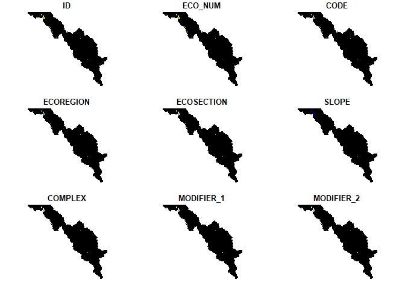<!-- -->

``` r
tmap_mode("plot") 
```

    ## tmap mode set to plotting

``` r
tm_shape(elc_habitat) + tm_sf()
```

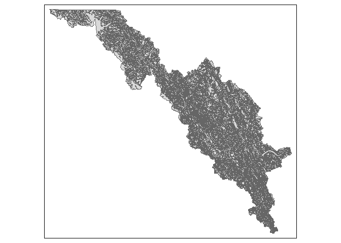<!-- -->

``` r
tm_shape(humanaccess) + tm_sf()
```

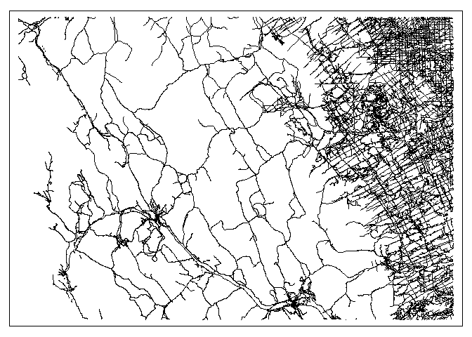<!-- -->

``` r
wolfyht<-st_read(here::here("Data","wolfyht.shp"))
```

    ## Reading layer `wolfyht' from data source 
    ##   `C:\Users\Administrator.KJLWS11\Documents\Labs 2-6\Data\wolfyht.shp' 
    ##   using driver `ESRI Shapefile'
    ## Simple feature collection with 413 features and 21 fields
    ## Geometry type: POINT
    ## Dimension:     XY
    ## Bounding box:  xmin: 555853 ymin: 5656997 xmax: 605389 ymax: 5741316
    ## Projected CRS: NAD83 / UTM zone 11N

``` r
head(wolfyht)
```

    ## Simple feature collection with 6 features and 21 fields
    ## Geometry type: POINT
    ## Dimension:     XY
    ## Bounding box:  xmin: 558477 ymin: 5670800 xmax: 588900 ymax: 5697212
    ## Projected CRS: NAD83 / UTM zone 11N
    ##   ID ID2 NAME NoCollared       Pack      DATE_ Season EASTING NORTHING
    ## 1  1 944   44          1 Bow valley 2001-11-27 winter  588900  5670800
    ## 2  2 945   44          1 Bow valley 2001-12-19 winter  567700  5686600
    ## 3  3 946   44          1 Bow valley 2001-12-22 winter  587500  5672700
    ## 4  4 947   44          1 Bow valley 2001-12-21 winter  588100  5671500
    ## 5  5 948   44          1 Bow valley 2001-12-20 winter  558477  5697212
    ## 6  6 949   44          1 Bow valley 2001-12-23 winter  586000  5674300
    ##   HOW_OBTAIN CONFIDENCE PackID  disthha  distacc wolfwin sheepwi goatwin
    ## 1          2          1      2 295.4657 295.4657       5       3       1
    ## 2          2          1      2 466.6905 466.6905       5       3       1
    ## 3          2          1      2 120.0000 120.0000       5       1       1
    ## 4          2          1      2 499.2995 499.2995       5       3       1
    ## 5          2          1      2   0.0000   0.0000       4       3       1
    ## 6          2          1      2 268.3282 268.3282       5       3       1
    ##   elkwint moosewi deerwin elevati               geometry
    ## 1       5       5       5    1402 POINT (588900 5670800)
    ## 2       5       4       4    1498 POINT (567700 5686600)
    ## 3       5       3       5    1402 POINT (587500 5672700)
    ## 4       5       5       5    1402 POINT (588100 5671500)
    ## 5       4       5       4    1587 POINT (558477 5697212)
    ## 6       5       5       5    1402 POINT (586000 5674300)

As a preliminary step, lets plot some of the wolfyht using the base plot
function, and using some of the structure of the wolfyht object. Lets
remind ourselves of the structure of the SpatialPointsDataFrame first.

``` r
class(wolfyht)
```

    ## [1] "sf"         "data.frame"

``` r
crs(wolfyht,proj = TRUE) # note this is a UTM projected map system. 
```

    ## [1] "+proj=utm +zone=11 +datum=NAD83 +units=m +no_defs"

``` r
str(wolfyht)
```

    ## Classes 'sf' and 'data.frame':   413 obs. of  22 variables:
    ##  $ ID        : int  1 2 3 4 5 6 7 8 9 10 ...
    ##  $ ID2       : num  944 945 946 947 948 949 950 951 952 953 ...
    ##  $ NAME      : chr  "44" "44" "44" "44" ...
    ##  $ NoCollared: num  1 1 1 1 1 1 1 1 1 1 ...
    ##  $ Pack      : chr  "Bow valley" "Bow valley" "Bow valley" "Bow valley" ...
    ##  $ DATE_     : Date, format: "2001-11-27" "2001-12-19" ...
    ##  $ Season    : chr  "winter" "winter" "winter" "winter" ...
    ##  $ EASTING   : num  588900 567700 587500 588100 558477 ...
    ##  $ NORTHING  : num  5670800 5686600 5672700 5671500 5697212 ...
    ##  $ HOW_OBTAIN: num  2 2 2 2 2 2 2 2 2 2 ...
    ##  $ CONFIDENCE: num  1 1 1 1 1 1 1 1 1 1 ...
    ##  $ PackID    : int  2 2 2 2 2 2 2 2 2 2 ...
    ##  $ disthha   : num  295 467 120 499 0 ...
    ##  $ distacc   : num  295 467 120 499 0 ...
    ##  $ wolfwin   : num  5 5 5 5 4 5 4 5 5 5 ...
    ##  $ sheepwi   : num  3 3 1 3 3 3 1 3 1 1 ...
    ##  $ goatwin   : num  1 1 1 1 1 1 3 1 1 1 ...
    ##  $ elkwint   : num  5 5 5 5 4 5 4 5 5 4 ...
    ##  $ moosewi   : num  5 4 3 5 5 5 4 5 3 3 ...
    ##  $ deerwin   : num  5 4 5 5 4 5 4 5 5 6 ...
    ##  $ elevati   : int  1402 1498 1402 1402 1587 1402 1433 1402 1405 1404 ...
    ##  $ geometry  :sfc_POINT of length 413; first list element:  'XY' num  588900 5670800
    ##  - attr(*, "sf_column")= chr "geometry"
    ##  - attr(*, "agr")= Factor w/ 3 levels "constant","aggregate",..: NA NA NA NA NA NA NA NA NA NA ...
    ##   ..- attr(*, "names")= chr [1:21] "ID" "ID2" "NAME" "NoCollared" ...

``` r
# Note that there are two fields, Easting and Northing which are the X and Y coordinates in UTM zone 11.  We will use these to map it for each PackID
# base plot of wolf packs by color with legend
base::plot(wolfyht$EASTING,wolfyht$NORTHING,col=c("red","blue")[wolfyht$PackID],ylab="Northing",xlab="Easting")
legend(555000,5742500,unique(wolfyht$Pack),col=c("blue","red"),pch=1) 
```

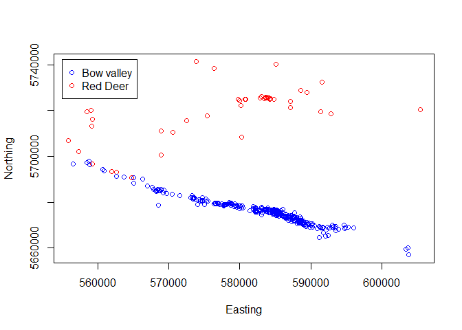<!-- -->

## Habitat Suitability Index Models

Next, we will explore/review some of the fields in the ELC database,
lets make a plot of the Moose_winter \## habitat suitability index value
for the study area.

For background on how these ‘rankings’ of habitat suitability were
created, see the associated readings here:

Holroyd, G. L., and K. J. Van Tighem, editors. 1983. Ecological
(biophysical) land classification of Banff and Jasper National Parks.
Volume 3. The wildlife inventory. Canadian Wildlife Service, Edmonton.

Briefly, habitat suitability index models were developed by Holroyd and
Van Tighem for Banff National Park using a variety of datasets, aerial
surveys, pellet counts, and expert opinion. ELC polygons were ranked in
order from low (0) to high (6), with lakes and water bodies classified
as 7. I will cover H.S.I. models, why you might want to build one, and
how using an example for Bison in Banff later this semester. For now,
lets continue.

``` r
#For fun - if you want to play with using package tmap()
#construct tmap plot for Moose Winter habitat
tm_shape(elc_habitat)+tm_sf("MOOSE_W", border.alpha = 0)
```

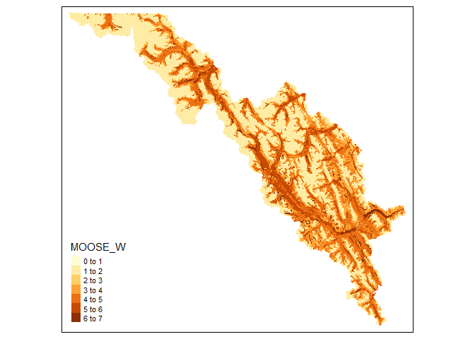<!-- -->

``` r
#construct ggplot2 plot for Moose Winter Habitat
# Note - color = NA in the geom_sf() removes the border lines
elk_plot<-ggplot() + 
  geom_sf(data = elc_habitat, mapping = aes(fill = as.factor(MOOSE_W)), color = NA) + labs(x="Easting",y="Northing") + theme(axis.text.y = element_text(angle = 90, hjust=0.5))

#adjust fill colors of MOOSE_W  (note that I just selected some random colors, but made "7" as blue)
elk_plot2 <- elk_plot + scale_fill_manual(name="MOOSE_W",values=c("gray","gray", "red", "orange", "yellow", "green","darkblue"))
elk_plot2
```

<!-- -->

Bighorn Sheep Winter Habitat Model

``` r
#construct ggplot2 plot for Moose Winter Habitat
sheep_plot<-ggplot() + 
  geom_sf(data = elc_habitat, mapping = aes(fill = as.factor(SHEEP_W)), color = NA) + labs(x="Easting",y="Northing") + theme(axis.text.y = element_text(angle = 90, hjust=0.5))

#adjust fill colors of MOOSE_W  (note that I just selected some random colors, but made "7" as blue)
sheep_plot2 <- sheep_plot + scale_fill_manual(name="SHEEP_W",values=c("gray","gray", "red", "orange", "yellow", "green","darkblue"))
sheep_plot2
```

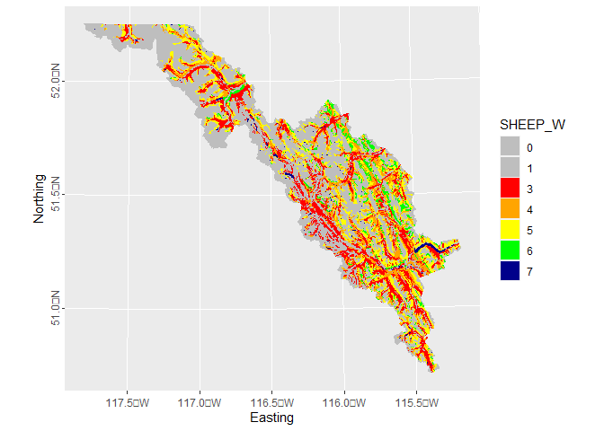<!-- -->

## Part 1b - Spatial Raster Operations

Here we will go through some typical raster operations when creating a
set of spatially consistent raster layers to make into a ‘stack’ of
rasters, a raster stack or brick, to then intersect animal locations
with.

First, we will use the fields for each of the Ungulate Habitat
Suitability Index Models described in the associated readings from the
ELC dataset. We will then create a series of raster files, ‘layers’, for
each species of winter ungulate in BNP using the `terra::rasterize()`
command.

The steps involved in creating these rasters below are key, and, good to
review. Remember, our goal is to create a consistent stack of rasters -
a raster stack, or brick, of the same raster extent, resolution and
projection for all subsequent analyses in R.

1.  Mask - we create a consistent raster MASK upon which to base all
    subsequent operations. This standardizes the extent, resolution and
    projection of the mask, and sets all values of the mask to be 0.

2.  `rasterize()` - we then use this operation to convert a vector file,
    a shapefile, to a raster.

3.  `resample()` - note that existing raster layers, e.g., elevation,
    distance to human access, had a different set of dimensions
    (extents) last week when we created our raster stack. They may have
    also had different resolutions, in which case we need to resample to
    a consistent resolution.

``` r
# Create a mask raster to use as a template for converting shapefile data to rasters
#create an empty raster
mask.raster <- rast()

#set extent (note that I customized this extent so it covered both elc_habitat and humanacess)
ext(mask.raster) <- c(xmin=443680.6, xmax=650430.4, ymin=5618416, ymax=5789236)     

#set the resolution to 30 m 
res(mask.raster)<-30

#match projection to elc_habitat shapefile
crs(mask.raster)<- "+proj=utm +zone=11 +datum=NAD83 +units=m +no_defs +ellps=GRS80 +towgs84=0,0,0"

#set all values of mask.raster to zero
mask.raster[]<-0
```

Next I use the terra::rasterize() to create rasters for DEER_W, MOOSE_W,
ELK_W, SHEEP_W, GOAT_W, WOLF_W

``` r
##This does not take as long as the raster() package and fasterize is no longer needed
deer_w<-terra::rasterize(elc_habitat, mask.raster, field="DEER_W")
moose_w<-terra::rasterize(elc_habitat, mask.raster, field="MOOSE_W")
elk_w<-terra::rasterize(elc_habitat, mask.raster, field="ELK_W")
sheep_w<-terra::rasterize(elc_habitat, mask.raster, field="SHEEP_W")
goat_w<-terra::rasterize(elc_habitat, mask.raster, field="GOAT_W")
wolf_w<-terra::rasterize(elc_habitat, mask.raster, field="WOLF_W")

#Alternative using Stars Package 
#deer_w <- st_as_stars(elc_habitat, name = attr(elc_habitat, "DEER_W"))
deer_w_stars <- st_rasterize(elc_habitat["DEER_W"])
moose_w_stars <- st_rasterize(elc_habitat["MOOSE_W"])
elk_w_stars <- st_rasterize(elc_habitat["ELK_W"])
sheep_w_stars <- st_rasterize(elc_habitat["SHEEP_W"])
goat_w_stars <- st_rasterize(elc_habitat["GOAT_W"])
wolf_w_stars <- st_rasterize(elc_habitat["WOLF_W"])
#plot result
plot(wolf_w)
```

<!-- -->

``` r
plot(wolf_w_stars)
```

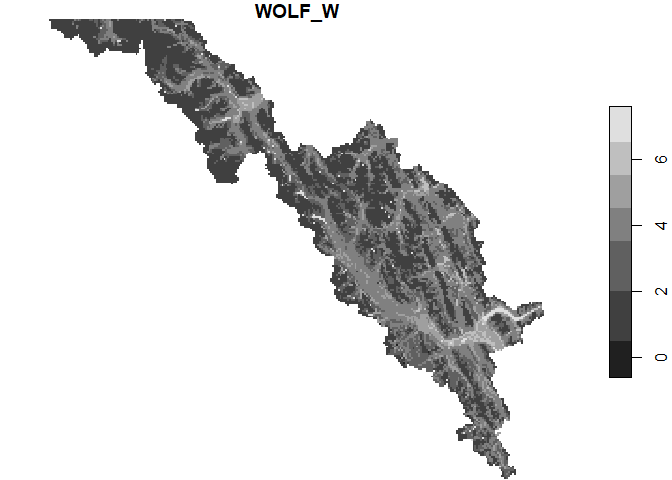<!-- -->

Next, we need to align the previously developed rasters, elevation and
distance to human access, with the raster.mask developed above to have
the exact same extent, spatial resolution, projection, etc. We do so
using the resample() function from the raster package.

Learn more about resampling by typing `?terra::resample`

``` r
#resample elevation and humanaccess to match mask.raster 
#note - not sure how to do this with stars package yet -SMS - 1/24/2023
elevation2<-resample(elevation, mask.raster, method="bilinear")
disthumaccess2<-resample(disthumaccess, mask.raster, method="bilinear")
```

Exporting raster layers you have worked on using the `writeRaster`
command from the terra package like this:

``` r
#write raster layers to file
writeRaster(deer_w, here::here("Lab2","Output", "DEER_W.tiff"), overwrite = TRUE)
```

For today’s lab we will us elevation rasters we created before the lab
and re-load them from our working directory.

``` r
#reading in elevation raster with terra
elevation2<-rast(here::here("Data","Elevation2.tif")) #resampled

#reading in elevation raster with stars
elevation2_stars <- read_stars(here::here("Data","Elevation2.tif"))
```

How can we zoom into just one area of a raster object? There are many
reasons we might want to, and many ways. One easy way is to use
`mapview()`. Note - mapview is not evaluated here because the html image
does not play well with .md files - try evaluating within your own
project

``` r
library(mapview)
mapview(wolfyht) + deer_w + sheep_w
```

## Part 1b - Distance to Raster (Human Access Layer)

First, there are many ways to evaluate human activity, polygonal (e.g.,
cities, parks), vector (roads, lines, points=houses), or more
integrative spatial measures like density of human features or distance
to human features. Later in class we will compare and contrast why we
would use distance to or density of a human feature as a resource
covariate for wildlife.

For now, I already created this raster layer because it took a LONG time
on a desktop. So this might be an example where using ArcGIS might save
time.But I include the code for illustration.

``` r
#first create an empty raster
dist.raster <- rast()
#set extent 
ext(dist.raster) <- ext(humanaccess)

#set the resolution to 30 m (Note that this takes a very long time with a 30 m resolution-even on my machine)
res(dist.raster)<-30

#match projection to humanaccess shapefile
crs(dist.raster)<- "+proj=utm +zone=11 +datum=NAD83 +units=m +no_defs +ellps=GRS80 +towgs84=0,0,0"

#set all values of dist.raster to zero
dist.raster[]<-0
```

Next, we need to ’rasterize\` the new human access layer, and set human
features to 1 using the dist.raster feature within rasterize. Note
again, for time we will not actually run these today.

``` r
human.raster<-terra::rasterize(humanaccess, dist.raster, 1)

#calculate distance to human access- NOTE : DO NOT RUN THIS IT TAKES FOREVER; I ENDED UP DOING THIS CALCULATION JUST FOR THE POINTS
accessdist <-system.time(distance(human.raster))
```

Lets bring in the previously modeled distance to human layer.

``` r
#using terra
disthumanaccess2<-rast(here::here("Data","DistFromHumanAccess2.tif")) 
plot(disthumanaccess2)
```

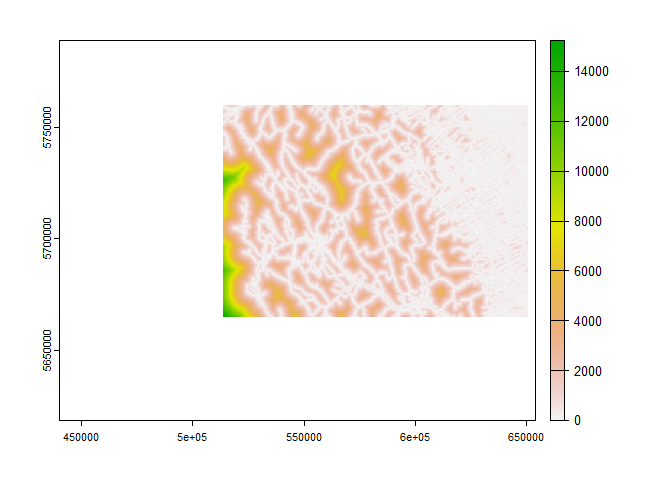<!-- -->

``` r
#using stars
disthumanaccess2_stars <- read_stars(here::here("Data","DistFromHumanAccess2.tif"))
```

## Advanced question: how would you calculate distance to high human use?

In the human access shapefile, there is a field for the classification
of human use on the trail from 0 to very high. We would then ‘reclass’
this field, and create a new shapefile. We could then use the steps
above to rasterize this shapefile.

``` r
#first reclassify labels on humanaccess.shp file so they are correct (note: need to bring in humanaccess.shp above)
levels(as.factor(humanaccess$SUM_CLASS))
```

    ##  [1] "0"         "High"      "HIGH"      "Low"       "LOW"       "MEDIUM"   
    ##  [7] "Moderate"  "Nil"       "NIL"       "VERY HIGH"

``` r
#[1] "0"         "High"      "HIGH"      "Low"       "LOW"      
#[6] "MEDIUM"    "Moderate"  "Nil"       "NIL"       "VERY HIGH"
#convert humanaccess$SUM_CLASS to a factor
humanaccess$SUM_CLASS<-as.factor(humanaccess$SUM_CLASS)

levels(humanaccess$SUM_CLASS)[1]<-"NIL"
levels(humanaccess$SUM_CLASS)[2]<-"HIGH"
levels(humanaccess$SUM_CLASS)[3]<-"LOW"
levels(humanaccess$SUM_CLASS)[5]<-"MODERATE"
levels(humanaccess$SUM_CLASS)[6]<-"NIL"

#create indicator variable for high or not high human access
highaccess<-humanaccess[humanaccess$SUM_CLASS=="HIGH" | humanaccess$SUM_CLASS=="VERY HIGH", ]

#use package tmap() to create simple plots
humanaccess_plot <- tm_shape(humanaccess)+tm_sf()
humanaccess_plot + tm_shape(highaccess) + tm_sf(col = "red") 
```

    ## Warning: The shape highaccess contains empty units.

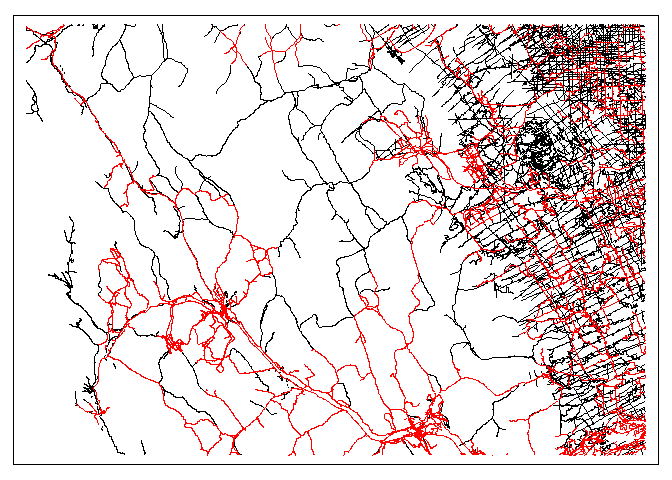<!-- --> Now you
would go through and rasterize this following the steps above to make
this a raster file. Note I already did this to save time - lets load the
distance to high human access layer.

``` r
#Reading in and plotting with terra
disthighhumanaccess<-rast(here::here("Data","DistFromHighHumanAccess2.tif"))
plot(disthighhumanaccess)
```

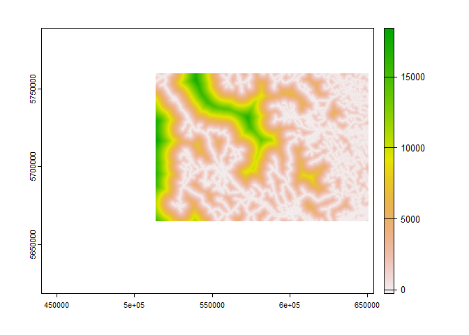<!-- -->

``` r
#reading in with stars
disthighhumanacess_stars <- read_stars(here::here("Data","DistFromHighHumanAccess2.tif"))
```

- Break Out Discussion \*

# Objective 2 - Home Range Analysis

Note I’ve done these here for the individual level I added the
pack-level analysis below. But our goal will be to calculate 99% minimum
convex polygon for individual wolves in the Red Deer wolf pack. Our
first step is to convert the SpatialPointsDataFrame to spatial points
object.

For these steps of estimating home ranges, we will be using the
adehabitat set of packages created by Clement Calenge that are EXTREMELY
valuable in habitat and spatial analyses in Ecology.

Learn more here:
<http://cran.nexr.com/web/packages/adehabitat/adehabitat.pdf>

And in this paper: Calenge, C. 2010. The package adehabitat for the R
software: a tool for the analysis of space and habitat use by animals.
Ecological Modeling 197:516-519.
<https://doi.org/10.1016/j.ecolmodel.2006.03.017>

First we will do a bit of data management to extract just the basics we
need from the wolf telemetry object, wolfyht.shp. We will extract the X
Y locations, define a new dataframe, add the XY coordinates, a
projection and create a new SpatialPointsDataFrame file - a common set
of steps that here is slightly unnecessary because we already have a
spatial points data frame. But useful to review especially for students
creating a new spatialPointsDataFrame from say, an excel spreadsheet or
data from GPS radiocollars.

``` r
rd.data<-wolfyht[wolfyht$Pack=="Red Deer",]
x<-rd.data$EASTING
y<-rd.data$NORTHING
xy<-cbind(x,y)
class(xy)
```

    ## [1] "matrix" "array"

``` r
rd <- data.frame(as.character(rd.data$NAME))
coordinates(rd) <- xy
crs(rd) <-  "+proj=utm +zone=11 +datum=NAD83 +units=m +no_defs +ellps=GRS80 +towgs84=0,0,0"

class(rd)
```

    ## [1] "SpatialPointsDataFrame"
    ## attr(,"package")
    ## [1] "sp"

``` r
# Fit 99% mpc
#cp.rd <- mcp(rd, percent=99)
#note error that one animal does not have at least 5 locations
table(rd.data$NAME)
```

    ## 
    ## 42 60 69 70 81 82 84 
    ## 43 25  4 15  3  2  1

``` r
#42 60 69 70 81 82 84 
#43 25  4 15  3  2  1  
#looks like 4 of the wolves do not have enough locations

rd.test <- st_drop_geometry(rd.data) %>% 
  filter(!NAME %in% c("69","81","82","84"))


#remove these individuals with too few of locations
names(rd)<-"NAME"
rd<-rd[rd@data$NAME!="69" & rd@data$NAME!="81" & rd@data$NAME!="82" & rd@data$NAME!="84",]
#remove unused NAME levels
rd@data$NAME<-factor(rd@data$NAME)
```

Next we will fit a 99% Minimum Convex Polygon to these cleaned data for
EACH individual wolf.

``` r
# Fit 99% mcp
cp.rd <- mcp(rd, percent=99)
plot(rd, col="black")
plot(cp.rd[cp.rd@data$id=="42",], col="blue", add=TRUE)
plot(cp.rd[cp.rd@data$id=="70",], col="green", add=TRUE)
plot(cp.rd[cp.rd@data$id=="60",], col="red", add=TRUE)
plot(rd, col="black", add=TRUE)
```

<!-- -->

``` r
#check area in square meters for each Red Deer wolf pack
as.data.frame(cp.rd)
```

    ##    id     area
    ## 42 42 95521.30
    ## 60 60 91224.93
    ## 70 70 81438.04

``` r
#calculate area for different percents of MPC in square meters. 
mcp.area(rd, percent=seq(50, 100, by=5))
```

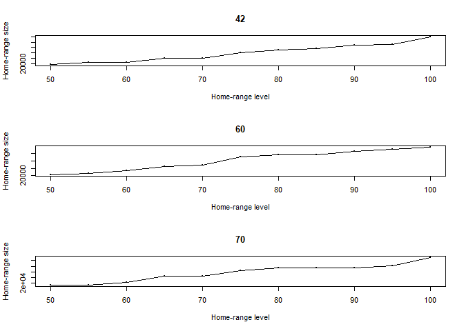<!-- -->

    ##            42       60        70
    ## 50   15969.17 22253.10  13110.79
    ## 55   23434.74 26181.99  13110.79
    ## 60   23736.24 33443.39  23183.75
    ## 65   39352.56 44338.50  45205.16
    ## 70   39482.98 48091.73  45205.16
    ## 75   60563.38 69739.30  65432.74
    ## 80   71418.82 75184.40  75296.97
    ## 85   76945.31 75184.40  75296.97
    ## 90   89897.98 84315.70  75383.97
    ## 95   92518.27 90962.47  81438.04
    ## 100 119714.68 96110.38 110373.43

We will now estimate Kernel Density Estimate home ranges using the
command `kernelUD()`.

``` r
#calculate 99% KDE for Red Deer wolf pack
red.deerUD <- kernelUD(rd, grid=30, extent=0.5, same4all=TRUE) # reference grid
image(red.deerUD)
```

<!-- -->

``` r
#get polygons for home ranges
homerangeRD <- getverticeshr(red.deerUD)
as.data.frame(homerangeRD)
```

    ##    id     area
    ## 42 42 244391.8
    ## 60 60 285485.5
    ## 70 70 400854.4

``` r
class(homerangeRD)
```

    ## [1] "SpatialPolygonsDataFrame"
    ## attr(,"package")
    ## [1] "sp"

``` r
plot(homerangeRD, col=2:4)
```

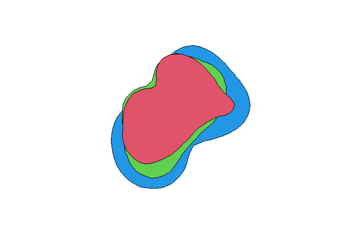<!-- -->

``` r
#Estimate UD in raster mode
red.deerud <- getvolumeUD(red.deerUD) 
red.deerud
```

    ## ********** Utilization distribution of several Animals ************
    ## 
    ## Type: volume under UD
    ## Smoothing parameter estimated with a  href smoothing parameter
    ## This object is a list with one component per animal.
    ## Each component is an object of class estUD
    ## See estUD-class for more information

``` r
## Set up graphical parameters for the output of getvolumeUD 
par(mar=c(0,0,2,0)) #set margin
image(red.deerud[[1]]) #for first wolf only
title("Red Deer Wolf UD") 
xyzv <- as.image.SpatialGridDataFrame(red.deerud[[1]]) 
contour(xyzv, add=TRUE)
```

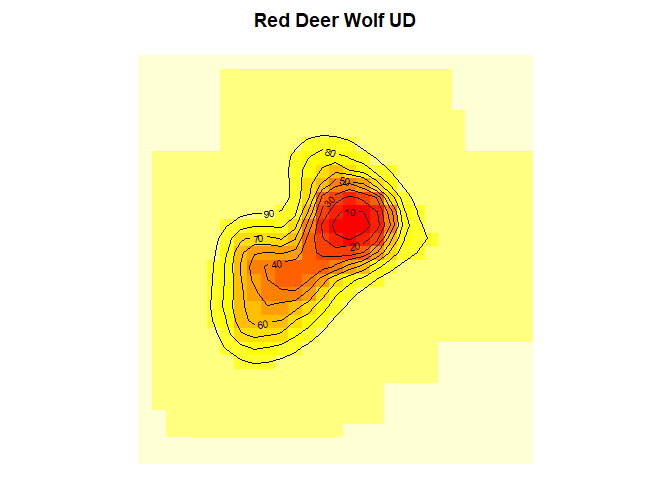<!-- -->

Next we will store the volume under the UD (as computed by getvolumeUD)
of the first animal in fud as a RASTER file of 1= home range, 0 = not
home range.

``` r
fud <- red.deerud[[1]] #for first wolf only
## store the value of the volume under UD in a vector hr95 
hr95 <- as.data.frame(fud)[,1] 
## if hr95 is <= 95 then the pixel belongs to the home range
## (takes the value 1, 0 otherwise)
hr95 <- as.numeric(hr95 <= 95) 
## Converts into a data frame 
hr95 <- data.frame(hr95) 
## Converts to a SpatialPixelsDataFrame 
coordinates(hr95) <- coordinates(red.deerud[[1]])
gridded(hr95) <- TRUE 
## display the results 
image(hr95)
```

<!-- -->

## Bow Valley wolves

Calculate 99% minimum convex polygon for individual wolves in Bow valley
wolf pack repeating the same steps as above.

``` r
#first convert the spatialpointsdataframe to spatial points object
bv.data<-wolfyht[wolfyht$Pack=="Bow valley",]
x<-bv.data$EASTING
y<-bv.data$NORTHING
xy<-cbind(x,y)

bv <- data.frame(as.character(bv.data$NAME))
coordinates(bv) <- xy
crs(bv) <-  "+proj=utm +zone=11 +datum=NAD83 +units=m +no_defs +ellps=GRS80 +towgs84=0,0,0"

# Fit 99% mpc
cp.bow <- mcp(bv, percent=99)
plot(bv, col="black")
plot(cp.bow[cp.bow@data$id=="63",], col="blue",add=TRUE)
plot(cp.bow[cp.bow@data$id=="87",], col="red",add=TRUE,)
plot(cp.bow[cp.bow@data$id=="44",], col="green",add=TRUE)
plot(bv, col="black", add=TRUE)
```

<!-- -->

## Red Deer wolves

``` r
#check area for each Red Deer wolf pack
as.data.frame(cp.bow)
```

    ##    id     area
    ## 44 44 13415.25
    ## 63 63 30628.48
    ## 87 87 11878.75

``` r
#calculate area for different percents of MPC
mcp.area(bv, percent=seq(50, 100, by=5))
```

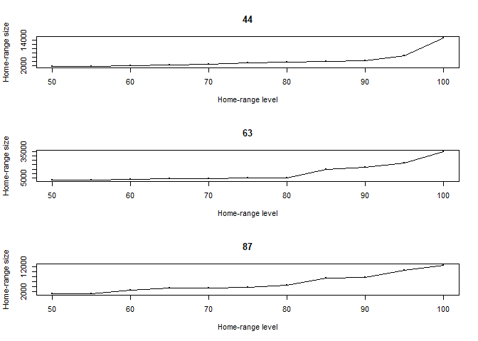<!-- -->

    ##            44        63       87
    ## 50   1645.560  2385.395  1105.98
    ## 55   1740.525  2849.145  1304.73
    ## 60   1905.350  3203.145  2499.00
    ## 65   2432.075  3866.500  3417.20
    ## 70   2697.350  4081.580  3490.95
    ## 75   3436.990  5052.962  3879.50
    ## 80   3755.760  5302.477  4667.75
    ## 85   4071.145 15020.820  7410.70
    ## 90   4498.821 16826.375  7782.20
    ## 95   6876.625 21646.750 10495.00
    ## 100 15108.718 34863.728 12531.75

``` r
#calculate 99% KDE for Red Deer wolf pack
bow.valleyUD <- kernelUD(bv, grid=30, extent=0.1, same4all=TRUE) # reference grid
image(bow.valleyUD)
```

<!-- -->

``` r
#get polygons for home ranges
homerangeBV <- getverticeshr(bow.valleyUD)
as.data.frame(homerangeBV)
```

    ##    id     area
    ## 44 44 38034.42
    ## 63 63 88711.30
    ## 87 87 42529.19

``` r
class(homerangeBV)
```

    ## [1] "SpatialPolygonsDataFrame"
    ## attr(,"package")
    ## [1] "sp"

``` r
plot(homerangeBV, col=2:4)
```

<!-- -->

``` r
#Estimate UD in raster mode
bow.valleyud <- getvolumeUD(bow.valleyUD) 
bow.valleyud
```

    ## ********** Utilization distribution of several Animals ************
    ## 
    ## Type: volume under UD
    ## Smoothing parameter estimated with a  href smoothing parameter
    ## This object is a list with one component per animal.
    ## Each component is an object of class estUD
    ## See estUD-class for more information

``` r
## Set up graphical parameters for the output of getvolumeUD 
par(mar=c(0,0,2,0)) #set margin
image(bow.valleyud[[1]])
title("Bow Valley Pack UD") 
xyzv <- as.image.SpatialGridDataFrame(bow.valleyud[[1]]) 
contour(xyzv, add=TRUE)
```

<!-- -->

Store the volume under the UD (as computed by getvolumeUD) of the first
animal in fud.

``` r
fud <- bow.valleyud[[1]]
## store the value of the volume under 95% UD in a vector hr95 
hr95 <- as.data.frame(fud)[,1] 
## if hr95 is <= 95 then the pixel belongs to the home range
## (takes the value 1, 0 otherwise)
hr95 <- as.numeric(hr95 <= 95) 
## Converts into a data frame 
hr95 <- data.frame(hr95) 
## Converts to a SpatialPixelsDataFrame 
coordinates(hr95) <- coordinates(bow.valleyud[[1]])
gridded(hr95) <- TRUE 
## display the results 
image(hr95)
```

<!-- -->

## Calculate 99% minimum convex polygon for both wolf packs

``` r
#first convert the spatialpointsdataframe to spatial points object
x<-wolfyht$EASTING
y<-wolfyht$NORTHING
xy<-cbind(x,y)

all <- data.frame(as.character(wolfyht$Pack))
coordinates(all) <- xy
crs(all) <-  "+proj=utm +zone=11 +datum=NAD83 +units=m +no_defs +ellps=GRS80 +towgs84=0,0,0"

# Fit 99% mpc
cp.all <- mcp(all, percent=99)

plot(wolfyht, col="black")
plot(cp.all[cp.all@data$id=="Bow valley",], col="blue",add=TRUE)
plot(cp.all[cp.all@data$id=="Red Deer",], col="green",add=TRUE)
plot(wolfyht, col="black", add=TRUE)
```

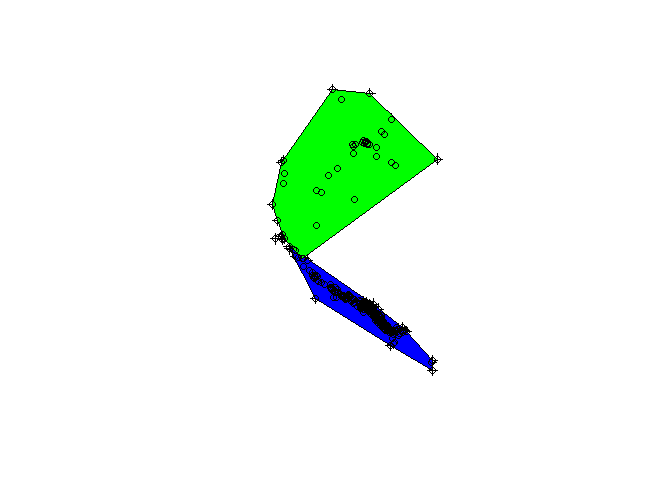<!-- -->

Checking areas, etc

``` r
#check area for each Red Deer wolf pack
as.data.frame(cp.all)
```

    ##                    id      area
    ## Bow valley Bow valley  33236.46
    ## Red Deer     Red Deer 137343.40

``` r
#calculate area for different percents of MPC
mcp.area(all, percent=seq(50, 100, by=5))
```

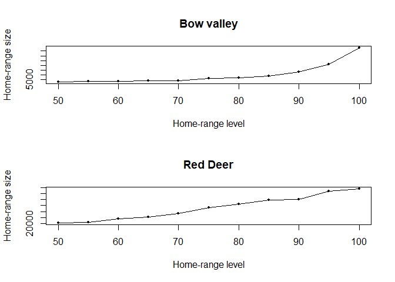<!-- -->

    ##     Bow valley  Red Deer
    ## 50    2561.216  20914.49
    ## 55    3210.875  23434.74
    ## 60    3490.250  35139.37
    ## 65    3668.550  41130.19
    ## 70    4031.390  53768.10
    ## 75    6289.680  73196.44
    ## 80    7302.325  85463.24
    ## 85    8540.538  98396.38
    ## 90   13400.878 101399.41
    ## 95   20957.750 129514.88
    ## 100  38557.463 137343.40

``` r
#calculate 99% KDE for both wolf packs
allUD <- kernelUD(all, grid=30, extent=0.5, same4all=TRUE) # reference grid
image(allUD)
```

<!-- -->

Get polygons for home ranges

``` r
homerangeALL <- getverticeshr(allUD)
as.data.frame(homerangeALL)
```

    ##                    id     area
    ## Bow valley Bow valley  54882.8
    ## Red Deer     Red Deer 249640.4

``` r
class(homerangeALL)
```

    ## [1] "SpatialPolygonsDataFrame"
    ## attr(,"package")
    ## [1] "sp"

``` r
plot(homerangeALL, col=2:3)
```

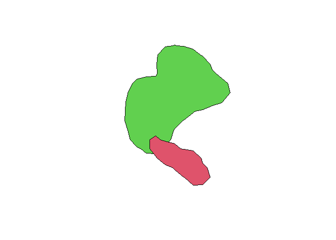<!-- -->

Estimate UD in raster mode

``` r
allud <- getvolumeUD(allUD) 
allud
```

    ## ********** Utilization distribution of several Animals ************
    ## 
    ## Type: volume under UD
    ## Smoothing parameter estimated with a  href smoothing parameter
    ## This object is a list with one component per animal.
    ## Each component is an object of class estUD
    ## See estUD-class for more information

``` r
## Set up graphical parameters for the output of getvolumeUD 
par(mar=c(0,0,2,0)) #set margin
image(allud[[1]]) #for first wolf only
title("Output of getvolumeUD") 
xyzv <- as.image.SpatialGridDataFrame(allud[[1]]) 
contour(xyzv, add=TRUE)
```

<!-- -->

Store the volume under the UD (as computed by getvolumeUD) of the first
animal in fud

``` r
fud <- allud[[1]] #for first wolf pack only
## store the value of the volume under UD in a vector hr95 
hr95 <- as.data.frame(fud)[,1] 
## if hr95 is <= 95 then the pixel belongs to the home range
## (takes the value 1, 0 otherwise)
hr95 <- as.numeric(hr95 <= 95) 
## Converts into a data frame 
hr95 <- data.frame(hr95) 
## Converts to a SpatialPixelsDataFrame 
coordinates(hr95) <- coordinates(allud[[1]])
gridded(hr95) <- TRUE 
## display the results 
image(hr95)
```

<!-- -->

# Objective 3 - Sampling Availability Within Home Ranges

The critical step in most used-available designs for habitat models,
including so-called presence-only models, is the sampling of
availability. We are going to dive right in without much care to the
conceptual foundation for sampling availability in any way, and just do
it here today with the home ranges we created for each MCP wolf pack
above.

However, as an exercise, we will consider one wrinkle in sampling
availability randomly within our Kernel home ranges. Recall our pixel
resolution was 30m. It might be ‘interesting’ to consider the problem of
whether we want to sample the exact same spatial unit for an ‘available’
sample. One way to do this is ensure that no randomly generated points
are within 30m of each other.

``` r
#subset polygons by wolf pack
red.deerPOLY<-homerangeALL[homerangeALL@data$id=="Red Deer",]
bow.valleyPOLY<-homerangeALL[homerangeALL@data$id=="Bow valley",]

#generate 1000 points from Red Deer wolf pack KDE polygon
rd.avail<-spsample(red.deerPOLY, 1000, "random")
plot(rd.avail)
```

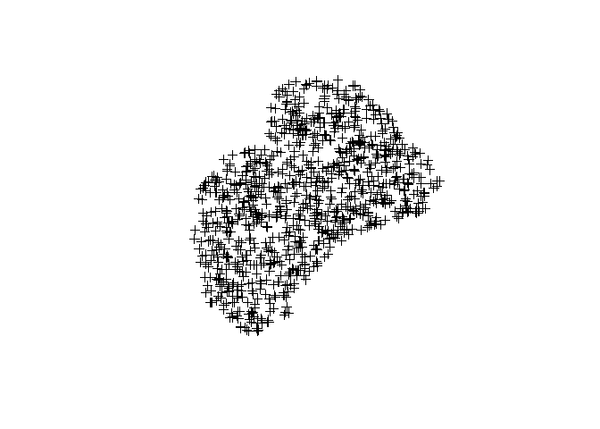<!-- -->

``` r
#generate 1000 points from Bow valley wolf pack KDE polygon
bv.avail<-spsample(bow.valleyPOLY, 1000, "random")
plot(bv.avail)
```

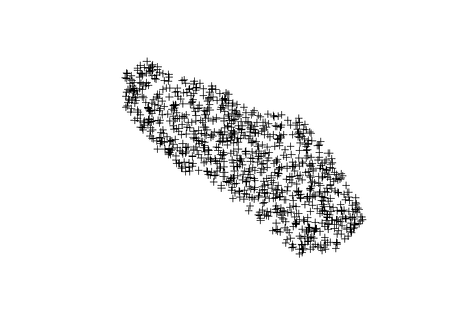<!-- -->

Lets plot them all together, used and home-range level availability.

``` r
plot(wolfyht$EASTING,wolfyht$NORTHING, col=c("red","blue")[wolfyht$PackID],ylab="Northing",xlab="Easting")
legend(555000,5742500,unique(wolfyht$Pack),col=c("blue","red"),pch=1)
plot(bv.avail, add=TRUE)
plot(rd.avail, add=TRUE)
```

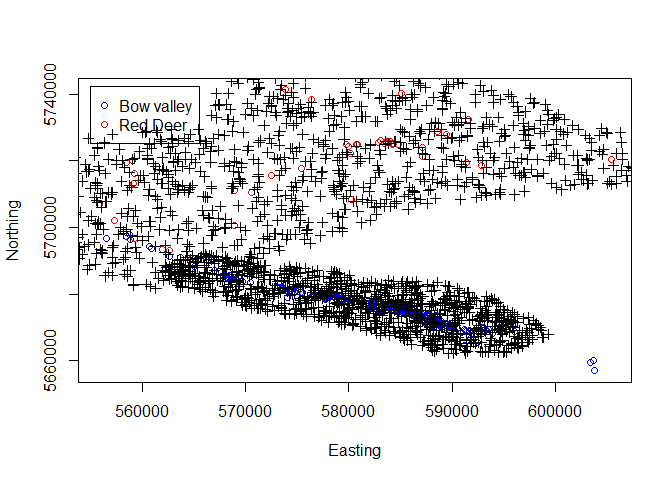<!-- -->

**Discuss in class: assumptions of sampling availability this way?
Spatial scale of this sampling design?**

# Objective 4 - Extracting Spatial Covariates For Points

A key step in building a data frame for the analysis of habitat use or
selection is associating animal use points, or availability points, with
the underlying ecological covariate values at their point locations in
space, and, sometimes, in time. In Objective 4 we will create a raster
stack/brick from our previously ‘harmonized’ spatial raster layers, and
learn how to extract the spatial covariate values associated with these
layers. Now that we have a nice raster stack, we will start with this in
subsequent labs.

Note the raster layers we created earlier, deer_w, moose_w, elk_w,
sheep_w, goat_w, wolf_w, elevation2, disthumanaccess2. Recall that to
stack raster layers for sampling, we must have the same extents and
resolutions across all layers otherwise it does not work, and we receive
an error message.

To extract covariate values is simple with the `extract()` command.
\*\*Note that the tidyverse package has a conflict with the raster
function `extract`, which is a BIG pain. IF you have tidyverse loaded,
remove it using this command: `.detach("tidyr")` Note today we are using
tidyverse, which depends on tidyr, but I’ve loaded it separately later
in summary statistics below.

``` r
#with terra
all_rasters<-c(deer_w, moose_w, elk_w, sheep_w, goat_w, wolf_w,elevation2, disthumanaccess2, disthighhumanaccess)
```

    ## Warning: [rast] SRS do not match

``` r
#with stars
#all_rasters_stars<-c(deer_w_stars, moose_w_stars, elk_w_stars, sheep_w_stars, goat_w_stars, wolf_w_stars,elevation2_stars, disthumanaccess2_stars, disthighhumanacess_stars)

class(all_rasters)
```

    ## [1] "SpatRaster"
    ## attr(,"package")
    ## [1] "terra"

``` r
#Extract covariate values for Red Deer wolf data  
cov.outRD<-extract(all_rasters, rd.data)
head(cov.outRD)
```

    ##   ID DEER_W MOOSE_W ELK_W SHEEP_W GOAT_W WOLF_W Elevation2 DistFromHumanAccess2
    ## 1  1      4       5     5       3      3      5   1766.146            427.39618
    ## 2  2      4       4     4       1      3      4   1788.780            360.50430
    ## 3  3      4       5     5       4      1      5   1765.100            283.66480
    ## 4  4      4       5     5       4      1      5   1742.913            167.41344
    ## 5  5     NA      NA    NA      NA     NA     NA   1987.394             27.90951
    ## 6  6      1       1     1       1      4      1   1778.360            622.62573
    ##   DistFromHighHumanAccess2
    ## 1                9367.8168
    ## 2               10398.5999
    ## 3               10296.5167
    ## 4                6347.8193
    ## 5                8853.8623
    ## 6                 723.7941

``` r
#Extract covariate values for available points
rd.avail_sf<-st_as_sf(rd.avail) #first change rd.avail to data type sf
cov.availRD<-extract(all_rasters, rd.avail_sf)

#Extract covariate values for Bow valley wolf data  
cov.outBV<-extract(all_rasters, bv.data)

#Extract covariate values for available points
bv.avail_sf <- st_as_sf(bv.avail)
cov.availBV<-extract(all_rasters, bv.avail_sf)
```

# Objective 5 – Exploratory Analyses of Wolf Habitat Use With R

Today we will focus on some exploratory analyses of JUST use of habitat
covariates by the 2 wolf packs. The first step is to merge the cov.outRD
and cov.outBV dataframes with a new field for pack.

But before that we need to convert the matrix (a list) to a data frame,
and add a new column for pack name.

``` r
rdused <- cov.outRD
rdused$pack <- c("Red Deer")

## repeat for Bow Valley pack
bvused <- cov.outBV
bvused$pack <- c("Bow Valley")

wolfused <- merge(rdused, bvused, all.x= TRUE, all.y = TRUE)
str(wolfused)
```

    ## 'data.frame':    413 obs. of  11 variables:
    ##  $ ID                      : num  1 1 2 2 3 3 4 4 5 5 ...
    ##  $ DEER_W                  : num  4 5 4 4 4 5 4 5 4 NA ...
    ##  $ MOOSE_W                 : num  5 5 4 4 5 3 5 5 5 NA ...
    ##  $ ELK_W                   : num  5 5 4 5 5 5 5 5 4 NA ...
    ##  $ SHEEP_W                 : num  3 3 1 3 4 1 4 3 3 NA ...
    ##  $ GOAT_W                  : num  3 1 3 1 1 1 1 1 1 NA ...
    ##  $ WOLF_W                  : num  5 5 4 5 5 5 5 5 4 NA ...
    ##  $ Elevation2              : num  1766 1402 1789 1497 1765 ...
    ##  $ DistFromHumanAccess2    : num  427 294 361 465 284 ...
    ##  $ DistFromHighHumanAccess2: num  9368 371 10399 228 10297 ...
    ##  $ pack                    : chr  "Red Deer" "Bow Valley" "Red Deer" "Bow Valley" ...

``` r
head(wolfused)
```

    ##   ID DEER_W MOOSE_W ELK_W SHEEP_W GOAT_W WOLF_W Elevation2 DistFromHumanAccess2
    ## 1  1      4       5     5       3      3      5   1766.146             427.3962
    ## 2  1      5       5     5       3      1      5   1402.000             293.7954
    ## 3  2      4       4     4       1      3      4   1788.780             360.5043
    ## 4  2      4       4     5       3      1      5   1496.907             464.8679
    ## 5  3      4       5     5       4      1      5   1765.100             283.6648
    ## 6  3      5       3     5       1      1      5   1402.000             131.8740
    ##   DistFromHighHumanAccess2       pack
    ## 1                9367.8168   Red Deer
    ## 2                 371.1612 Bow Valley
    ## 3               10398.5999   Red Deer
    ## 4                 228.2955 Bow Valley
    ## 5               10296.5167   Red Deer
    ## 6                 255.1532 Bow Valley

``` r
## and for next week, lets add a new column for a 1=used 0 = avail
wolfused$used <- 1
```

## Numerical summaries (review from Lab 1)

First we will conduct basic univariate analyses by pack for the
different resource covariates extracted for the USED wolf telemetry
data.

``` r
summary(wolfused)
```

    ##        ID            DEER_W         MOOSE_W          ELK_W      
    ##  Min.   :  1.0   Min.   :1.000   Min.   :1.000   Min.   :1.000  
    ##  1st Qu.: 52.0   1st Qu.:4.000   1st Qu.:3.000   1st Qu.:4.000  
    ##  Median :114.0   Median :5.000   Median :4.000   Median :4.000  
    ##  Mean   :134.9   Mean   :4.655   Mean   :4.135   Mean   :4.558  
    ##  3rd Qu.:217.0   3rd Qu.:5.000   3rd Qu.:5.000   3rd Qu.:5.000  
    ##  Max.   :320.0   Max.   :7.000   Max.   :7.000   Max.   :7.000  
    ##                  NA's   :13      NA's   :13      NA's   :13     
    ##     SHEEP_W          GOAT_W          WOLF_W        Elevation2  
    ##  Min.   :1.000   Min.   :1.000   Min.   :1.000   Min.   :1402  
    ##  1st Qu.:1.000   1st Qu.:1.000   1st Qu.:4.000   1st Qu.:1407  
    ##  Median :3.000   Median :1.000   Median :5.000   Median :1441  
    ##  Mean   :2.507   Mean   :1.748   Mean   :4.737   Mean   :1548  
    ##  3rd Qu.:3.000   3rd Qu.:3.000   3rd Qu.:5.000   3rd Qu.:1602  
    ##  Max.   :7.000   Max.   :7.000   Max.   :7.000   Max.   :2225  
    ##  NA's   :13      NA's   :13      NA's   :13                    
    ##  DistFromHumanAccess2 DistFromHighHumanAccess2     pack                used  
    ##  Min.   :   0.00      Min.   :    0.00         Length:413         Min.   :1  
    ##  1st Qu.:  94.46      1st Qu.:   73.72         Class :character   1st Qu.:1  
    ##  Median : 227.41      Median :  227.64         Mode  :character   Median :1  
    ##  Mean   : 308.90      Mean   : 1205.01                            Mean   :1  
    ##  3rd Qu.: 409.32      3rd Qu.:  482.47                            3rd Qu.:1  
    ##  Max.   :2338.26      Max.   :11339.46                            Max.   :1  
    ##  NA's   :4            NA's   :4

Note that there are 4 missing NA values in the distance to human access
layer. Why?

``` r
plot(disthumanaccess2)
plot(wolfyht, add = TRUE)
```

    ## Warning in plot.sf(wolfyht, add = TRUE): ignoring all but the first attribute

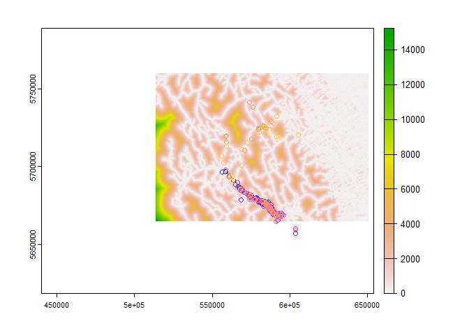<!-- -->

This is a really common problem in combining raster layers of different
sources, spatial extents, etc. Another common example we will see later
is CLOUD categories in landcover models. Here, we will clean up missing
data in the distance to access variable. Missing data are a problem, we
will replace NA’s with 0’s for now. Discuss in class.

``` r
#Note, this replaces just NAs for just the wolf used locations with NA for distance to human access, but note there were 13 missing values, say, for some of the ELC H.S.I models. 
wolfused <- na.omit(wolfused)
summary(wolfused)
```

    ##        ID             DEER_W         MOOSE_W          ELK_W      
    ##  Min.   :  1.00   Min.   :1.000   Min.   :1.000   Min.   :1.000  
    ##  1st Qu.: 52.75   1st Qu.:4.000   1st Qu.:3.000   1st Qu.:4.000  
    ##  Median :118.50   Median :5.000   Median :4.000   Median :4.000  
    ##  Mean   :136.69   Mean   :4.662   Mean   :4.129   Mean   :4.561  
    ##  3rd Qu.:218.25   3rd Qu.:5.000   3rd Qu.:5.000   3rd Qu.:5.000  
    ##  Max.   :320.00   Max.   :7.000   Max.   :7.000   Max.   :7.000  
    ##     SHEEP_W          GOAT_W          WOLF_W        Elevation2  
    ##  Min.   :1.000   Min.   :1.000   Min.   :1.000   Min.   :1402  
    ##  1st Qu.:1.000   1st Qu.:1.000   1st Qu.:4.000   1st Qu.:1405  
    ##  Median :3.000   Median :1.000   Median :5.000   Median :1438  
    ##  Mean   :2.508   Mean   :1.745   Mean   :4.737   Mean   :1535  
    ##  3rd Qu.:3.000   3rd Qu.:3.000   3rd Qu.:5.000   3rd Qu.:1569  
    ##  Max.   :7.000   Max.   :7.000   Max.   :7.000   Max.   :2225  
    ##  DistFromHumanAccess2 DistFromHighHumanAccess2     pack                used  
    ##  Min.   :   0.00      Min.   :    0.00         Length:396         Min.   :1  
    ##  1st Qu.:  99.94      1st Qu.:   64.22         Class :character   1st Qu.:1  
    ##  Median : 232.71      Median :  218.43         Mode  :character   Median :1  
    ##  Mean   : 304.65      Mean   : 1082.69                            Mean   :1  
    ##  3rd Qu.: 411.73      3rd Qu.:  450.82                            3rd Qu.:1  
    ##  Max.   :2105.20      Max.   :11300.85                            Max.   :1

``` r
dim(wolfused)
```

    ## [1] 396  12

## Graphical data visualization

Ungulate habitat suitability models first.

``` r
par(mfrow = c(2,3))
hist(wolfused$DEER_W)
hist(wolfused$ELK_W)
hist(wolfused$MOOSE_W)
hist(wolfused$SHEEP_W)
hist(wolfused$GOAT_W)
```

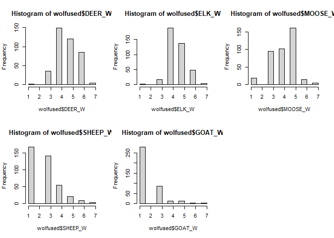<!-- -->

Continuous covariates next, elevation (m), distance (m).

``` r
par(mfrow = c(3,1))
hist(wolfused$Elevation2)
hist(wolfused$DistFromHumanAccess2)
hist(wolfused$DistFromHighHumanAccess2)
```

<!-- -->

## Data exploration by wolf pack

``` r
par(mfrow = c(1,1))
# Plot Bow Valley
hist(wolfused$Elevation2[wolfused$pack=="Bow Valley"],breaks=50, xlim = c(1400,2250), probability = TRUE, main="Wolf Habitat Selection", xlab="Elevation") 

#Plot Red Deer
hist(wolfused$Elevation2[wolfused$pack=="Red Deer"],breaks=50, col="darkgray",probability =TRUE, add=TRUE)
# Add legend
legend("topright", c("Bow Valley", "Red Deer"), fill = c("white","darkgray"),border = "black")
```

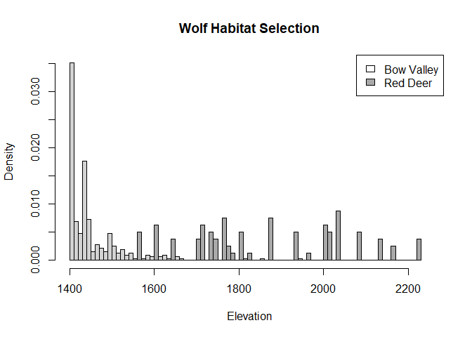<!-- -->

So, the Red Deer wolf pack ‘uses’ higher elevations than the Bow Valley
wolf pack. Now, repeat these steps on your own for all other covariates
using the plotrix R package.

``` r
par(mfrow = c(2,1))
multhist(list(wolfused$Elevation2[wolfused$pack=="Bow Valley"],wolfused$Elevation2[wolfused$pack=="Red Deer"]), freq = TRUE, main = "Elevation")
# I chose to put a legend in the lower right hand graph. 
# That's what the additional arguments in the line below specify.
multhist(list(wolfused$DistFromHumanAccess2[wolfused$pack=="Bow Valley"],wolfused$DistFromHumanAccess2[wolfused$pack=="Red Deer"]), freq = TRUE, main = "Distance From Humans", legend.text = c("Bow Valley", "Red Deer"), args.legend = list(bty = "n"))
```

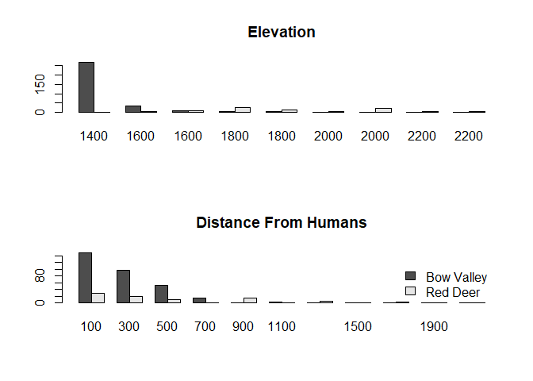<!-- -->

Next the prey figures

``` r
par(mfrow = c(2,3))
multhist(list(wolfused$ELK_W[wolfused$pack=="Bow Valley"],wolfused$ELK_W[wolfused$pack=="Red Deer"]), freq = TRUE, main = "Elk HSI", legend.text = c("Bow Valley", "Red Deer"), args.legend = list(bty = "n"))
multhist(list(wolfused$DEER_W[wolfused$pack=="Bow Valley"],wolfused$DEER_W[wolfused$pack=="Red Deer"]), freq = TRUE, main = "Deer HSI", legend.text = c("Bow Valley", "Red Deer"), args.legend = list(bty = "n"))
multhist(list(wolfused$MOOSE_W[wolfused$pack=="Bow Valley"],wolfused$MOOSE_W[wolfused$pack=="Red Deer"]), freq = TRUE, main = "Moose HSI", legend.text = c("Bow Valley", "Red Deer"), args.legend = list(bty = "n"))
multhist(list(wolfused$SHEEP_W[wolfused$pack=="Bow Valley"],wolfused$SHEEP_W[wolfused$pack=="Red Deer"]), freq = TRUE, main = "Sheep HSI", legend.text = c("Bow Valley", "Red Deer"), args.legend = list(bty = "n"))
multhist(list(wolfused$GOAT_W[wolfused$pack=="Bow Valley"],wolfused$GOAT_W[wolfused$pack=="Red Deer"]), freq = TRUE, main = "Goat HSI", legend.text = c("Bow Valley", "Red Deer"), args.legend = list(bty = "n"))
```

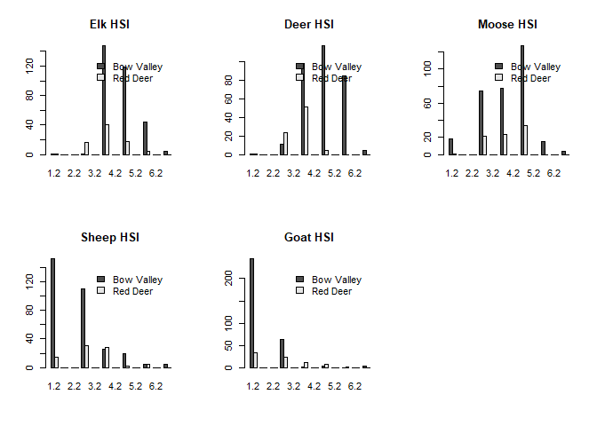<!-- -->

## Boxplots (from the lattice package)

``` r
bwplot(ELK_W + DEER_W+MOOSE_W+ SHEEP_W+GOAT_W~pack, auto.key=TRUE,allow.multiple = TRUE,data=wolfused, outer=TRUE)
```

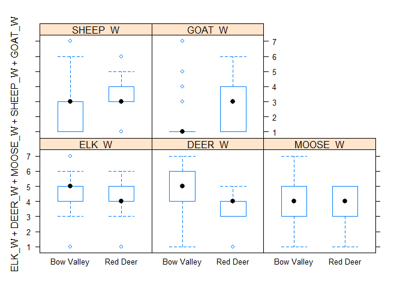<!-- -->

``` r
bwplot(DistFromHumanAccess2 + DistFromHighHumanAccess2 + Elevation2~pack, auto.key=TRUE,allow.multiple = TRUE,data=wolfused, outer=TRUE)
```

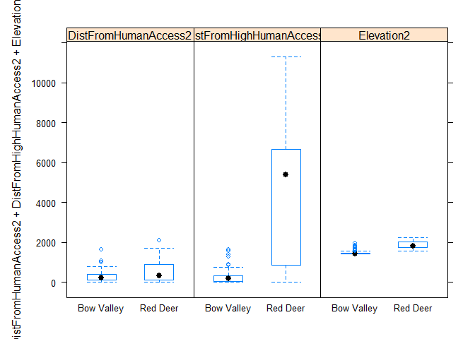<!-- -->

## Summary Statistics

``` r
aggregate(Elevation2 ~ pack, data=wolfused, FUN=mean)
```

    ##         pack Elevation2
    ## 1 Bow Valley   1451.127
    ## 2   Red Deer   1864.125

``` r
aggregate(DistFromHumanAccess2 ~ pack, data=wolfused, FUN=mean)
```

    ##         pack DistFromHumanAccess2
    ## 1 Bow Valley             256.9808
    ## 2   Red Deer             492.9217

``` r
aggregate(.~pack, data=wolfused[c("pack", "DEER_W", "ELK_W", "MOOSE_W", "SHEEP_W", "GOAT_W")], mean)
```

    ##         pack   DEER_W   ELK_W  MOOSE_W  SHEEP_W  GOAT_W
    ## 1 Bow Valley 4.901899 4.68038 4.129747 2.338608 1.53481
    ## 2   Red Deer 3.712500 4.08750 4.125000 3.175000 2.57500

``` r
sapply(wolfused, median, na.rm=TRUE)
```

    ## Warning in mean.default(sort(x, partial = half + 0L:1L)[half + 0L:1L]): argument
    ## is not numeric or logical: returning NA

    ##                       ID                   DEER_W                  MOOSE_W 
    ##                 118.5000                   5.0000                   4.0000 
    ##                    ELK_W                  SHEEP_W                   GOAT_W 
    ##                   4.0000                   3.0000                   1.0000 
    ##                   WOLF_W               Elevation2     DistFromHumanAccess2 
    ##                   5.0000                1437.7133                 232.7071 
    ## DistFromHighHumanAccess2                     pack                     used 
    ##                 218.4318                       NA                   1.0000

## Summary Statistics with Tibble

``` r
library(tidyverse)
```

    ## ── Attaching packages ─────────────────────────────────────── tidyverse 1.3.2 ──
    ## ✔ tibble  3.1.8     ✔ purrr   1.0.0
    ## ✔ tidyr   1.2.1     ✔ stringr 1.5.0
    ## ✔ readr   2.1.3     ✔ forcats 0.5.2
    ## ── Conflicts ────────────────────────────────────────── tidyverse_conflicts() ──
    ## ✖ tidyr::extract() masks terra::extract(), raster::extract()
    ## ✖ dplyr::filter()  masks stats::filter()
    ## ✖ dplyr::id()      masks adehabitatLT::id()
    ## ✖ dplyr::lag()     masks stats::lag()
    ## ✖ dplyr::select()  masks raster::select(), MASS::select()

``` r
wolf_df <- as_tibble(wolfused)

wolf_df %>% group_by(pack) %>% summarise(mean(Elevation2))
```

    ## # A tibble: 2 × 2
    ##   pack       `mean(Elevation2)`
    ##   <chr>                   <dbl>
    ## 1 Bow Valley              1451.
    ## 2 Red Deer                1864.

``` r
wolf_df %>% group_by(pack) %>% summarise(mean(DistFromHumanAccess2))
```

    ## # A tibble: 2 × 2
    ##   pack       `mean(DistFromHumanAccess2)`
    ##   <chr>                             <dbl>
    ## 1 Bow Valley                         257.
    ## 2 Red Deer                           493.

``` r
wolf_df %>% group_by(pack) %>% summarise(mean(DistFromHighHumanAccess2))
```

    ## # A tibble: 2 × 2
    ##   pack       `mean(DistFromHighHumanAccess2)`
    ##   <chr>                                 <dbl>
    ## 1 Bow Valley                             207.
    ## 2 Red Deer                              4540.

``` r
wolf_df %>% group_by(pack) %>% summarise(mean(MOOSE_W))
```

    ## # A tibble: 2 × 2
    ##   pack       `mean(MOOSE_W)`
    ##   <chr>                <dbl>
    ## 1 Bow Valley            4.13
    ## 2 Red Deer              4.12

``` r
wolf_df %>% group_by(pack) %>% summarise(mean(ELK_W))
```

    ## # A tibble: 2 × 2
    ##   pack       `mean(ELK_W)`
    ##   <chr>              <dbl>
    ## 1 Bow Valley          4.68
    ## 2 Red Deer            4.09

``` r
wolf_df %>% group_by(pack) %>% summarise(mean(SHEEP_W))
```

    ## # A tibble: 2 × 2
    ##   pack       `mean(SHEEP_W)`
    ##   <chr>                <dbl>
    ## 1 Bow Valley            2.34
    ## 2 Red Deer              3.18

``` r
wolf_df %>% group_by(pack) %>% summarise(mean(DEER_W))
```

    ## # A tibble: 2 × 2
    ##   pack       `mean(DEER_W)`
    ##   <chr>               <dbl>
    ## 1 Bow Valley           4.90
    ## 2 Red Deer             3.71

``` r
wolf_df %>% group_by(pack) %>% summarise(mean(GOAT_W))
```

    ## # A tibble: 2 × 2
    ##   pack       `mean(GOAT_W)`
    ##   <chr>               <dbl>
    ## 1 Bow Valley           1.53
    ## 2 Red Deer             2.58

``` r
wolf_df %>% group_by(pack) %>% summarise(mean(WOLF_W))
```

    ## # A tibble: 2 × 2
    ##   pack       `mean(WOLF_W)`
    ##   <chr>               <dbl>
    ## 1 Bow Valley           4.88
    ## 2 Red Deer             4.18

**Discussion** how do the Bow Valley and Red Deer wolf packs differ
across the different environmental covariates?

\#Practice Excercises (e.g., Homework)

1)  What were the patterns of USE of habitat by wolves in the Red Deer
    and Bow Valley wolf packs for the 7 variables considered? Feel free
    to use tables/figures.

2)  Compare patterns of use between wolves in the Red Deer pack and Bow
    Valley wolf packs for elevation and distance to human access – what
    biological, statistical, or methodological reasons might be driving
    the observed differences between packs?

3)  How do the patterns of use for UNGULATE layers correspond to the
    observations of (Hebblewhite et al. 2004) that diet selection (4th
    order diet selection following Johnson et al. (1980) by wolves in
    the Canadian Rockies follows this rank order?: Elk \>
    Deer\>Moose\>Sheep\>Goat. How do the two different packs differ?
    What possible explanations can you give for differences between diet
    selection and habitat use?

4)  As a form of model validation, how does our frequency of use of wolf
    telemetry locations compare to that predicted by the ELC_HABITAT
    Habitat Suitability Index Model winter wolf H.S.I. values? Make a
    graph showing the correspondence between frequency of use and
    predicted wolf H.S.I. values. What can you conclude from this?
