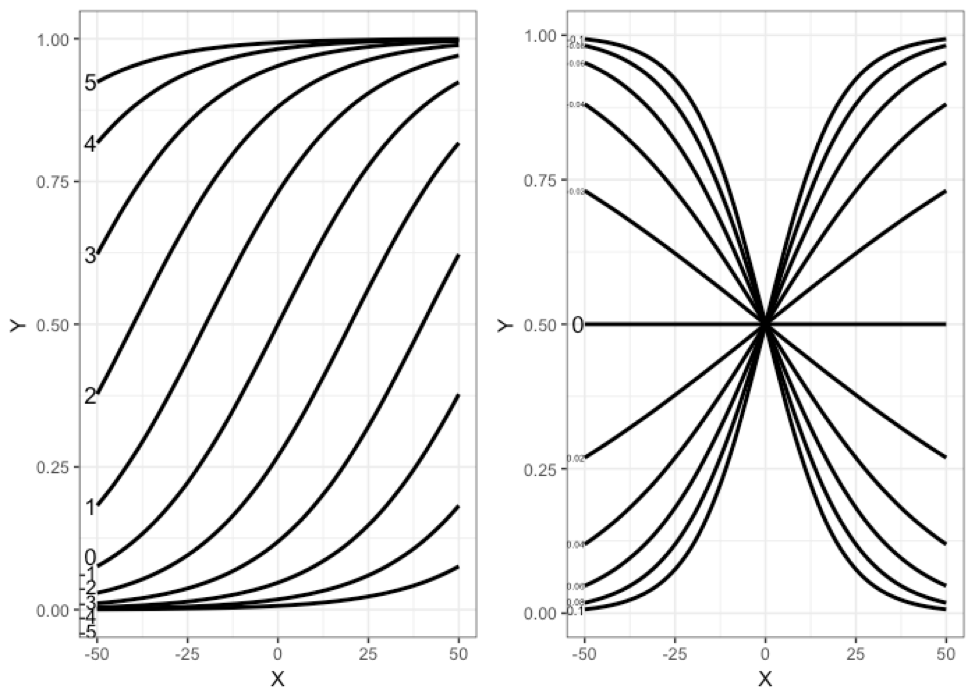
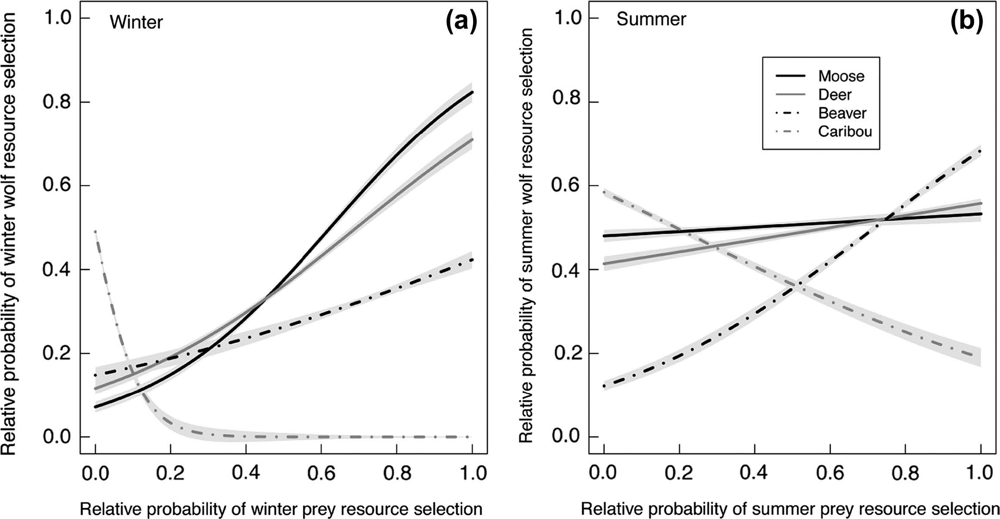

```{r setup , include=FALSE}
require(knitr)
knitr::opts_chunk$set(echo = TRUE)
r <- getOption("repos")
r["CRAN"] <- "https://ftp.osuosl.org/pub/cran/"
options(repos = r)
```


# Introduction to the Logistic Regression Model for Used-Available Data

The general introduction to the biological rationale of the ecological system and wolf telemetry data was given in the Lab 2 introduction. In Lab 3, we extend the analysis of habitat use by wolves in two wolf packs from 2001-2005 in Banff National Park to analysis of habitat selection using univariate logistic model to estimate a resource selection function (RSF) as a function of the availability of resources. 

Boyce and McDonald (1999) and Manly et al. (2002) defined a resource selection function (RSF) as any function that is proportional to the probability of use of a resource unit to covariates that allow biologists to gain insight into the underlying factors affecting the probability of use. Thus, H.S.I. models, expert opinion models, models based solely on use, occupancy models, and selection models are all potentially classified as RSF models is their function relates to the probability of use. The basic form of a resource selection function model is to relate the covariates that predict used locations against covariates that predict un-used or available locations. As we shall see in future weeks, there is a CRITICAL distinction in interpretation of the RSF dependent on which design is employed; the use-availability or the used-unused. For now, however, we will simply consider the best way to compare used locations against available locations.

We will use logistic regression, a type of generalized linear model and member of the family of binomial models using the logit link function that relate the linear predictor vector of covariates to the probability function via the logistic function. This is a very useful model where we have binomial categorical outcomes such as used (which is set to =1) or available/un-used (which is set to =0). The basic equation is:

$$logit(y) = \frac{exp^(\beta_0+\beta_1*X_1+\beta_n*X_n) + e}{1 + exp(\beta_0+\beta_1*X_11+\beta_n*X_n) + e}$$

where y is the probability of a 1 (in true logistic regression), $\beta_0$ is the baseline probability, or intercept, $\beta_1$ and $\beta_n$ are the coefficients of covariates $X_1....X_n$, respectively. In this way, the exponentiated portion of the numerator and denominator are the familiar form of ANY linear model 

$$ y = \beta_0+\beta_1*X_1+\beta_n*X_n + e $$
Except here, y, is linear in the logit scale which ranges from - infinity to + infinity, which is problematic of course because the response, 0 or 1, cannot range between positive and negative infinity. This is the purpose of the logit link function which takes a linear term in the brackets and constrains it to be between 0 and 1. Mathematically, the function of this is to mathematically bound the response variable, Y, here Logit(P) between 0 and 1. If we exponentiate a small number, and then divide it by 1+ a small number, we get a number close to 0. Conversely, if the numerator evaluates as a large number, then 1+ a large number approaches 1.  The [exp/(1+exp)] link function simply bounds the response to be a continuous function between 0 and 1. 

Equation 2 is called the *Linear Predictor*.  Here, *y*, is linear in the logit scale which ranges from - infinity to + infinity.  This is problematic of course because the response, 0 or 1, cannot range between positive and negative infinity.  This is the purpose of the logit link function used in Equation 1 which is simplified here:

$$P = logit(y) = \frac{exp^{()}}{1 + exp^{()}}$$ Equation 3
which takes a linear term in the brackets and constrains it to be between 0 and 1. Mathematically, the function of this is to mathematically bound the response variable, Y, here Logit(Y) - a probability - between 0 and 1.  We call this equation 3 the Logit Link Function. 

Consider the mathematics of this Logit Link Function. If we consider some really small terms in the linear predictor, then exponentiate them ($\exp(-5)$ = 0.0067), and then divide it by 1+ a small number (0.0067), we get a number close to 0. Conversely, if the numerator evaluates as a large number, say + 5, then ($\exp(5)$ = 148) then 1+ a large number, 148 approaches 1.  The [exp/(1+exp)] link function simply bounds the response to be a continuous function between 0 and 1, a probability. 

Finally, technically, *y* in Equation 2 is now the log-odds, that is, P / (1 - P), which we have algebraically solved using the log rule following:

$$ln\frac{(P)}{(1-P)} = \beta_0+\beta_1X_1+\beta_nX_n + \epsilon$$ Equation 4
Note here that in Equation 4, the Y variable is technically called the log-odds, that is, the log of the odds ratio between the probability of an event occuring, and the probability of an event not occuring. This can range from - infinity to + infinity. Log-odds is not necessarily easy to think about. Consider a 'fair' coin where p = 0.5. Thus, the log odds here is log (0.5/0.5) = log (1) = 0. Thus, in a fair coin, there is no greater or lower log-odds of either outcome. 

The final algebraic set of transformations are to consider the odds ratio formulation: 

$$\frac{(P)}{(1-P)} = exp^{(\beta_0+\beta_1X_1+\beta_nX_n)} + \epsilon$$ Equation 5

And again, like last week from Likelihood, recognize that because of the log-product rule, we can break out the coefficients separately such as:

$$\frac{(P)}{(1-P)} = exp^{(\beta_0)} + exp^{\beta_1X_1} +exp^{\beta_nX_n} + \epsilon$$ Equation 6
Here, then, in Equation 5 and 6 the formulations are considered the odds ratio of Y occuring, given a per-unit change in each X variable.  Read more on Odds-ratio's in Hosmer and Lemeshow.  But go back to our 'fair' coin of p =0.5. Thus, here, we have the odds ratio of 0.5/0.5 = 1. That is, an odds ratio of 1 is a fair bet, equally likely to obtain a heads (1) or a tail (0). This is the formulation that is common sense to people who gamble (though why we do that I'm unclear).  

Consider an outcome that is 0.67 chance of heads, and 0.33 chance of tails. here, the odds-ratio = 0.67/0.33 = 2, and the log-odds is log(2) = 0.69. Thus, the probability of obtaining a heads here, 1, is twice that of getting a tails. The log-odds says there is a 69% higher chance of getting a heads than a tail.  We will learn why the log-odds is not symmetric shortly. 

We will explore the logistic model below with simulated and empirical data building on our wolf habitat use and selection case study after getting started. 

**SIDEBAR**
*In this first, gentle, introduction to Resource Selection Functions (RSF) we are glossing over a few VERY important points about RSF models and the distinction between relative probabilities in used-availability designs (RSF) and the true probability obtained in Resource Selection Probability Functions (RSPF). *

## Lab 3 Objectives 

1. Merge the wolf used and wolf availability datasets from last weeks lab based on the Kernel Density Estimated home range for both wolf packs. 

2. Conduct graphical and numerical data exploration of the differences between USED and AVAILABLE locations for each wolf pack for the ~ 8 ecologial covariates we developed in Lab 2. 

3. Learn about logistic regression through simulation. 

4. Fit Univariate logistic regression to wolf used-available data. 

5. Learn how to interpret Logistic regression coefficients. 

6. Making graphical predictions of the results of logistic regression models for our univariate covariates. 

### Preliminaries: getting started, loading packages, setting working directory
Today we will use the following pacakges `packages <- c("ggplot2","lattice", "tidyverse", "effects")` - note I supress output in the next set of ipak functions. 
```{r, include = FALSE}
#function to install and load required packages
ipak <- function(pkg){
  new.pkg <- pkg[!(pkg %in% installed.packages()[, "Package"])]
  if (length(new.pkg)) 
    install.packages(new.pkg, dependencies = TRUE)
  sapply(pkg, require, character.only = TRUE)
}

#load or install these packages:
packages <- c("ggplot2","lattice", "tidyverse", "effects")

#run function to install packages
ipak(packages)
```

# Objective 1 - Merging the wolf availabiltiy sample from the KDE's from Lab 2. 
Note last week we merged the wolf USED data, but did not merge the USED data with the AVAILABILITY data. Here is the code to merge the availabiltiy data. Note I did this for you, skip to 1.0 below. 
```
rdavail <- as.data.frame(cov.availRD)
rdavail$pack <- c("Red Deer")

#repeat for Bow Valley pack
bvavail <- as.data.frame(cov.availBV)
bvavail$pack <- c("Bow Valley")

## merge the two availability samples together
wolfavail <- rbind(rdavail, bvavail)

## and for next week, lets add a new column for a 1=used 0 = avail
wolfavail$used <- 0

write.table(wolfused, file = "wolfused.csv", row.names=FALSE, na="", col.names=TRUE, sep=",")
write.table(wolfavail, file = "wolfavail.csv", row.names=FALSE, na="", col.names=TRUE, sep=",")
```

# Objective 2 - Exploring Merged Wolf USED and AVAIL datasets
First read them back into active memory. 
```{r}
wolfused <-read.csv(here::here("Data","wolfused.csv"), header = TRUE)
wolfavail <-read.csv(here::here("Data","wolfavail.csv"), header = TRUE)
wolfkde <- rbind(wolfused, wolfavail)
str(wolfkde)
table(wolfkde$used, wolfkde$pack)
table(wolfkde$used, wolfkde$deer_w2)

## next we will create a new variable called usedFactor and graphically compare USED and AVAIL locations for prey
wolfkde$usedFactor <- factor(wolfkde$used, labels=c('0','1'))
str(wolfkde)
```

## Graphical Data Exploration for all Wolves

We will use the base boxplot graphing function in the R base package to explore differences between the usedFactor (1, 0) binary response variable for allt he different covariates of habitat suitability index variables. 
```{r}
par(mfrow = c(2,3))
boxplot(deer_w2~usedFactor, data=wolfkde, main = "Deer", xlab="usedFactor", ylab="deer")
boxplot(elk_w2~usedFactor, main = "Elk", ylab="elk_w2", xlab="usedFactor", data=wolfkde)
boxplot(moose_w2~usedFactor, main = "Moose", ylab="moose_w2", xlab="usedFactor", data=wolfkde)
boxplot(goat_w2~usedFactor, main = "Goat", ylab="goat_w2", xlab="usedFactor", data=wolfkde)
boxplot(sheep_w2~usedFactor, main = "Sheep", ylab="sheep_w2", xlab="usedFactor", data=wolfkde)
```
Class discussion: how do we interpret the comparison of used and available for ungulate prey for wolves in Banff?

Now lets do for Elevation and Distance from Human Access2
```{r}
par(mfrow = c(1,3))
boxplot(Elevation2~usedFactor, data=wolfkde, main = "Elevation", xlab="usedFactor", ylab="deer")
boxplot(DistFromHumanAccess2~usedFactor, data=wolfkde, main = "Dist. Human Access", ylab="elk_w2", xlab="usedFactor")
boxplot(DistFromHighHumanAccess2~usedFactor, data=wolfkde, main = "Dist. High Human Access", ylab="elk_w2", xlab="usedFactor")
```
Class discussion: similarly, what do we think? Do wolves like humans? Do wolves like elevation?

## Splitting by Wolf Packs
Note that the above analyses are for both packs combined, but your analyses last week confirmed that the red deer wolf pack, for example, dwells at higher elevations than the bow valley pack. We should probably consider the wolf packs separately. 

```{r}
## subset for Bow Valley Pack
bvkde<- subset(wolfkde, subset=pack =="Bow Valley")
par(mfrow = c(2,3))
boxplot(deer_w2~usedFactor, data=bvkde, main = "Deer", xlab="usedFactor", ylab="deer")
boxplot(elk_w2~usedFactor, data=bvkde, main = "Elk", ylab="elk_w2", xlab="usedFactor")
boxplot(moose_w2~usedFactor, data=bvkde, main = "Moose", ylab="moose_w2", xlab="usedFactor")
boxplot(goat_w2~usedFactor, data=bvkde, main = "Goat", ylab="goat_w2", xlab="usedFactor")
boxplot(sheep_w2~usedFactor, data=bvkde, main = "Sheep", ylab="sheep_w2", xlab="usedFactor")
```

Now lets do for Elevation and Distance from Human Access2
```{r}
par(mfrow = c(1,3))
boxplot(Elevation2~usedFactor, data=bvkde, main = "Elevation", xlab="usedFactor", ylab="deer")
boxplot(DistFromHumanAccess2~usedFactor, data=bvkde, main = "Dist. Human Access", ylab="elk_w2", xlab="usedFactor")
boxplot(DistFromHighHumanAccess2~usedFactor, data=bvkde, main = "Dist. High Human Access", ylab="elk_w2", xlab="usedFactor")
```

Class discussion: how does the Bow Valley pack compare to all wolves in BNP?

```{r}
## subset for Red Deer Wolf
rdkde <- subset(wolfkde, subset=pack=="Red Deer")
table(rdkde$used, rdkde$pack)
par(mfrow = c(2,3))
boxplot(deer_w2~usedFactor, data=rdkde, main = "Deer", xlab="usedFactor", ylab="deer")
boxplot(elk_w2~usedFactor, data=rdkde, main = "Elk", ylab="elk_w2", xlab="usedFactor")
boxplot(moose_w2~usedFactor, data=rdkde, main = "Moose", ylab="moose_w2", xlab="usedFactor")
boxplot(goat_w2~usedFactor, data=rdkde, main = "Goat", ylab="goat_w2", xlab="usedFactor")
boxplot(sheep_w2~usedFactor, data=rdkde, main = "Sheep", ylab="sheep_w2", xlab="usedFactor")
```

Now lets do for Elevation and Distance from Human Access2
```{r}
par(mfrow = c(1,3))
boxplot(Elevation2~usedFactor, data=rdkde, main = "Elevation", xlab="usedFactor", ylab="deer")
boxplot(DistFromHumanAccess2~usedFactor, data=rdkde, main = "Dist. Human Access ", ylab="elk_w2", xlab="usedFactor")
boxplot(DistFromHighHumanAccess2~usedFactor, data=rdkde, main = "Dist. High Human Access", ylab="elk_w2", xlab="usedFactor")
```
Class discussion: and what about the red deer pack?

It would be nice if there was a way to graph both by pack and used?
```{r}
## Can make more complex box plots
par(mfrow = c(1,1))
boxplot(Elevation2~used+pack, data = wolfkde, main = "Bow Valley vs. Red Deer Elevation Used-Avail")
boxplot(DistFromHumanAccess2~used+pack, data = wolfkde, main = "Bow Valley vs. Red Deer Human Access Used-Avail")
boxplot(deer_w2~used+pack, data = wolfkde, main = "Bow Valley vs. Red Deer Elevation Used-Avail")
boxplot(moose_w2~used+pack, data = wolfkde, main = "Bow Valley vs. Red Deer Elevation Used-Avail")
boxplot(elk_w2~used+pack, data = wolfkde, main = "Bow Valley vs. Red Deer Elevation Used-Avail")
boxplot(goat_w2~used+pack, data = wolfkde, main = "Bow Valley vs. Red Deer Elevation Used-Avail")
boxplot(sheep_w2~used+pack, data = wolfkde, main = "Bow Valley vs. Red Deer Elevation Used-Avail")

## using lattice package
bwplot(sheep_w2+ goat_w2 + elk_w2+moose_w2+ deer_w2~as.factor(usedFactor)|pack, data = wolfkde, layout = c(2,5), pch = "|", outer = TRUE)

```

## Numerical Summary Statistics
```{r}
aggregate(wolfkde[1:9], by=list(wolfkde$pack, wolfkde$usedFactor), FUN=mean, na.rm=TRUE)

wolf_df <- as_tibble(wolfkde)
wolf_df %>% group_by(pack, used) %>% summarise(mean(Elevation2))
wolf_df %>% group_by(pack, used) %>% summarise(dha = mean(DistFromHumanAccess2))
```
Why are there missing data for Bow Valley Available Locations? Missing data... lets remove it

```{r}
wolfkde2 <- na.omit(wolfkde)
wolf_df <- as_tibble(wolfkde2)
wolf_df %>% group_by(pack, used) %>% summarise(dha = mean(DistFromHumanAccess2))
wolf_df %>% group_by(pack, used) %>% summarise(dhha =mean(DistFromHighHumanAccess2))

wolf_df %>% group_by(pack, used) %>% summarise(moose = mean(moose_w2))
wolf_df %>% group_by(pack, used) %>% summarise(elk = mean(elk_w2))
wolf_df %>% group_by(pack, used) %>% summarise(sheep = mean(sheep_w2))
wolf_df %>% group_by(pack, used) %>% summarise(deer = mean(deer_w2))
wolf_df %>% group_by(pack, used) %>% summarise(goat = mean(goat_w2))

```

# Objective 3 - Learning about Logisitic Regresson through Simulating 

Now, we are going to conduct univariate logistic regression following advice from (Hosmer and Lemeshow 2000) who advocate such an approach for understanding the effect of each covariate on the probability of use. There are at least three different ways to conduct a logistic regression in most stats packages, including R, but following from lab 1 and 2, we are going to use GLM- GENERALIZED LINEAR MODEL to increase familiarity with this format.

First we will simulate a binomial random variable using the plogis function
learn more about 
?plogis() and ? rbinom()
```{r}
## First lets flip fair coins 100 times
rbinom(100, 1, 0.5)
trial = rbinom(100, 1, 0.5)
sum(trial)

## What about say, a survival probability of 0.9.
surv1 <- rbinom(100, 1, 0.9)
sum(surv1)
```
So 92 animals survived, say.  (it will depend on your simulation). 

`plogis()`
plogis is the distribution function for converting a value from the logistic scale to a real probability
```{r}
plogis(0)
## note that if p = 0, then the probability of an outcome is 0.5, heads or tails - i.e., a fair coin. 
plogis(1)
plogis(-5)
plogis(-100)
plogis(5)
plogis(100)
```
Note that no matter what real number we put in plogis, the resultant probability is always bound between 0 and 1. 

Next we will simulate 101 numbers from -50 to 50, and then imagine we are conducting a single binomial trial at each value from -50 to 50. The probability, say, selecting a discrete habitat value increases with each value of x according to the Logistic beta coefficient of 0.07
```{r}
x = c(-50:50) ## just creating a uniform vector from -50 to 50. 
y = rbinom(length(x), 1, plogis(0+0.07*x) )
## unpack this line by ?rbinom
## and ? plogis

plot( y ~ x)
abline(lm((y~x)))
```

Lets fit a linear model, assuming a gaussian distributed Y variable 
```{r}
wrong = lm(y~x)
summary(wrong)
coef(wrong)
```
Note these coefficients bear little resemblance ot the coefficients embedded in the plogis() function above. `rbinom(length(x), 1, plogis(0+0.07*x) )`

What have we learned by incorrectly analyzing binary (1, 0) data by forcing a linear model (linear regression) through the origin? There has to be a better way....  Logistic Regression!

```{r}
res = glm( y~x, family=binomial(link="logit"))
summary(res)
yLogit=predict(res)

plot( yLogit ~ x )
yhat=predict(res, type="response")
plot( y ~ x)
lines(yhat~x)
```
These plots show that the slope of the logistic function is linear in the logit transformation (plot yLogit ~ x), and non-linear in real probability.  The logit link function 
$$logit(y) = \frac{exp^(\beta_0+\beta_1*X_1+\beta_n*X_n) + e}{1 + exp(\beta_0+\beta_1*X_11+\beta_n*X_n) + e}$$
handily keeps the real probability bounded between 0 and 1 always. 

*Excercise* Try negative coefficients, and/or, try a different 'intercept' value, the 0 in the plogis() command above. 

# Objective 4 -  Univariate Logistic Regression with glm

Next we will explore logistic regression using univariate logistic regression for the variables in our wolf used-available model.  Learn about glm using: 
`?glm` 
```{r}
elev <- glm(used ~ Elevation2, family=binomial(logit), data=wolfkde)
summary(elev)
## exploring univarite logistic regression
## how to obtain 95% confidence intervals? Where are they in the output?
## CI's using profile log-likelihood's
confint(elev)
## CI's using standard errors
confint.default(elev)
```

## Odds Ratio Interpretation
Recall Equation 5 (and 6) above: 
$$\frac{(P)}{(1-P)} = exp^{(\beta_0+\beta_1X_1+\beta_nX_n)} + \epsilon$$ 

In Equation 5 (and 6) the formulations are considered the odds ratio of Y occuring, given a per-unit change in each X variable.  Read more on Odds-ratio's in Hosmer and Lemeshow.  But go back to our 'fair' coin of p =0.5. Thus, here, we have the odds ratio of 0.5/0.5 = 1. That is, an odds ratio of 1 is a fair bet, equally likely to obtain a heads (1) or a tail (0). This is the formulation that is common sense to people who gamble (though why people gamble I'm unclear).  

Consider an outcome that is 0.67 chance of heads, and 0.33 chance of tails. here, the odds-ratio = 0.67/0.33 = 2, and the log-odds is log(2) = 0.69. Thus, the probability of obtaining a heads here, 1, is twice that of getting a tails. The log-odds says there is a 69% higher chance of getting a heads than a tail.  We will learn the log-odds is not symmetric shortly.

To estimate the Odds ratio from a logistic regression model, therefore, based on Equation 5, we simply exponentiate the beta coefficients. 
```{r}
exp(coefficients(elev))
## how to obtain 95% CI's on odds ratio's
exp(cbind(OR=coef(elev), confint(elev)))
```
Thus, for every increase in elevation by 1 meter, the odds of wolf use decrease by 0.9936, a really small amount. Note this is not really compelling. Next we will consider rescaling to make a more compelling example. 

## Rescaling beta coefficients and odds ratio's 
Lets rescale to be the odds in a per 100 meter change of elevation. 
```{r}
wolfkde$elev100 <- wolfkde$Elevation2 / 100
elev100 <- glm(used ~ elev100, family=binomial(logit), data=wolfkde)
summary(elev100)
exp(coef(elev100))
```
We would conclude that for every increase in 100 meters of elevation, the odds of wolf use decreases by 0.528. Therefore the interpretation of the odds ratio is scale dependent. 

## Plotting Predictions
Next, lets continue by extracting predictions from our Elevation model. First, we create a new vector of elevations from 0 to 3000m , the approximate range of elevations in BNP where wolves were observed or could have been (avail). 
```{r}
elevBnp = 0:3000 ## creates a new vector elevBnp with ranges from 0 - 3000 in it.
elevPred = predict(elev, newdata=data.frame(Elevation2=elevBnp), type = "response") ## uses the predict function to predict Y values given the model object elev
hist(elevPred)
plot(elevBnp, elevPred, type="l", ylim = c(0,1.0), ylab= "Pr(Used)")
```

But were there elevations from 0 - 1300m in Banff?
```{r}
plot(wolfkde$Elevation2, wolfkde$used)
lines(elevBnp, elevPred, type="l", ylab= "Pr(Used)")
```
How do wolves respond to elevation? Can we make predictions about wolf use of elevations < 1000 m based on our data in Banff? What would that be called?

# Objective 5 - Interpreting Coefficients in Logistic Models
What this example shows us is that there is a pure logistic model behind the response of wolves to elevation is only 'capturing' a range of the entire logistic function.  This is because of the logit link and the challenge of interpreting the intercept and slope expressed in the linear scale in true probabilities. 

Note that just like OLS regression, the intercept and slope determine the shape of the logistic regression response in real probabilities. But it is more complicated because of the relationship between the coefficients in the linear part of the logit (e.g., Eq. 4) and their relationship to the real probabilities. This is why many, many statistical textbooks always tell students that the best way to interpret probabilities from any logistic regression is to plot them. This is especially true in logistic regression models with more than one covariate, interactions, and more complex models such as mixed-effects models.  Certainly, we can easily understand that a negative $\beta_1$ implies that the probability of the outcome, here, use, declines with increasing X. But we cannot necessarily understand or solve something like the Y intercept when X = 0, or, vice versa, what X will be when Y = 0 like we can with OLS regression. 

To illustrate the effects of varying the $\beta_0$ and $\beta_1$ on the shape of the logistic regression predictions, I show here in Fig. 3.1 the effects of varying first the intercept, $\beta_0$, from -5 to 5 where $\beta_1$  was fixed at 0.05 (Fig. 9.1.a).  This shows that like the OLS regression, here, $\beta_0$ governs where Y crosses the X=0 line. Unlike OLS, however, the slopes are not parallel because of the fixed $\beta_1$  =0.05 because of the logit link function.  Second, I fixed $\beta_0$ = 0 varied the coefficient, $\beta_1$ , from -0.10 to +0.10.  




A second complication is that the shape of the predicted probabilities can take on a linear, exponential, curvilinear, or the full range of the logistic regression response depending on the range of the X values. Consider the wolf elevation response above.  That is, there is *always a perfect logistic regression function predicted by any logit link function*, it just may be that the range of values observed in any particular dataset (i.e., range of X values) capture only a portion of the logistic link function as illustrated in Figure X. 


With this in mind, lets proceed through the rest of the univariate logistic regression models. 

```{r}
## next human use
distHuman <- glm(used ~ DistFromHumanAccess2, family=binomial(logit), data=wolfkde)
summary(distHuman)
hist(wolfkde$DistFromHumanAccess2)
disthumanBnp = 0:7000
disthumanPred = predict(distHuman, newdata=data.frame(DistFromHumanAccess2=disthumanBnp), type="response")
hist(disthumanPred)
plot(disthumanBnp, disthumanPred, type="l", ylab= "Pr(Used)")
plot(wolfkde$DistFromHumanAccess2, wolfkde$used)
lines(disthumanBnp, disthumanPred, type="l", ylab= "Pr(Used)")
```
Similarly, how do wolves respond to high human activity?

```{r}
## next human use
distHHuman <- glm(used ~ DistFromHighHumanAccess2, family=binomial(logit), data=wolfkde)
summary(distHHuman)
hist(wolfkde$DistFromHighHumanAccess2)
disthumanBnp = 0:10000
disthumanPred = predict(distHHuman, newdata=data.frame(DistFromHighHumanAccess2=disthumanBnp), type="response")
hist(disthumanPred)
plot(disthumanBnp, disthumanPred, type="l", ylab= "Pr(Used)")
plot(wolfkde$DistFromHumanAccess2, wolfkde$used)
lines(disthumanBnp, disthumanPred, type="l", ylab= "Pr(Used)")
```

Next for the ungulate H.S.I. models
```{r}
# now lets do all at once for ungulate HSI models
sheep <- glm(used ~ sheep_w2, family=binomial(logit), data=wolfkde)
summary(sheep)
habvalues = 0:7
deer <- glm(used ~ deer_w2, family=binomial(logit), data=wolfkde)
summary(deer)
elk <- glm(used ~ elk_w2, family=binomial(logit), data=wolfkde)
summary(elk)
moose <- glm(used ~ moose_w2, family=binomial(logit), data=wolfkde)
summary(moose)
goat <- glm(used ~ goat_w2, family=binomial(logit), data=wolfkde)
summary(goat)
```

And similarly, lets examine the predicted probabilities
```{r}
habvalues = 0:7 ## making a vector of hsi values
sheeppred = predict(sheep, newdata = data.frame(sheep_w2 = habvalues), type = "response")
goatpred = predict(goat, newdata = data.frame(goat_w2 = habvalues), type = "response")
moosepred = predict(moose, newdata = data.frame(moose_w2 = habvalues), type = "response")
elkpred = predict(elk, newdata = data.frame(elk_w2 = habvalues), type = "response")
deerpred = predict(deer, newdata = data.frame(deer_w2 = habvalues), type = "response")
sheeppred = predict(sheep, newdata = data.frame(sheep_w2 = habvalues), type = "response")
```

Now lets go back to our elevation object and save predictions from the Elevation model in the wolfkde dataframe. We can use this to plot predicted values for most situations as well. 
```{r}
## back to elevation
elev <- glm(used ~ Elevation2, family=binomial(logit), data=wolfkde)
summary(elev)
wolfkde$fitted.Elev <- fitted(elev)
head(wolfkde)
hist(wolfkde$fitted.Elev)
plot(wolfkde$fitted.Elev, wolfkde$Elevation2)
```


# Objective 6 -  Improving Graphical Predictions using ggplot2

First lets explore the distribution of predicted values from the elevation model. 
```{r}
# ggplot 2 explore basic histogram functio
ggplot(wolfkde, aes(x=fitted.Elev)) + geom_histogram()
# lets explore faceting
ggplot(wolfkde, aes(x=fitted.Elev)) + geom_histogram(binwidth=0.05, fill="gray70", colour="black") + facet_grid(used ~ .)
ggplot(wolfkde, aes(x=fitted.Elev)) + geom_histogram(binwidth=0.05, fill="gray70", colour="black") + facet_grid(used ~ ., scales = "free")
ggplot(wolfkde, aes(x=fitted.Elev, fill=usedFactor)) + geom_histogram(binwidth=0.05, position="identity", alpha=0.7) + xlab("Predicted Probability of Wolf Use") + theme(axis.title.x=element_text(size=16))
# lets redo this graph using faceting by pack
ggplot(wolfkde, aes(x = fitted.Elev, y=after_stat(density), fill=usedFactor)) + geom_histogram(binwidth=0.05, position="identity", alpha=0.7) + xlab("Predicted Probability of Wolf Use") + theme(axis.title.x=element_text(size=16)) + facet_grid(pack ~ ., scales="free")
```
This gives us a firm sense that things differ by pack, not only the # of locations, but also the relatively lower predicted probability of use for the Red deer wolf pack compared to the Bow Valley wolf pack. Why is this? Remind ourselves of the structure of our model - it is a simple GLM of used ~ elevation, with no differences or accounting for differences between wolf packs.  You can imagine an excercise would be to estimate the pack-specific univariate beta-coefficients between wolf packs for the same suite of covariates.  What ecological questions would this address? 

```{r}
# Now lets explore fitting functions to the distributions
ggplot(wolfkde, aes(x=fitted.Elev)) + geom_density()
ggplot(wolfkde, aes(x=fitted.Elev), fill=usedFactor) + geom_density(alpha=0.5) + xlim(0,1)+xlab("Predicted Probability of Wolf Use") + theme(axis.title.x=element_text(size=16)) 
# kernel lines
ggplot(wolfkde, aes(x=fitted.Elev, y=..density.., fill=usedFactor)) + geom_histogram(binwidth=0.05) + geom_density(alpha = 0.5) + facet_grid(pack ~ .)

```

## Plotting Logistic Regresson with ggplot2

ggplot2 has a great handy function called + stat_smooth for plotting logistic regression. stat_smooth() can be specified to fit a univariate glm with a binomial logistic regression model beween y~x, and add this plot - with its 95% CI - to a gpplot. 
```{r}
# Exploring Predictions as a function of covariates
# this fits a univariate glm as a function of elevation and predicts
ggplot(wolfkde, aes(x=Elevation2, y=used)) + geom_point() + stat_smooth(method="glm", method.args = list(family="binomial"))
```

## Distance from human access
```{r}
ggplot(wolfkde, aes(x=DistFromHumanAccess2, y=used)) + geom_point() + stat_smooth(method="glm", method.args = list(family="binomial"))
ggplot(wolfkde, aes(x=elk_w2, y=used)) + geom_point() + stat_smooth(method="glm", method.args = list(family="binomial"))
```

But whats up with the dots? - lets jitter and see
```{r}
ggplot(wolfkde, aes(x=elk_w2, y=used)) + geom_point() +geom_jitter(aes(colour = used), width=0.25, height = 0.05) + stat_smooth(method="glm", method.args = list(family="binomial"))
```

What the jittering shows is the nice, clear separation between 0's and 1's. MOST 1's are > 4 H.S.I. ranking scores, and similarly, most 0's are < 5 HSI score. 
```{r}
## lets redo elevation jittered by used
ggplot(wolfkde, aes(x=Elevation2, y=used)) + geom_point() +geom_jitter(aes(colour = used), width=0.25, height = 0.05)+ stat_smooth(method="glm", method.args = list(family="binomial"))
```

## Splitting by wolf pack 
Next we will split by wolf packs, and change the confidence interval to 99th. However, note that this fits two separate logistic regression models to each wolf packs Y ~ Elevation.  I often use this to explore whether or not there are differences between groups or factors before proceeding to fit statistical models split by factors. Lets take a look:
```{r}
ggplot(wolfkde, aes(x=Elevation2, y=used, colour=pack)) + geom_point() + geom_jitter(width=0.25, height = 0.05) +stat_smooth(method="glm", method.args = list(family="binomial"), level=0.90)
```
This is the first analysis that shows us the two wolf packs respond very differently to elevation.  I wonder if they respond differently to Moose, or Sheep, say?

```{r}
ggplot(wolfkde, aes(x=moose_w2, y=used, colour=pack)) + stat_smooth(method="glm", method.args = list(family="binomial"))

ggplot(wolfkde, aes(x=sheep_w2, y=used, colour=pack)) + stat_smooth(method="glm", method.args = list(family="binomial"))
```
This provides ample evidence that perhaps we should not be pooling over both wolf packs and paves the way for your homework this week. 
You can also facet by pack, and put each pack in its own panel. 

```{r}
# versus faceting by wolf pack
ggplot(wolfkde, aes(x=Elevation2, y=used)) + geom_point() + stat_smooth(method="glm", method.args = list(family="binomial"), level=0.90) + facet_grid(pack~.)
```
And finally, this last plot again illustrates the futility of fitting a linear model (lm) to binary data compared against the predictions from the elev model. 
```{r}
# this function plots predictions from the previously fitted best model
ggplot(wolfkde, aes(x=Elevation2, y=fitted.Elev)) + geom_point() + stat_smooth(method=lm) + ylim(0, 0.8)
```

Lastly, I will illustrate our first use of the effects package which is especially nice later for quickly visualizing interactions. `?effect`. Learn more here https://www.jstatsoft.org/article/view/v008i15

```{r}
plot(effects::effect("Elevation2", elev), grid=TRUE, rescale.axis = FALSE, ylab = "Probability(Used)") 
```

Lets explore the effects() function more with other variables. 

```{r}
plot(effects::effect("deer_w2", deer), grid=TRUE, rescale.axis = FALSE, ylab = "Probability(Used)")
```

## Saving Graphics 
It is a HUGE time saver to use R to make publication quality figures
see here: https://www.r-bloggers.com/creating-publication-quality-graphics-using-r/
and https://www.r-bloggers.com/high-resolution-figures-in-r/

```{r}
#Printing PDFs from R
pdf("Output/wolf_elev.pdf", width=4, height=4)
print(ggplot(wolfkde, aes(x=Elevation2, y=used)) + geom_point(colour="gray") + stat_smooth(method="glm", method.args = list(family="binomial")) + xlab("Elevation (m)") + ylab("Predicted Probability of Wolf Use"))
dev.off()
# then go and look in the active directory for wolf_elev.pdf
#or
ggsave("Output/elev_wolf2.pdf", width=4, height=4)
#
```

Now - how to make a figure of all 5 prey species predictions ## code figured out from Latham et al. (2013) in Ecography

Latham, A. D. M., M. C. Lathan, K. H. Knopff, M. Hebblewhite, and S. Boutin. 2013. Wolves, deer and beaver: implications of prey enrichment and seasonal prey swtiching for woodland caribou declines. . Ecography 36:001 - 015.



```{r}
figPrey<-ggplot(wolfkde, aes(x=elk_w2, y=used)) + geom_smooth(data = wolfkde, aes(x=elk_w2, y=used, col="Elk"),method="glm", method.args = list(family="binomial")) + geom_smooth(data = wolfkde, aes(x=deer_w2, y=used, col="Deer"),method="glm", method.args = list(family="binomial"))+ geom_smooth(data = wolfkde, aes(x=moose_w2, y=used, col="Moose"),method="glm", method.args = list(family="binomial"))+ geom_smooth(data = wolfkde, aes(x=sheep_w2, y=used, col="Sheep"),method="glm", method.args = list(family="binomial"))+ geom_smooth(data = wolfkde, aes(x=goat_w2, y=used, col="Goat"),method="glm", method.args = list(family="binomial")) + xlab("Relative prey habitat suitability") + ylab("Relative probability of wolf use") + theme(axis.title.y=element_text(size=12), axis.text.y=element_text(size=12)) + theme(axis.title.x=element_text(size=12), axis.text.x=element_text(size=12))+ labs(fill="Prey Species")

figPrey
  
## lets save this
pdf("Output/figPrey.pdf", width=6, height=6)
figPrey
dev.off()
```
Now, remember that the figure is saved in your working directory. 

# Literature Cited

Boyce, M. S. and L. L. McDonald. 1999. Relating populations to habitats using resource selection functions. Trends in ecology and evolution 14:268-272.

Hosmer, D. W. and S. Lemeshow, editors. 2000. Applied Logistic Regression. John Wiley and Sons, New York.

Manly, B. F. J., L. L. McDonald, D. L. Thomas, T. L. McDonald, and W. P. Erickson, editors. 2002. Resource selection by animals: statistical analysis and design for field studies. Second Edition. Kluwer, Boston, USA.


# Homework 3: LAB 3 Practice Excercises 

I encourage you to work through these questions for practice excercises. Some questions merely summarize what we did in Lab (Q1). Q2 asks you to fit univariate logistic regression models by the 2 packs, and summarize results to understand if there are differences (or similarities) between wolf packs for selection for the 8 univariate covariates. Q3 is a typical compare 2 forms of sampling availability question, comparing availability sampled with KDE or MCPs. 

1. Summarize the patterns of univariate selection you have examined for ALL covariates pooled across wolf packs and then separated by wolf packs (new). Answer the following question.
  a. What are the most important variables (strongest) in their univariate effect on wolf resource selection? What are the effects?
  b. How do the patterns of selection observed this week relate to the analysis of USE from lab 2? 
  c. How do the effects of covariates differ between wolf packs?

2) Split the wolfkde dataset by the 2 wolf packs, and refit univariate logistic regression models to each of the covariates.  Summarize these in a table showing Pack as columns (3 columns total with the pooled model we fit in lab as well), and then the 8 covariates as rows so you can easily compare coefficients between 3 sets of models we compared. Which coefficients show that wolves have different selectivity for covariates? 

3)	Repeat (on your own) the steps required to merge the USED wolf data with the AVAILABLE wolf pack data from the 95% MCP Home ranges we developed in LAB 2.  Note – this may mean you need to quickly re-run Lab 2 to save the MCP home ranges, and sample 1000 random availability points within these MCP’s. With the merged USED/AVAIL dataset for 95% MCP home ranges, repeat the analyses in this lab – what are the main differences (if any) between the MCP and Kernel home range estimates of Availability?? 


