WILD 562 Lab5 : Multiple Logisitic Regression & Model Selection
================
Mark Hebblewhite
January 31, 2023

# Lab5: Multiple Logisitic Regression & Model Selectionn

General introduction to the biological rationale of this lab was given
in the Lab 2-4 lab introductions. In Lab 5, we extend the analysis of
habitat use by wolves in two wolf packs from 2001-2005 in Banff National
Park to multivariate analysis of habitat selection using multiple
logistic regression to estimate a resource selection function (RSF) as a
function of the availability of resources.

First, we will deal with the problem of teasing apart correlated
independent variables to use in multiple logistic regression models for
RSF models. Second, we will use our biological knowledge of the system
and the correlations between variables to develop an a-priori set of
candidate models that minimize problems from confounded variables
following the philosophy of the information theoretic approach to data
analysis using Akaike Information Criteria and other model selection
methods (Burnham and Anderson 1998, Anderson et al. 2000).

## 0.1 Preliminaries: setting packages

The packages we will use today are:
`packages <- c("car", "tidyverse", "MASS", "AICcmodavg", "MuMIn", "corrgram", "GGally", "bootStepAIC", "broom")`

## 0.2 Preliminaries: importing data

``` r
wolfkde <- read.csv(here::here("Data","wolfkde5.csv"), header=TRUE, sep = ",", na.strings="NA", dec=".")
head(wolfkde)
```

    ##   deer_w2 moose_w2 elk_w2 sheep_w2 goat_w2 wolf_w2 Elevation2
    ## 1       4        5      5        3       3       5   1766.146
    ## 2       4        4      4        1       3       4   1788.780
    ## 3       4        5      5        4       1       5   1765.100
    ## 4       4        5      5        4       1       5   1742.913
    ## 5      NA       NA     NA       NA      NA      NA   1987.394
    ## 6       1        1      1        1       4       1   1778.360
    ##   DistFromHumanAccess2 DistFromHighHumanAccess2 landcover16 EASTING NORTHING
    ## 1            427.39618                9367.8168           8  580840  5724800
    ## 2            360.50430               10398.5999           2  580000  5724195
    ## 3            283.66480               10296.5167           2  579800  5724800
    ## 4            167.41344                6347.8193           2  583803  5725654
    ## 5             27.90951                8853.8623           2  573900  5741316
    ## 6            622.62573                 723.7941          13  588573  5728804
    ##       pack used usedFactor      habitatType        landcov.f closedConif
    ## 1 Red Deer    1          1            Shrub            Shrub           0
    ## 2 Red Deer    1          1 Moderate Conifer Moderate Conifer           0
    ## 3 Red Deer    1          1 Moderate Conifer Moderate Conifer           0
    ## 4 Red Deer    1          1 Moderate Conifer Moderate Conifer           0
    ## 5 Red Deer    1          1 Moderate Conifer Moderate Conifer           0
    ## 6 Red Deer    1          1   Burn-Grassland             Burn           0
    ##   modConif openConif decid regen mixed herb shrub water rockIce burn alpineHerb
    ## 1        0         0     0     0     0    0     1     0       0    0          0
    ## 2        1         0     0     0     0    0     0     0       0    0          0
    ## 3        1         0     0     0     0    0     0     0       0    0          0
    ## 4        1         0     0     0     0    0     0     0       0    0          0
    ## 5        1         0     0     0     0    0     0     0       0    0          0
    ## 6        0         0     0     0     0    0     0     0       0    1          0
    ##   alpineShrub alpine
    ## 1           0      0
    ## 2           0      0
    ## 3           0      0
    ## 4           0      0
    ## 5           0      0
    ## 6           0      0

``` r
table(wolfkde$pack, wolfkde$used)
```

    ##             
    ##                 0    1
    ##   Bow Valley 1000  320
    ##   Red Deer    996   93

# Multiple Logistic Regression & Collinearity

We will use logistic regression, a type of generalized linear model and
member of the family of binomial models using the logit link function,
that relate the linear predictor vector of covariates to the probability
function via the logistic function. This is a very useful model where we
have binomial categorical outcomes such as used (which is set to =1) or
available/un-used (which is set to =0). The basic equation is:

$$w(x) = \frac{exp^(\beta_0+\beta_1*X_1) + e}{1 + exp(\beta_0+\beta_1*X_11) + e}$$

where <sub>w(x)</sub> is the probability of a 1 (in true logistic
regression), $\beta_0$ is the baseline probability, or intercept,
$\beta_1$ is the coefficient of covariates $X_1$, respectively.
Critically, $e$ is the error term, which we have mostly breezed by so
far this semester. The assumptions of any regression model are said to
be \~ \$ iid\$, where data are +1. identically distributed (homogenously
distributed) +2. independent +3. distributed according to some
distributional assumptions, e.g., for Normal gaussian linear models, we
assume the data are \$ \~ N(, )\$ where the parameters of the normal
distrution, $N$, are mean, $\mu$, and variance equal to the standard
deviation here, $\sigma$. +4. that the X’s are measured without error.
Usually, we ignore this assumption in almost all frequentist ecological
models, to our peril. We will continue this proud tradition here, except
to acknowledge that you need to go Bayesian if you want to address this
assumption ‘easily’.

In binomial logistic regression, the assumptions are the same, but the
error variance is reported as \$ \~ Bin(p)\$ where the errors are said
to be binomially distributed according to some probability, $p$.

In multiple regression of any type, we now have one more assumption.
Note that in multiple logistic regression, we now have:
$$w(x) = \frac{exp^(\beta_0+\beta_1*X_1+\beta_n*X_n) + e}{1 + exp(\beta_0+\beta_1*X_11+\beta_n*X_n) + e}$$
where y is the probability of a 1 (in true logistic regression),
$\beta_0$ is the baseline probability, or intercept, $\beta_1$ and
$\beta_n$ are the *partial* coefficients of covariates $X_1....X_n$,
respectively. In this context, the $\beta_n$’s are the partial
regression coefficients of the effect of $\beta_n$ on $X_n$ **holding
the effects of all other $X_n$’s constant at their mean** value. We
shall explore the consequences of this assumption in today’ lab.

Thus, the *NEW* assumption of multiple logistic regression that is
NECESSARY to be able to interpret the $\beta_n$ as the *partial*
coefficients is this:

+5. For $\beta_1$ and $\beta_n$ to be valid, $X_1$ and all $X_n$’s must
be independent, and uncorrelated. This is the BIGGEST challenge and
problem of multiple regression of any type.

## Revisiting Univariate Regressions from Lab 2

We will first evaluate collinearity between Distance to High Human Use
and Elevation

``` r
## First lets fit Univariate models of these 2 covariates
elev <- glm(used~Elevation2, data =wolfkde, family= binomial(logit))
disthhacc <-  glm(used~DistFromHighHumanAccess2, data =wolfkde, family= binomial(logit))

# Next, fit both in our first multiple logistic regression model
elev.disthhacc <- glm(used~Elevation2 +DistFromHighHumanAccess2 , data =wolfkde, family= binomial(logit))
summary(elev.disthhacc)
```

    ## 
    ## Call:
    ## glm(formula = used ~ Elevation2 + DistFromHighHumanAccess2, family = binomial(logit), 
    ##     data = wolfkde)
    ## 
    ## Deviance Residuals: 
    ##     Min       1Q   Median       3Q      Max  
    ## -1.3850  -0.5246  -0.1744  -0.0467   3.2732  
    ## 
    ## Coefficients:
    ##                            Estimate Std. Error z value Pr(>|z|)    
    ## (Intercept)               1.019e+01  6.515e-01  15.641  < 2e-16 ***
    ## Elevation2               -7.079e-03  4.257e-04 -16.629  < 2e-16 ***
    ## DistFromHighHumanAccess2  2.317e-04  3.063e-05   7.566 3.86e-14 ***
    ## ---
    ## Signif. codes:  0 '***' 0.001 '**' 0.01 '*' 0.05 '.' 0.1 ' ' 1
    ## 
    ## (Dispersion parameter for binomial family taken to be 1)
    ## 
    ##     Null deviance: 2180.1  on 2369  degrees of freedom
    ## Residual deviance: 1476.9  on 2367  degrees of freedom
    ##   (39 observations deleted due to missingness)
    ## AIC: 1482.9
    ## 
    ## Number of Fisher Scoring iterations: 7

``` r
# now lets extract coefficients

summary(elev)$coefficients[,1:2]
```

    ##                 Estimate   Std. Error
    ## (Intercept)  7.866205928 0.4888041831
    ## Elevation2  -0.005455301 0.0003038507

``` r
summary(disthhacc)$coefficients[,1:2]
```

    ##                               Estimate   Std. Error
    ## (Intercept)              -1.1458898955 6.659037e-02
    ## DistFromHighHumanAccess2 -0.0002289669 2.828194e-05

``` r
summary(elev.disthhacc)$coefficients[,1:2]
```

    ##                             Estimate   Std. Error
    ## (Intercept)              10.18959176 6.514719e-01
    ## Elevation2               -0.00707877 4.256818e-04
    ## DistFromHighHumanAccess2  0.00023174 3.063027e-05

What just happened to the coefficient for Distance to High Human Access?
Why did it change, in fact, flip signs from having a negative effect to
a positive effect when combined in the model with Elevation?

Let us visually explore differences between the coefficients from the
Univariate models versus the multiple logistic regression model with
elevation + distance to high human access.

``` r
## lets visually explore differences
disthumanBnp = 0:7000
prDisthhacc <- predict(disthhacc, newdata=data.frame(DistFromHighHumanAccess2=disthumanBnp), type="response")
head(prDisthhacc)
```

    ##         1         2         3         4         5         6 
    ## 0.2412406 0.2411987 0.2411568 0.2411149 0.2410730 0.2410311

``` r
plot(wolfkde$DistFromHighHumanAccess2, wolfkde$used)
lines(disthumanBnp, prDisthhacc, type="l", ylab= "Pr(Used)")
```

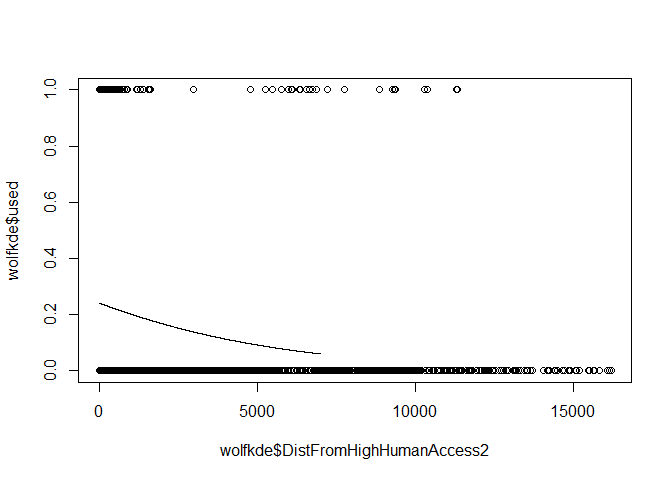<!-- -->

Now lets do the same for the Multiple Logistic regression model but now
we have 2 sets of covariates to consider, elevation and distance from
high human access.

This gives us our first problem - how do we plot the effects of
elevation on Pr(Use) at the same time as Distance to High Human Access?
This is the core assumption of the interpretation of the $\beta_e$
coefficient, where Be is the elevation coefficient - that it represents
the effects of, say, $\beta_h$ (the human access coefficient) on the
Probability of Use, holding the effects of Elevation constant at the
mean.

Thus, lets determine the ‘median’ elevation (note mean = median in a
truly normally distributed covariate).

``` r
summary(wolfkde$Elevation2)
```

    ##    Min. 1st Qu.  Median    Mean 3rd Qu.    Max. 
    ##    1401    1578    1931    1944    2246    3112

``` r
## ok - lets evaluate the probability of use at 1931 meters from the elev.disthhacc model
medianElev = 1931
prElevMedian.Disthhacc <- predict(elev.disthhacc, newdata=data.frame(DistFromHighHumanAccess2=disthumanBnp, Elevation2=medianElev), type="response")
```

Note here we have to pass covariate vectors for BOTH $\beta_e$ and
$\beta_h$ to predict() function. We pass the distance vector we created
above, but then set elevation constant at the mean elevation. Lets take
a look at the predicted probabilities from our original univariate
regression model - plotted above, and, second, the predicted
probabilities at the mean elevation from the multivariate model.

``` r
plot(wolfkde$DistFromHighHumanAccess2, wolfkde$used, xlim=(c(0,10000)))
lines(disthumanBnp, prElevMedian.Disthhacc, type="l", ylab= "Pr(Used)")
lines(disthumanBnp, prDisthhacc, type="l", ylab= "Pr(Used)")
```

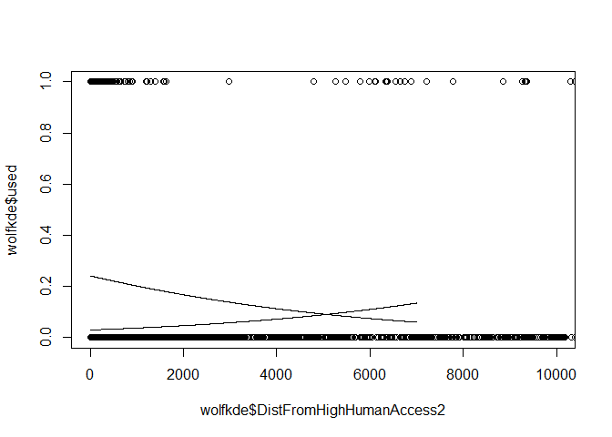<!-- -->

What is going on?? Why did the coefficient switch sign plotted at the
median elevation of 1931m?

## Partial Regression Coefficients

In multiple linear or logistic regression the B’s now change
interpretation to the effects of X2 on Y while holding effects of X1
constant at their mean.

The previous plot was only plotted for 1 level of Elevation at the
median elevation of 1931m. Lets create a new data framew with elevations
and distance to high human access varying in 10 levels using the
pretty() function `? pretty`

``` r
newdata <- expand.grid(Elevation2 = pretty(wolfkde$Elevation2, 5), DistFromHighHumanAccess2 = pretty(wolfkde$DistFromHighHumanAccess2, 10))
head(newdata)
```

    ##   Elevation2 DistFromHighHumanAccess2
    ## 1       1000                        0
    ## 2       1500                        0
    ## 3       2000                        0
    ## 4       2500                        0
    ## 5       3000                        0
    ## 6       3500                        0

``` r
newdata$prElev.Disthha <-predict(elev.disthhacc, newdata, type="response")

ggplot(newdata, aes(x = DistFromHighHumanAccess2, y = prElev.Disthha)) + geom_line() + facet_wrap(~Elevation2)
```

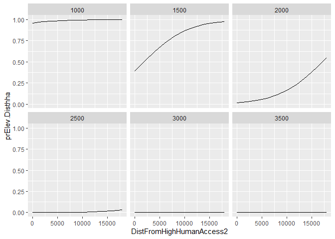<!-- -->

This plot shows the relationship between the pr(wolf) as a function of
distance from high human access across 6 different elevation bands from
1000 - 3500m. Can we hold effects of X1 (Distance from High Human
Access) constant while varying X2 (Elevation)? the answer is NO -
obviously these figures show you that the probability of a point being a
wolf used point changes as a function of both elevation and distance to
high human use. Its CHALLENGING to say the least to understand what is
going on here.

## Collinearity and Correlations

Why are Elevation and DistHighHumanUse changing? They are CORRELATED!
Lets formally test the new assumption of multiple linear regression
using Pearsons correlation test.

``` r
cor.test(wolfkde$Elevation2, wolfkde$DistFromHighHumanAccess2)
```

    ## 
    ##  Pearson's product-moment correlation
    ## 
    ## data:  wolfkde$Elevation2 and wolfkde$DistFromHighHumanAccess2
    ## t = 30.404, df = 2368, p-value < 2.2e-16
    ## alternative hypothesis: true correlation is not equal to 0
    ## 95 percent confidence interval:
    ##  0.5002857 0.5582300
    ## sample estimates:
    ##       cor 
    ## 0.5298759

We see that indeed, elevaiton and distance from high human access are
correlated very strongly, with a Pearsons correlation coefficient r =
0.529, p \<2.2e-16. Note that I put more stock in the magnitude of the
correlation coefficient, r, than the p-value here.

Second, we will fit a linear model of distance as a function of
elevation to see the regression coefficient between the two, and
finally, we will plot elevation and distance using two approaches.

``` r
elev_disthha <- lm(DistFromHighHumanAccess2~Elevation2, data=wolfkde)
summary(elev_disthha)
```

    ## 
    ## Call:
    ## lm(formula = DistFromHighHumanAccess2 ~ Elevation2, data = wolfkde)
    ## 
    ## Residuals:
    ##     Min      1Q  Median      3Q     Max 
    ## -6853.3 -1763.8  -388.8   215.3 12510.5 
    ## 
    ## Coefficients:
    ##               Estimate Std. Error t value Pr(>|t|)    
    ## (Intercept) -6305.7051   297.7015  -21.18   <2e-16 ***
    ## Elevation2      4.5579     0.1499   30.40   <2e-16 ***
    ## ---
    ## Signif. codes:  0 '***' 0.001 '**' 0.01 '*' 0.05 '.' 0.1 ' ' 1
    ## 
    ## Residual standard error: 2917 on 2368 degrees of freedom
    ##   (39 observations deleted due to missingness)
    ## Multiple R-squared:  0.2808, Adjusted R-squared:  0.2805 
    ## F-statistic: 924.4 on 1 and 2368 DF,  p-value: < 2.2e-16

``` r
plot(wolfkde$Elevation2,wolfkde$DistFromHighHumanAccess2, type="p")
abline(lm(DistFromHighHumanAccess2~Elevation2, data=wolfkde), col="red")
```

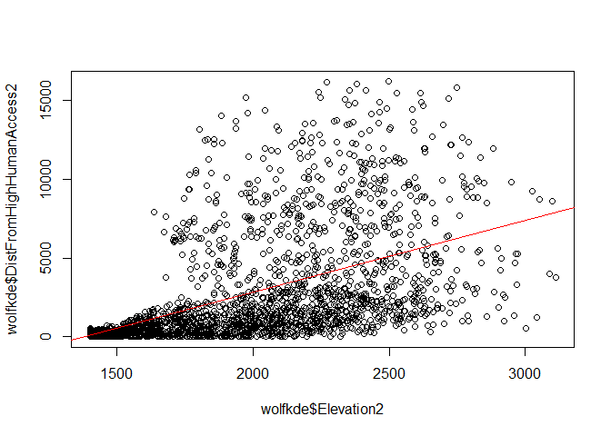<!-- --> Can we hold
effects of X1 constant while varying X1? Lets use the pairs() to
visualize the correlation with elevation as X and Y.

``` r
pairs(~Elevation2+DistFromHighHumanAccess2, data=wolfkde, main="Scatterplot Matrix")
```

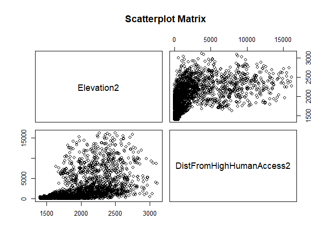<!-- --> These
analyses clearly demonstrate that elevation and distance to High Human
Access are *correlated*, i.e., there are no areas far from high human
access at LOW elevations. *Collinearity* is synonymous with a high
correlation. Collinearity is defined as the existence of a strong
correlation between two or more (when 3 or more variables are correlated
its termed multicollinearity) independent variables in a linear
regression model. The strength of the correlation makes it difficult to
disentangle the effects of the two or more variables on the dependent
variable, and violates the assumption of independent random variables
for linear models.

The Pearsons correlation coefficient was very significant, with $\rho$ =
0.53, meaning that \~ 53% of the variation in elevation was explained by
distance and vice versa. When we conducted a linear regression of the
two, we saw that for every meter further from high human access, we
increased in elevation by 4 meters on average. Also recall that the
Coefficient of Determination, $r^2$, is the $\rho$ squared.

Moreover, we have also seen that our two covariates here, elevation and
distance, are MORE than correlated - they are **confounded** in the
sense that the coefficient of distance to high human access changed
DRAMATICALLY in the presence of elevation. This is more than just a
violation of the assumptions of multiple logistic regression - it is a
result of poor experimental design, and cannot readily be remedied using
fancy statistics. **The bottom line is that we did not study wolves at
low elevations that were far from human access.** Thus we will never
really be able to make strong inferences about what wolves would do at
low elevations in the absence of human activity. We will discuss this in
class, but this is a case of confounded experimental design that all the
sophisticated statistics in the world will not resolve.

Lets examine our ‘study design’

``` r
wolfkde.Used <- subset(wolfkde, wolfkde$used==1)
wolfkde.Used$elev2F <- cut(wolfkde.Used$Elevation2, 2)
wolfkde.Used$DistFromHighHumanAccess2.2F <- cut(wolfkde.Used$DistFromHighHumanAccess2, 2)
table(wolfkde.Used$elev2F, wolfkde.Used$DistFromHighHumanAccess2.2F)
```

    ##                      
    ##                       (-11.3,5.67e+03] (5.67e+03,1.14e+04]
    ##   (1.4e+03,1.81e+03]               336                  21
    ##   (1.81e+03,2.23e+03]               29                  23

Note the 2 elevaition classes, low (1.4e+03,1.81e+03\]) and high, are
the ROWS, and the 2 distance classes are the COLUMNS (close to humans,
far from humans). What this table tells us is that most of our wolf
‘used’ locations occurs at low elevations in areas close to human access
(n=336), and that we have very few locations at high elevations, far
from humans, and the combination. This visualizes the experimental
confound that is present in our data. This question is unresolvable with
the current data.

In practice, there are few observational regression analyses in ecology
where covariates are truly not correlated at all. This is the point of a
STRONG experimental design where one isolates and controls critical
variables of interest. There are many published sets of guidelines for
how collinear is too collinear for two covariates to include in the same
models. However, the guidelines range from a $\rho$ of 0.3 - 0.7
according to various sources.

The key reason why there is no hard and fast guidelines for a threshold
that is set and stone for collinearity is because collinearity is really
a sign of the bigger experimental and statistical design flaw,
confounding.

## Confounding

Lets revisit the coefficents again to discuss confounding. First,
confounding is NOT just collinearity, it is a matter of causation. From
Wikipedia, we see [Definition of
Confounding](https://en.wikipedia.org/wiki/Confounding).

In statistics, a confounder (also confounding variable, confounding
factor, or lurking variable) is a variable that influences both the
dependent variable and independent variable causing a spurious
association. Confounding is a causal concept, and as such, cannot be
described in terms of correlations or associations

The best available defense against the possibility of spurious results
due to confounding is *experimental design* . For example, through
stratification of sampling effort, proper randomization of samples,
large enough samples, etc. The goal of the principles of proper
experimental design are to ensure that all potential confounding
variables (known and unknown) will be distributed by chance across all
study groups and hence will be uncorrelated with the binary variable for
inclusion/exclusion in any group.

``` r
summary(elev)$coefficients[,1:2]
```

    ##                 Estimate   Std. Error
    ## (Intercept)  7.866205928 0.4888041831
    ## Elevation2  -0.005455301 0.0003038507

``` r
summary(disthhacc)$coefficients[,1:2]
```

    ##                               Estimate   Std. Error
    ## (Intercept)              -1.1458898955 6.659037e-02
    ## DistFromHighHumanAccess2 -0.0002289669 2.828194e-05

``` r
summary(elev.disthhacc)$coefficients[,1:2]
```

    ##                             Estimate   Std. Error
    ## (Intercept)              10.18959176 6.514719e-01
    ## Elevation2               -0.00707877 4.256818e-04
    ## DistFromHighHumanAccess2  0.00023174 3.063027e-05

We note that the sign for Elevation is quite stable when alone and when
in the presence of distance to high human access. Alone, it is -0.0055,
together, it is -0.0071. This is a magnitude of change of about 27% from
alone to when in a multiple logistic model.

Conversely, the coefficient for distance varies dramatically from
-0.0002 when alone in a univariate model, to 0.00023 when in the
presence of elevation. This is a change of - 115%, a complete sign flip
in the opposite direction. The coefficient for elevation is what I call
a *stable* coefficient. In contrast, the coefficient for distance is
*unstable* when in the presence of other covariates. This is a sign of
both collinearity and confounding, and points to the experimental design
challenge of being able to say anything about distance to high human
access.

Hosmer and Lemeshow discuss guidelines for confounding in Medical
Statistics. Their guidelines are to be alarmed by changes of
coefficients that are \> and absolute value of 20% when in the presence
of multiple variables. This is an astonishingly stringent guideline for
almost all regression analyses I have ever seen in ecology! 20% is a
great target, but in practice, I have seen 50% and even sign flipping as
the major criteria for ecological studies. The latter, especially, is
problematic as in our case of elevation and distance.

With this background, lets continue to investigate and screen for
multi-collinearity (many cases of correlations between 2 variables) in
our wolfkde dataframe. Lets next test 2 other variables, elk and deer…

``` r
## lets test 2 other variables, elk and deer...
deer <- glm(used~deer_w2, data =wolfkde, family= binomial(logit))
elk <-  glm(used~elk_w2, data =wolfkde, family= binomial(logit))

# Next, fit both in our first multiple logistic regression model
deer.elk <- glm(used~deer_w2 + elk_w2, data =wolfkde, family= binomial(logit))

# now lets extract coefficients
summary(deer)$coefficients[,1:2]
```

    ##              Estimate Std. Error
    ## (Intercept) -5.932341 0.30658301
    ## deer_w2      1.117935 0.06934898

``` r
summary(elk)$coefficients[,1:2]
```

    ##              Estimate Std. Error
    ## (Intercept) -5.883763 0.30283606
    ## elk_w2       1.122130 0.06991732

``` r
summary(deer.elk)$coefficients[,1:2]
```

    ##               Estimate Std. Error
    ## (Intercept) -6.9775171 0.36903412
    ## deer_w2      0.7469043 0.08686179
    ## elk_w2       0.6337477 0.08998392

Note this time the sign’s didn’t flip, but, they significantly changed,
weakening in the presence of each other. The coefficient for deer was
1.17 alone, 0.74 together, a 36% change! For elk, it was 1.12 alone,
0.633 together, representing a 44% change. Both are dramatic changes,
suggestive of a correlation. Which we confirm:

``` r
cor.test(wolfkde$deer_w2, wolfkde$elk_w2)
```

    ## 
    ##  Pearson's product-moment correlation
    ## 
    ## data:  wolfkde$deer_w2 and wolfkde$elk_w2
    ## t = 78.712, df = 2155, p-value < 2.2e-16
    ## alternative hypothesis: true correlation is not equal to 0
    ## 95 percent confidence interval:
    ##  0.8500532 0.8718655
    ## sample estimates:
    ##       cor 
    ## 0.8613558

``` r
plot(wolfkde$deer_w2,wolfkde$elk_w2, type="p")
abline(lm(elk_w2~deer_w2, data=wolfkde), col="red")
```

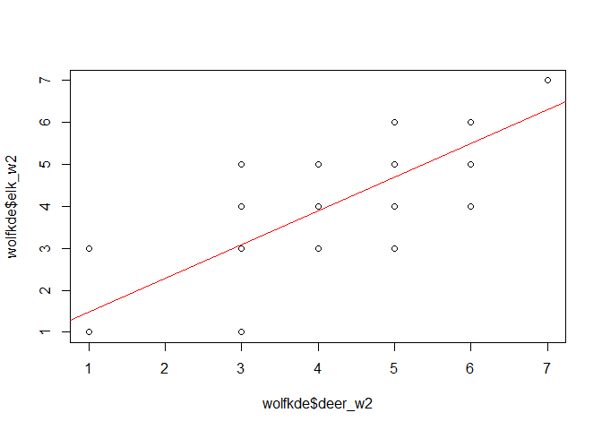<!-- --> We confirm
that the deer H.S.I. and elk H.S.I. scores are correlated with a $\rho$
= 0.86, representing essentially the exact same variable. But doing
these collinearity screens one at a time is very tedious. In the next
section we will advance to checking all covariates in a dataset at the
same time.

# Screening for Collinearity

There are no firm guidelines for how to detect collinearity, and in
today’s lab we will explore some of the following approaches;

1)  Screening for collinearity by examining correlations and
    scatterplots between variables to identify potential confounded
    variables. Guidelines for excluding correlated variables are not
    firm, and range between r=0.3 to 0.7 (Prairie and Bird 1989, Hosmer
    and Lemeshow 2000,Menard 2002). This ‘range’ of guidelines is
    because what is most important to avoid is the problem identified in
    the next point.

2)  Perhaps the most straightforward approach is to look for dramatic
    changes in the regression coefficients when a predictor variable is
    added or deleted. This is known as statistical confounding when two
    covariates are correlated strongly with each other to the point
    where you can’t separate out their effects on a dependent variable.

3)  Estimated regression coefficients have the opposite sign to that
    predicted based on univariate analyses.

4)  Formal detection using variance inflation factors (VIF) based on the
    tolerance score – which is calculated defined as 1 / (1- R2j) where
    R2j is the multiple correlation coefficient.

## Continuous variables

Lets continue plotting pairwise correlations one at a time.

``` r
plot(wolfkde$Elevation2 ,wolfkde$goat_w2, type="p")
abline(lm(goat_w2~Elevation2, data=wolfkde), col="red")
```

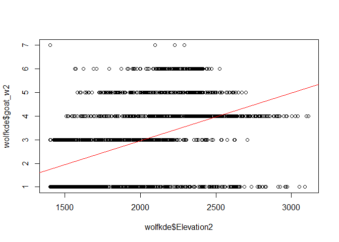<!-- -->

``` r
## graphically examining collinearity
```

perhaps unsurprisingly, elevaiton is going to be strongly correlated
wtih the prey variables, both negatively as here for goat, and
positively for things like deer and elk.

## Scatterplot Matrices

Next we will explore different ways of plotting multicollinearity using
multiple variables at once. First, we will use the methods pairs() in
the base package

``` r
pairs(~Elevation2+DistFromHumanAccess2+DistFromHighHumanAccess2, data=wolfkde, main="Scatterplot Matrix")
```

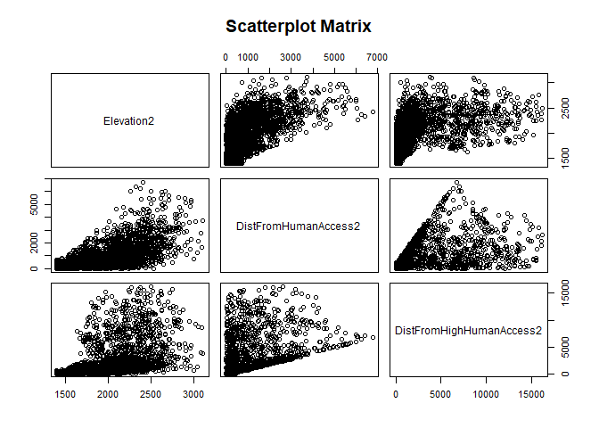<!-- -->

``` r
pairs(~deer_w2+moose_w2+elk_w2+sheep_w2+goat_w2+Elevation2, data=wolfkde, main="Scatterplot Matrix")
```

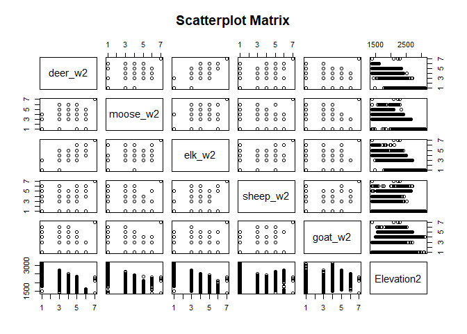<!-- --> Here again
we see the now familiar wedge shaped, triangular distribution that is
indicative of our poor experimental design again with respect to the
sampling of wolf territories across an elevation and distance from human
gradient.

The prey model is a bit tougher to interpret because of the integer
values of the prey HSI values.

### ScatterplotMatrix from Library car

Next, we will use the scatterplotMatrix() function from the Car Library.
This is a bit more graphically pleasing and overlays the linear model
fit and 95% CI as well on continuous variables.

``` r
## using car library
scatterplotMatrix(~deer_w2+moose_w2+elk_w2+sheep_w2+goat_w2+Elevation2, data=wolfkde, main="Scatterplot Matrix")
```

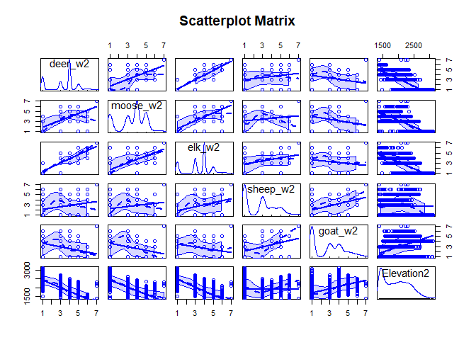<!-- -->

``` r
scatterplotMatrix(~Elevation2+DistFromHumanAccess2+DistFromHighHumanAccess2, data=wolfkde, main="Scatterplot Matrix")
```

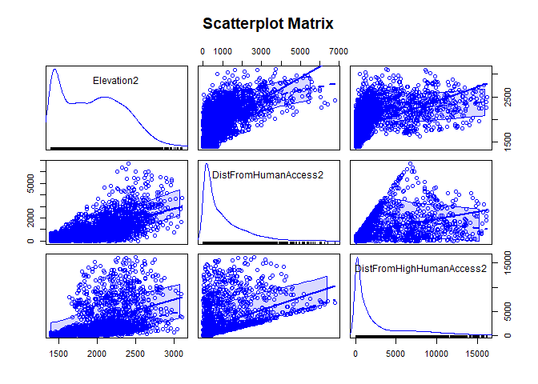<!-- -->

``` r
scatterplotMatrix(~deer_w2+moose_w2+elk_w2+sheep_w2+goat_w2+Elevation2+DistFromHumanAccess2+DistFromHighHumanAccess2, data=wolfkde, main="Scatterplot Matrix")
```

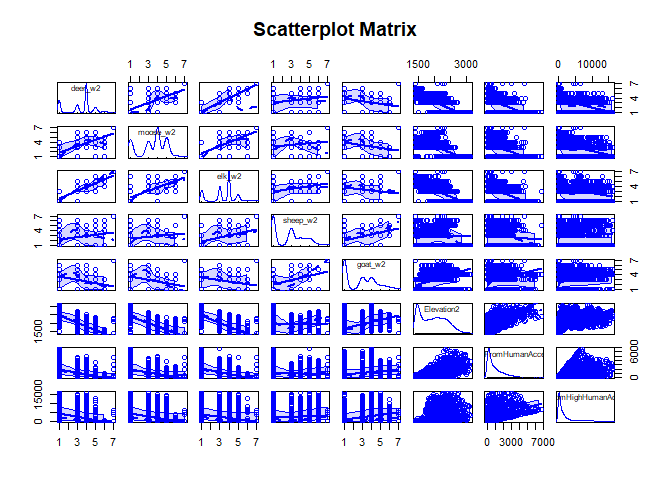<!-- -->

### Using Library corrgram

This makes a scatterplot matrix with the upper panel defined as the
Pearsons correlation coefficient expressed in Pie graph form (where r =
1.0), red = negative correlation and blue equals a positive correlation.
Similarly, the bottom panel displays the strength of the correlation in
shaded color.

In the next two plots I vary the options for the upper and lower panel
to variously display the data and linear fit on the bottom panel, and,
the 95% ellipse of the correlation coefficient in the bottom.

Find out more here:

    ?corrgram()

``` r
corrgram(wolfkde[1:9], order=TRUE, lower.panel=panel.shade,
         upper.panel=panel.pie, text.panel=panel.txt,
         main="Correlations in the Wolf Data")
```

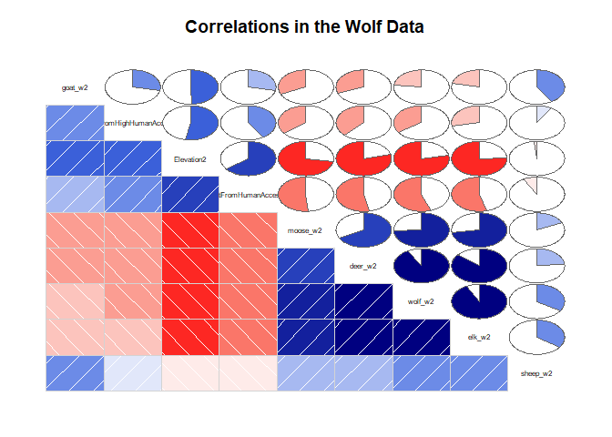<!-- -->

``` r
corrgram(wolfkde[1:9], order=TRUE, lower.panel=panel.pts,
         upper.panel=panel.pie, text.panel=panel.txt,
         main="Correlations in the Wolf Data")
```

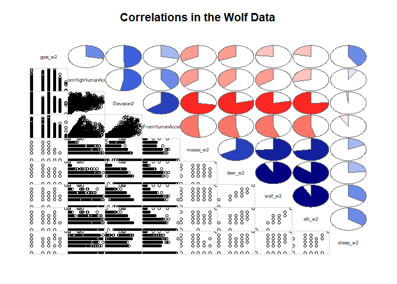<!-- -->

``` r
corrgram(wolfkde[1:9], order=TRUE, lower.panel=panel.ellipse,
         upper.panel=panel.pie, text.panel=panel.txt,
         main="Correlations in the Wolf Data")
```

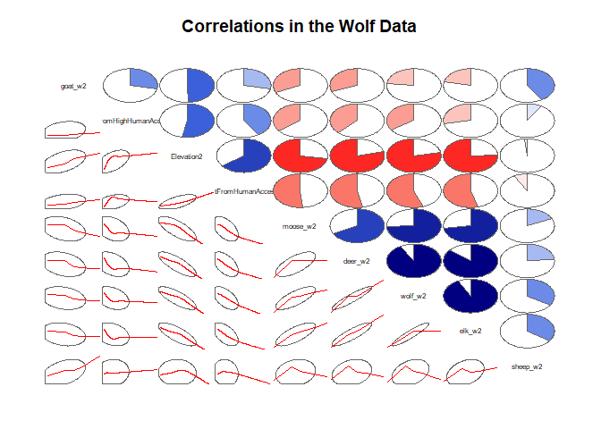<!-- -->

### ggcorr

Note there are a billion ways to explore scatter plot matrices
<https://www.r-bloggers.com/multiple-regression-lines-in-ggpairs/>

and in R Graphics Cookbook Section 5.13.

``` r
## using the ggcorr package
ggcorrplot <- ggcorr(wolfkde[1:9], label = TRUE)
ggcorrplot
```

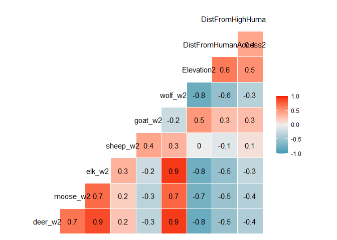<!-- -->

``` r
## GGally package with ggpairs()
ggpairplot<-ggpairs(wolfkde[1:9])
ggpairplot
```

    ## Warning: Removed 252 rows containing non-finite values (`stat_density()`).

    ## Warning in ggally_statistic(data = data, mapping = mapping, na.rm = na.rm, :
    ## Removed 252 rows containing missing values

    ## Warning in ggally_statistic(data = data, mapping = mapping, na.rm = na.rm, :
    ## Removed 252 rows containing missing values

    ## Warning in ggally_statistic(data = data, mapping = mapping, na.rm = na.rm, :
    ## Removed 252 rows containing missing values

    ## Warning in ggally_statistic(data = data, mapping = mapping, na.rm = na.rm, :
    ## Removed 252 rows containing missing values

    ## Warning in ggally_statistic(data = data, mapping = mapping, na.rm = na.rm, :
    ## Removed 252 rows containing missing values

    ## Warning in ggally_statistic(data = data, mapping = mapping, na.rm = na.rm, :
    ## Removed 252 rows containing missing values

    ## Warning in ggally_statistic(data = data, mapping = mapping, na.rm = na.rm, :
    ## Removed 291 rows containing missing values

    ## Warning in ggally_statistic(data = data, mapping = mapping, na.rm = na.rm, :
    ## Removed 291 rows containing missing values

    ## Warning: Removed 252 rows containing missing values (`geom_point()`).

    ## Warning: Removed 252 rows containing non-finite values (`stat_density()`).

    ## Warning in ggally_statistic(data = data, mapping = mapping, na.rm = na.rm, :
    ## Removed 252 rows containing missing values

    ## Warning in ggally_statistic(data = data, mapping = mapping, na.rm = na.rm, :
    ## Removed 252 rows containing missing values

    ## Warning in ggally_statistic(data = data, mapping = mapping, na.rm = na.rm, :
    ## Removed 252 rows containing missing values

    ## Warning in ggally_statistic(data = data, mapping = mapping, na.rm = na.rm, :
    ## Removed 252 rows containing missing values

    ## Warning in ggally_statistic(data = data, mapping = mapping, na.rm = na.rm, :
    ## Removed 252 rows containing missing values

    ## Warning in ggally_statistic(data = data, mapping = mapping, na.rm = na.rm, :
    ## Removed 291 rows containing missing values

    ## Warning in ggally_statistic(data = data, mapping = mapping, na.rm = na.rm, :
    ## Removed 291 rows containing missing values

    ## Warning: Removed 252 rows containing missing values (`geom_point()`).
    ## Removed 252 rows containing missing values (`geom_point()`).

    ## Warning: Removed 252 rows containing non-finite values (`stat_density()`).

    ## Warning in ggally_statistic(data = data, mapping = mapping, na.rm = na.rm, :
    ## Removed 252 rows containing missing values

    ## Warning in ggally_statistic(data = data, mapping = mapping, na.rm = na.rm, :
    ## Removed 252 rows containing missing values

    ## Warning in ggally_statistic(data = data, mapping = mapping, na.rm = na.rm, :
    ## Removed 252 rows containing missing values

    ## Warning in ggally_statistic(data = data, mapping = mapping, na.rm = na.rm, :
    ## Removed 252 rows containing missing values

    ## Warning in ggally_statistic(data = data, mapping = mapping, na.rm = na.rm, :
    ## Removed 291 rows containing missing values

    ## Warning in ggally_statistic(data = data, mapping = mapping, na.rm = na.rm, :
    ## Removed 291 rows containing missing values

    ## Warning: Removed 252 rows containing missing values (`geom_point()`).
    ## Removed 252 rows containing missing values (`geom_point()`).
    ## Removed 252 rows containing missing values (`geom_point()`).

    ## Warning: Removed 252 rows containing non-finite values (`stat_density()`).

    ## Warning in ggally_statistic(data = data, mapping = mapping, na.rm = na.rm, :
    ## Removed 252 rows containing missing values

    ## Warning in ggally_statistic(data = data, mapping = mapping, na.rm = na.rm, :
    ## Removed 252 rows containing missing values

    ## Warning in ggally_statistic(data = data, mapping = mapping, na.rm = na.rm, :
    ## Removed 252 rows containing missing values

    ## Warning in ggally_statistic(data = data, mapping = mapping, na.rm = na.rm, :
    ## Removed 291 rows containing missing values

    ## Warning in ggally_statistic(data = data, mapping = mapping, na.rm = na.rm, :
    ## Removed 291 rows containing missing values

    ## Warning: Removed 252 rows containing missing values (`geom_point()`).
    ## Removed 252 rows containing missing values (`geom_point()`).
    ## Removed 252 rows containing missing values (`geom_point()`).
    ## Removed 252 rows containing missing values (`geom_point()`).

    ## Warning: Removed 252 rows containing non-finite values (`stat_density()`).

    ## Warning in ggally_statistic(data = data, mapping = mapping, na.rm = na.rm, :
    ## Removed 252 rows containing missing values

    ## Warning in ggally_statistic(data = data, mapping = mapping, na.rm = na.rm, :
    ## Removed 252 rows containing missing values

    ## Warning in ggally_statistic(data = data, mapping = mapping, na.rm = na.rm, :
    ## Removed 291 rows containing missing values

    ## Warning in ggally_statistic(data = data, mapping = mapping, na.rm = na.rm, :
    ## Removed 291 rows containing missing values

    ## Warning: Removed 252 rows containing missing values (`geom_point()`).
    ## Removed 252 rows containing missing values (`geom_point()`).
    ## Removed 252 rows containing missing values (`geom_point()`).
    ## Removed 252 rows containing missing values (`geom_point()`).
    ## Removed 252 rows containing missing values (`geom_point()`).

    ## Warning: Removed 252 rows containing non-finite values (`stat_density()`).

    ## Warning in ggally_statistic(data = data, mapping = mapping, na.rm = na.rm, :
    ## Removed 252 rows containing missing values

    ## Warning in ggally_statistic(data = data, mapping = mapping, na.rm = na.rm, :
    ## Removed 291 rows containing missing values

    ## Warning in ggally_statistic(data = data, mapping = mapping, na.rm = na.rm, :
    ## Removed 291 rows containing missing values

    ## Warning: Removed 252 rows containing missing values (`geom_point()`).
    ## Removed 252 rows containing missing values (`geom_point()`).
    ## Removed 252 rows containing missing values (`geom_point()`).
    ## Removed 252 rows containing missing values (`geom_point()`).
    ## Removed 252 rows containing missing values (`geom_point()`).
    ## Removed 252 rows containing missing values (`geom_point()`).

    ## Warning in ggally_statistic(data = data, mapping = mapping, na.rm = na.rm, :
    ## Removed 39 rows containing missing values

    ## Warning in ggally_statistic(data = data, mapping = mapping, na.rm = na.rm, :
    ## Removed 39 rows containing missing values

    ## Warning: Removed 291 rows containing missing values (`geom_point()`).
    ## Removed 291 rows containing missing values (`geom_point()`).
    ## Removed 291 rows containing missing values (`geom_point()`).
    ## Removed 291 rows containing missing values (`geom_point()`).
    ## Removed 291 rows containing missing values (`geom_point()`).
    ## Removed 291 rows containing missing values (`geom_point()`).

    ## Warning: Removed 39 rows containing missing values (`geom_point()`).

    ## Warning: Removed 39 rows containing non-finite values (`stat_density()`).

    ## Warning in ggally_statistic(data = data, mapping = mapping, na.rm = na.rm, :
    ## Removed 39 rows containing missing values

    ## Warning: Removed 291 rows containing missing values (`geom_point()`).
    ## Removed 291 rows containing missing values (`geom_point()`).
    ## Removed 291 rows containing missing values (`geom_point()`).
    ## Removed 291 rows containing missing values (`geom_point()`).
    ## Removed 291 rows containing missing values (`geom_point()`).
    ## Removed 291 rows containing missing values (`geom_point()`).

    ## Warning: Removed 39 rows containing missing values (`geom_point()`).
    ## Removed 39 rows containing missing values (`geom_point()`).

    ## Warning: Removed 39 rows containing non-finite values (`stat_density()`).

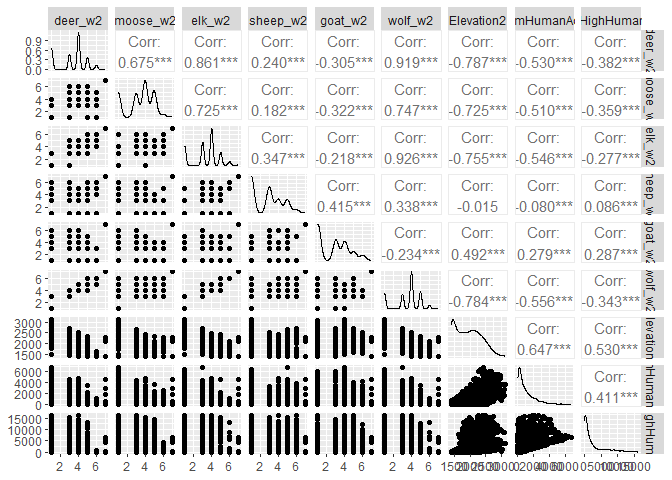<!-- -->

### Multicollinearity Function

Here is a simple function for calculating correlations and
probabilities,
<https://stat.ethz.ch/pipermail/r-help/2001-November/016201.html>
Correlations appear below the diagonal and significance probabilities
above the diagonal

``` r
cor.prob <- function(X, dfr = nrow(X) - 2) {
  R <- cor(X, use="complete.obs")
  above <- row(R) < col(R)
  r2 <- R[above]^2
  Fstat <- r2 * dfr / (1 - r2)
  R[above] <- 1 - pf(Fstat, 1, dfr)
  R
}

cor.prob(as.matrix(wolfkde[,c("deer_w2","elk_w2", "moose_w2", "sheep_w2", "goat_w2", "Elevation2", "DistFromHumanAccess2", "DistFromHighHumanAccess2")]))
```

    ##                             deer_w2     elk_w2   moose_w2    sheep_w2   goat_w2
    ## deer_w2                   1.0000000  0.0000000  0.0000000  0.00000000 0.0000000
    ## elk_w2                    0.8626931  1.0000000  0.0000000  0.00000000 0.0000000
    ## moose_w2                  0.6744718  0.7261029  1.0000000  0.00000000 0.0000000
    ## sheep_w2                  0.2342658  0.3433162  0.1775864  1.00000000 0.0000000
    ## goat_w2                  -0.3080804 -0.2191919 -0.3223450  0.41414693 1.0000000
    ## Elevation2               -0.7884382 -0.7562834 -0.7246609 -0.01123869 0.4949585
    ## DistFromHumanAccess2     -0.5299680 -0.5462672 -0.5104927 -0.08041229 0.2787289
    ## DistFromHighHumanAccess2 -0.3823739 -0.2771004 -0.3593654  0.08629733 0.2867019
    ##                          Elevation2 DistFromHumanAccess2
    ## deer_w2                   0.0000000         0.000000e+00
    ## elk_w2                    0.0000000         0.000000e+00
    ## moose_w2                  0.0000000         0.000000e+00
    ## sheep_w2                  0.5813983         7.778882e-05
    ## goat_w2                   0.0000000         0.000000e+00
    ## Elevation2                1.0000000         0.000000e+00
    ## DistFromHumanAccess2      0.6622517         1.000000e+00
    ## DistFromHighHumanAccess2  0.5298149         4.295220e-01
    ##                          DistFromHighHumanAccess2
    ## deer_w2                              0.000000e+00
    ## elk_w2                               0.000000e+00
    ## moose_w2                             0.000000e+00
    ## sheep_w2                             2.222056e-05
    ## goat_w2                              0.000000e+00
    ## Elevation2                           0.000000e+00
    ## DistFromHumanAccess2                 0.000000e+00
    ## DistFromHighHumanAccess2             1.000000e+00

Next, lets modify the function to add \*’s for P=0.05 significant
correlations try this

``` r
cor.prob2 <- function(X, dfr = nrow(X) - 2) {
  R <- cor(X, use="complete.obs")
  above <- row(R) < col(R)
  r2 <- R[above]^2
  Fstat <- r2 * dfr / (1 - r2)
  R[above] <- 1 - pf(Fstat, 1, dfr)
  Rstar = ifelse(R[above]<0.05, "***", "NS")
  R[above]=paste(R[above],Rstar)
  R
}

cor.prob2(as.matrix(wolfkde[,c("deer_w2","elk_w2", "moose_w2", "sheep_w2", "goat_w2", "Elevation2", "DistFromHumanAccess2", "DistFromHighHumanAccess2")]))
```

    ##                          deer_w2              elk_w2              
    ## deer_w2                  "1"                  "0 ***"             
    ## elk_w2                   "0.862693127598712"  "1"                 
    ## moose_w2                 "0.674471775950577"  "0.726102871977064" 
    ## sheep_w2                 "0.234265793522001"  "0.343316157179214" 
    ## goat_w2                  "-0.308080392316883" "-0.219191863521459"
    ## Elevation2               "-0.788438190137434" "-0.756283409908158"
    ## DistFromHumanAccess2     "-0.529967964874404" "-0.546267213934725"
    ## DistFromHighHumanAccess2 "-0.3823738562015"   "-0.277100413472897"
    ##                          moose_w2             sheep_w2             
    ## deer_w2                  "0 ***"              "0 ***"              
    ## elk_w2                   "0 ***"              "0 ***"              
    ## moose_w2                 "1"                  "0 ***"              
    ## sheep_w2                 "0.177586400300924"  "1"                  
    ## goat_w2                  "-0.322344982053384" "0.414146928729061"  
    ## Elevation2               "-0.724660907098854" "-0.0112386851028276"
    ## DistFromHumanAccess2     "-0.510492710064905" "-0.0804122947181291"
    ## DistFromHighHumanAccess2 "-0.359365385166628" "0.0862973269530151" 
    ##                          goat_w2             Elevation2            
    ## deer_w2                  "0 ***"             "0 ***"               
    ## elk_w2                   "0 ***"             "0 ***"               
    ## moose_w2                 "0 ***"             "0 ***"               
    ## sheep_w2                 "0 ***"             "0.581398314050348 NS"
    ## goat_w2                  "1"                 "0 ***"               
    ## Elevation2               "0.494958474815303" "1"                   
    ## DistFromHumanAccess2     "0.278728941569084" "0.662251706406083"   
    ## DistFromHighHumanAccess2 "0.286701871855566" "0.529814916784233"   
    ##                          DistFromHumanAccess2       DistFromHighHumanAccess2  
    ## deer_w2                  "0 ***"                    "0 ***"                   
    ## elk_w2                   "0 ***"                    "0 ***"                   
    ## moose_w2                 "0 ***"                    "0 ***"                   
    ## sheep_w2                 "7.77888244085645e-05 ***" "2.22205557801614e-05 ***"
    ## goat_w2                  "0 ***"                    "0 ***"                   
    ## Elevation2               "0 ***"                    "0 ***"                   
    ## DistFromHumanAccess2     "1"                        "0 ***"                   
    ## DistFromHighHumanAccess2 "0.429522031098444"        "1"

So which covariates have the highest correlations?? Deer, Elk, and Moose
all have correlation coefficients \> 0.65; Sheep and Goats are
correlated \> 0.4; elevation is inversely correlated with an R of -0.75
with deer, elk , moose

### Variance Inflation Factors

NExt we will learn about how to screen for multicollinearity using
Variance Inflation Factors. The problem with including say, deer and elk
in the same model is that they are so highly correlated that

One definition for VIF is the variance inflation factor (VIF) is the
ratio of variance in a multiple linear model , divided by the variance
of a model with one term alone (univariate model). It provides an index
that measures how much the variance (the square of the estimate’s
standard deviation) of an estimated regression coefficient is increased
because of collinearity.

[Wikipedia on Variance Inflation
Factors](https://en.wikipedia.org/wiki/Variance_inflation_factor)

A tolerance of less than 0.1, or a VIF \> 10 indicates a
multicollinearity problem in simple linear regression. If Rj equals zero
(i.e., no correlation between Xj and the remaining independent
variables), then VIFj equals 1. This is the minimum value. Neter et
al. (1996) and ( McCullough and Nelder 1989) recommend looking at the
largest VIF value. A value greater than 10 is an indication of potential
multi-collinearity problems. As a rough guideline, values between 1 and
2 are not a major problem, but values approaching 10 should cause
concern.

Learn more about vif’s in R.

    ?vif()

The square root of the variance inflation factor indicates how much
larger the variance is, compared with what it would be if that variable
were uncorrelated with the other predictor variables in the model. If
the variance inflation factor of a predictor variable were 5.27 (√5.27 =
2.3) this means that the standard deviation for the coefficient of that
predictor variable is 2.3 times as large as it would be if that
predictor variable were uncorrelated with the other predictor variables.
The definition of ‘high’ is somewhat arbitrary but values in the range
of 5-10 are commonly used. So in this case, we are really concerned with
Elevation.

``` r
full.model = glm(used~deer_w2 + elk_w2 +moose_w2 +sheep_w2+goat_w2+Elevation2+DistFromHumanAccess2+DistFromHighHumanAccess2, data =wolfkde, family= binomial(logit))
summary(full.model)
```

    ## 
    ## Call:
    ## glm(formula = used ~ deer_w2 + elk_w2 + moose_w2 + sheep_w2 + 
    ##     goat_w2 + Elevation2 + DistFromHumanAccess2 + DistFromHighHumanAccess2, 
    ##     family = binomial(logit), data = wolfkde)
    ## 
    ## Deviance Residuals: 
    ##     Min       1Q   Median       3Q      Max  
    ## -1.9200  -0.4636  -0.1536  -0.0378   3.2277  
    ## 
    ## Coefficients:
    ##                            Estimate Std. Error z value Pr(>|z|)    
    ## (Intercept)               6.418e+00  1.349e+00   4.759 1.95e-06 ***
    ## deer_w2                   1.859e-01  1.169e-01   1.590 0.111758    
    ## elk_w2                    4.677e-01  1.249e-01   3.744 0.000181 ***
    ## moose_w2                 -4.129e-01  9.038e-02  -4.568 4.91e-06 ***
    ## sheep_w2                 -1.015e-01  5.464e-02  -1.857 0.063244 .  
    ## goat_w2                  -1.800e-01  5.987e-02  -3.006 0.002647 ** 
    ## Elevation2               -4.746e-03  6.207e-04  -7.646 2.08e-14 ***
    ## DistFromHumanAccess2     -6.667e-04  1.988e-04  -3.354 0.000796 ***
    ## DistFromHighHumanAccess2  1.850e-04  3.443e-05   5.372 7.78e-08 ***
    ## ---
    ## Signif. codes:  0 '***' 0.001 '**' 0.01 '*' 0.05 '.' 0.1 ' ' 1
    ## 
    ## (Dispersion parameter for binomial family taken to be 1)
    ## 
    ##     Null deviance: 2040.9  on 2117  degrees of freedom
    ## Residual deviance: 1271.7  on 2109  degrees of freedom
    ##   (291 observations deleted due to missingness)
    ## AIC: 1289.7
    ## 
    ## Number of Fisher Scoring iterations: 7

``` r
vif(full.model)
```

    ##                  deer_w2                   elk_w2                 moose_w2 
    ##                 2.246567                 2.300770                 1.466803 
    ##                 sheep_w2                  goat_w2               Elevation2 
    ##                 1.244975                 1.398556                 3.696289 
    ##     DistFromHumanAccess2 DistFromHighHumanAccess2 
    ##                 1.280759                 2.069548

Here we see that elevation has the highest VIF of \~ 3.7. While below
the arbitrary threshold of 5, remember all this measures is
collinearity, NOT confounding. But in the final model, sheep nor deer
are significant any more, but they probably shouldnt have been in the
model in the first place

## Collinearity amongst Categorical Variables

So far, we have considered collinearity of only continuous variables.
Categorical variables can also be collinear, and, often, confounded with
continuous variables. Next, we will asses collinearity of continuous and
categorical variables

``` r
cor.test(wolfkde$alpine, wolfkde$Elevation2)
```

    ## 
    ##  Pearson's product-moment correlation
    ## 
    ## data:  wolfkde$alpine and wolfkde$Elevation2
    ## t = 9.133, df = 2407, p-value < 2.2e-16
    ## alternative hypothesis: true correlation is not equal to 0
    ## 95 percent confidence interval:
    ##  0.1441284 0.2213302
    ## sample estimates:
    ##       cor 
    ## 0.1830114

``` r
cor.test(wolfkde$burn, wolfkde$Elevation2)
```

    ## 
    ##  Pearson's product-moment correlation
    ## 
    ## data:  wolfkde$burn and wolfkde$Elevation2
    ## t = -4.1959, df = 2407, p-value = 2.817e-05
    ## alternative hypothesis: true correlation is not equal to 0
    ## 95 percent confidence interval:
    ##  -0.12472393 -0.04543012
    ## sample estimates:
    ##         cor 
    ## -0.08521194

``` r
cor.test(wolfkde$closedConif, wolfkde$Elevation2)
```

    ## 
    ##  Pearson's product-moment correlation
    ## 
    ## data:  wolfkde$closedConif and wolfkde$Elevation2
    ## t = -8.863, df = 2407, p-value < 2.2e-16
    ## alternative hypothesis: true correlation is not equal to 0
    ## 95 percent confidence interval:
    ##  -0.2161762 -0.1388237
    ## sample estimates:
    ##        cor 
    ## -0.1777745

``` r
cor.test(wolfkde$herb, wolfkde$Elevation2)
```

    ## 
    ##  Pearson's product-moment correlation
    ## 
    ## data:  wolfkde$herb and wolfkde$Elevation2
    ## t = -4.0152, df = 2407, p-value = 6.121e-05
    ## alternative hypothesis: true correlation is not equal to 0
    ## 95 percent confidence interval:
    ##  -0.12111019 -0.04176791
    ## sample estimates:
    ##         cor 
    ## -0.08156828

``` r
cor.test(wolfkde$goat_w2, wolfkde$Elevation2)
```

    ## 
    ##  Pearson's product-moment correlation
    ## 
    ## data:  wolfkde$goat_w2 and wolfkde$Elevation2
    ## t = 26.267, df = 2155, p-value < 2.2e-16
    ## alternative hypothesis: true correlation is not equal to 0
    ## 95 percent confidence interval:
    ##  0.4598180 0.5237848
    ## sample estimates:
    ##       cor 
    ## 0.4924662

This confirms, rather unsurprisingly, that we probably should not
consider goat and elevation in the same model. But elevaiton and other
categorical variables are not that badly correlated, with r \<\< 0.2 in
most cases. Lets continue.

Lets do all variables, continuous and categorical together.

``` r
cor.prob(as.matrix(wolfkde[,c("Elevation2", "DistFromHumanAccess2", "openConif", "closedConif", "modConif", "burn", "herb", "decid", "burn", "alpine")]))
```

    ##                       Elevation2 DistFromHumanAccess2     openConif
    ## Elevation2            1.00000000           0.00000000  8.021298e-05
    ## DistFromHumanAccess2  0.64732298           1.00000000  9.521703e-04
    ## openConif            -0.08026320          -0.06728107  1.000000e+00
    ## closedConif          -0.17650604          -0.09227233 -1.198039e-01
    ## modConif             -0.39820036          -0.26391952 -1.588049e-01
    ## burn                 -0.08603154          -0.09427014 -4.570670e-02
    ## herb                 -0.08229087          -0.06408666 -3.732384e-02
    ## decid                -0.04838043          -0.01801220 -8.541525e-03
    ## burn.1               -0.08603154          -0.09427014 -4.570670e-02
    ## alpine                0.18355101           0.05107017 -4.794270e-02
    ##                        closedConif      modConif          burn          herb
    ## Elevation2            0.000000e+00  0.000000e+00  2.355556e-05  5.260796e-05
    ## DistFromHumanAccess2  5.727688e-06  0.000000e+00  3.571979e-06  1.649118e-03
    ## openConif             3.671231e-09  4.440892e-15  2.487332e-02  6.701109e-02
    ## closedConif           1.000000e+00  0.000000e+00  2.908779e-06  1.353882e-04
    ## modConif             -3.305117e-01  1.000000e+00  5.281513e-10  4.090980e-07
    ## burn                 -9.512680e-02 -1.260944e-01  1.000000e+00  1.459071e-01
    ## herb                 -7.768000e-02 -1.029680e-01 -2.963591e-02  1.000000e+00
    ## decid                -1.777700e-02 -2.356413e-02 -6.782151e-03 -5.538266e-03
    ## burn.1               -9.512680e-02 -1.260944e-01  1.000000e+00 -2.963591e-02
    ## alpine               -9.978045e-02 -1.322630e-01 -3.806751e-02 -3.108572e-02
    ##                             decid        burn.1       alpine
    ## Elevation2            0.017561070  2.355556e-05 0.000000e+00
    ## DistFromHumanAccess2  0.376868968  3.571979e-06 1.217818e-02
    ## openConif             0.675200435  2.487332e-02 1.861089e-02
    ## closedConif           0.383132606  2.908779e-06 9.243828e-07
    ## modConif              0.247630094  5.281513e-10 7.174794e-11
    ## burn                  0.739353466  0.000000e+00 6.174528e-02
    ## herb                  0.785862099  1.459071e-01 1.271812e-01
    ## decid                 1.000000000  7.393535e-01 7.270995e-01
    ## burn.1               -0.006782151  1.000000e+00 6.174528e-02
    ## alpine               -0.007113937 -3.806751e-02 1.000000e+00

Lots to digest here, but we screen for big numbers and see that there
are a few areas to be concerned with between our 2 continuous covaraites
and some of the landcover categories.

Lets plot the correlations between Elevation \[7\] and landcover types
\[18:29\]

``` r
corrgram(wolfkde[c(7, 18:29)], order=TRUE, lower.panel=panel.fill,
         upper.panel=panel.pie, text.panel=panel.txt,
         main="Landcover Correlations with Elevation")
```

<!-- --> So nothing
too egregious except, unsurprisingly, Rock and Ice and Elevaiton.

Next, lets test for correlations between human access\[8\], and the
landcover dummy variables.

``` r
corrgram(wolfkde[c(8, 18:29)], order=TRUE, lower.panel=panel.cor,
         upper.panel=panel.pie, text.panel=panel.txt,
         main="Landcover Correlations with Distance from Human Access")
```

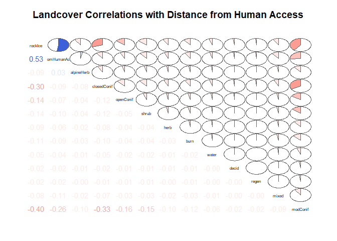<!-- -->

Again, only issue is Rock and Ice but even then its not a huge effect.
We can essentially see this here:

``` r
boxplot(Elevation2~landcov.f, ylab="Elevation (m)", data=wolfkde, las=3)
```

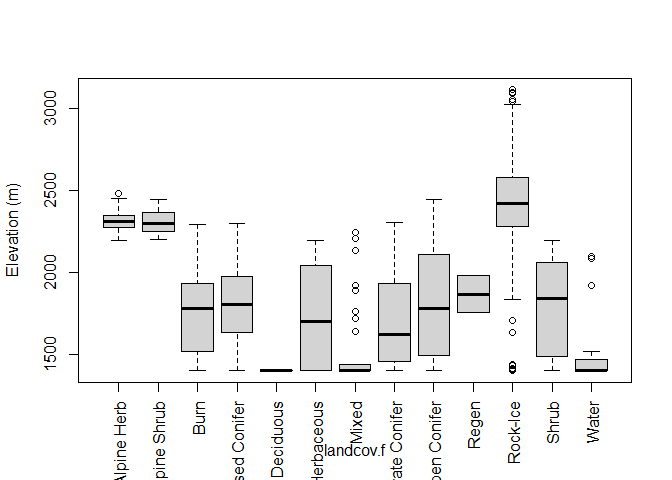<!-- -->

``` r
boxplot(DistFromHumanAccess2~landcov.f, ylab="Elevation (m)", data=wolfkde, las=3)
```

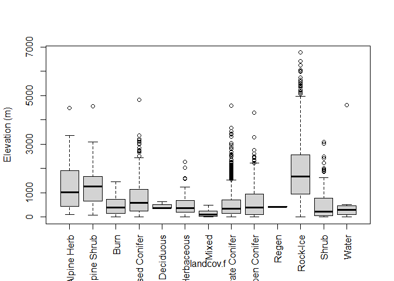<!-- --> So
collinearity is not as important for categorical variables but it
becomes important if we start to assess categorical interactions with
continuous factors.

## Interaction Between Categorical Factors and Continuous

Here we will focus on the relationship between whether wolves are
responding to human use differently in open and closed cover types.

``` r
wolfkde$closed = 0
wolfkde$closed <- wolfkde$closedConif + wolfkde$modConif + wolfkde$openConif + wolfkde$decid + wolfkde$mixed + wolfkde$burn
## note I considered burn here as 'closed' - could change. 

wolfkde$closedFactor <-as.factor(wolfkde$closed)

ggplot(wolfkde, aes(x=DistFromHighHumanAccess2, y=used, fill=closedFactor)) + stat_smooth(method="glm", method.args = list(family="binomial"), level=0.95) #+ facet_grid(closed~.)
```

    ## `geom_smooth()` using formula = 'y ~ x'

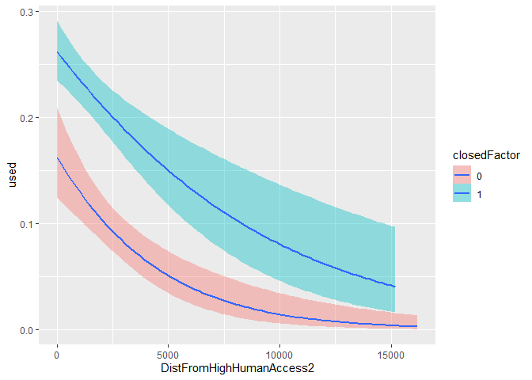<!-- --> This shows
the effect of distance from high human access varies a lot with whether
wolves are in closed cover or not. But does there look to be an
interaction? I.e., does the effect of X here on Y vary across levels of
the categorical factor? Not really. Lets look at a box plot.

``` r
boxplot(DistFromHighHumanAccess2~closed, ylab="Distance from High Human (m)", data=wolfkde)
```

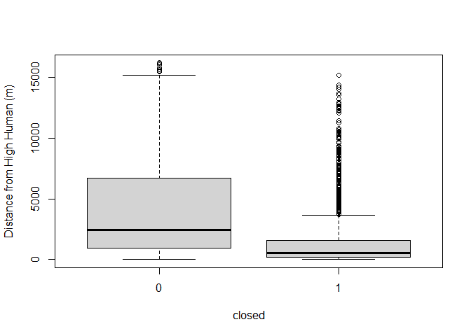<!-- -->

``` r
cor.test(wolfkde$closed, wolfkde$DistFromHighHumanAccess2)
```

    ## 
    ##  Pearson's product-moment correlation
    ## 
    ## data:  wolfkde$closed and wolfkde$DistFromHighHumanAccess2
    ## t = -18.386, df = 2368, p-value < 2.2e-16
    ## alternative hypothesis: true correlation is not equal to 0
    ## 95 percent confidence interval:
    ##  -0.3881870 -0.3177051
    ## sample estimates:
    ##        cor 
    ## -0.3534476

``` r
cor.test(wolfkde$closed, wolfkde$Elevation2)
```

    ## 
    ##  Pearson's product-moment correlation
    ## 
    ## data:  wolfkde$closed and wolfkde$Elevation2
    ## t = -40.381, df = 2407, p-value < 2.2e-16
    ## alternative hypothesis: true correlation is not equal to 0
    ## 95 percent confidence interval:
    ##  -0.6587165 -0.6110702
    ## sample estimates:
    ##       cor 
    ## -0.635498

So yes, you can only get far away from humans evidently in open
landcover types (rock / ice) but this isnt that big a problem, based on
the correlation coefficient of $\rho$= -0.35.

However, note that for Rock and Ice and Elevation, the correlation is
much more severe, $\rho$= -0.65. However, recall that here we are really
mainly concerned where we might want to consider an INTERACTION between
the effects of a categorical variable and a continuous variable - IF
there is a very strong correlation, then again, from an experimental
design view point we cannot separate out effects of elevation or the
closed factor variable (in our example).

But, here, looking at the stat_smoother tells us that despite the
probability of wolf use being lower in closed forests, its a completely
additive effect.

``` r
ggplot(wolfkde, aes(x=Elevation2, y=used, fill=closedFactor)) + stat_smooth(method="glm", method.args = list(family="binomial"), level=0.95) 
```

    ## `geom_smooth()` using formula = 'y ~ x'

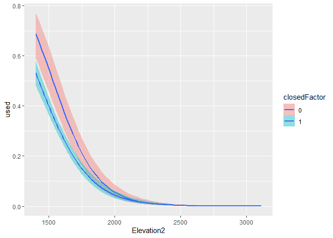<!-- -->

In our final step, lets fit the model now

``` r
disthha.cover <-  glm(used~closed + DistFromHighHumanAccess2 + closed*DistFromHighHumanAccess2, data =wolfkde, family= binomial(logit))
summary(disthha.cover)
```

    ## 
    ## Call:
    ## glm(formula = used ~ closed + DistFromHighHumanAccess2 + closed * 
    ##     DistFromHighHumanAccess2, family = binomial(logit), data = wolfkde)
    ## 
    ## Deviance Residuals: 
    ##     Min       1Q   Median       3Q      Max  
    ## -0.7790  -0.7403  -0.5331  -0.2311   3.0188  
    ## 
    ## Coefficients:
    ##                                   Estimate Std. Error z value Pr(>|z|)    
    ## (Intercept)                     -1.642e+00  1.573e-01 -10.436  < 2e-16 ***
    ## closed                           6.050e-01  1.737e-01   3.483 0.000495 ***
    ## DistFromHighHumanAccess2        -2.561e-04  5.350e-05  -4.787 1.69e-06 ***
    ## closed:DistFromHighHumanAccess2  1.165e-04  6.298e-05   1.850 0.064321 .  
    ## ---
    ## Signif. codes:  0 '***' 0.001 '**' 0.01 '*' 0.05 '.' 0.1 ' ' 1
    ## 
    ## (Dispersion parameter for binomial family taken to be 1)
    ## 
    ##     Null deviance: 2180.1  on 2369  degrees of freedom
    ## Residual deviance: 2036.9  on 2366  degrees of freedom
    ##   (39 observations deleted due to missingness)
    ## AIC: 2044.9
    ## 
    ## Number of Fisher Scoring iterations: 6

``` r
boxplot(DistFromHighHumanAccess2~closedFactor, ylab="Distance From High Human Access (m)", data=wolfkde)
```

<!-- -->

So yes, you can only get far away from humans evidently in open
landcover types (rock / ice) but this is not that big a problem.

Lets try again with distance to human access

``` r
ggplot(wolfkde, aes(x=DistFromHumanAccess2, y=used, fill=closedFactor)) + stat_smooth(method="glm", method.args = list(family="binomial"), level=0.95) #+ facet_grid(closed~.)
```

    ## `geom_smooth()` using formula = 'y ~ x'

    ## Warning: Removed 39 rows containing non-finite values (`stat_smooth()`).

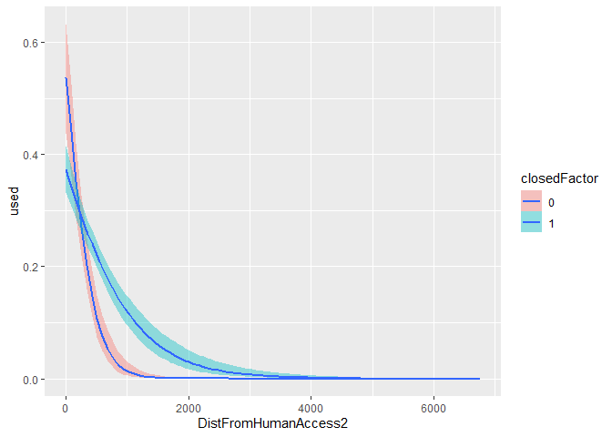<!-- --> Note, there
is a bit stronger evidence of an interaction here (the lines cross),
which brings us back to our original observation above.

``` r
boxplot(DistFromHumanAccess2~closedFactor, ylab="Distance From High Human Access (m)", data=wolfkde)
```

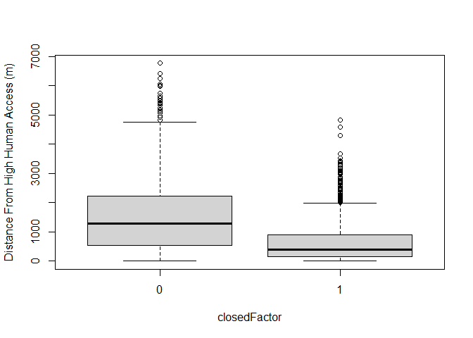<!-- -->

``` r
distha.cover <-  glm(used~closed + DistFromHumanAccess2 + closed*DistFromHumanAccess2, data =wolfkde, family= binomial(logit))
summary(distha.cover)
```

    ## 
    ## Call:
    ## glm(formula = used ~ closed + DistFromHumanAccess2 + closed * 
    ##     DistFromHumanAccess2, family = binomial(logit), data = wolfkde)
    ## 
    ## Deviance Residuals: 
    ##      Min        1Q    Median        3Q       Max  
    ## -1.23950  -0.75295  -0.33048  -0.00622   2.82414  
    ## 
    ## Coefficients:
    ##                               Estimate Std. Error z value Pr(>|z|)    
    ## (Intercept)                  0.1448340  0.2022547   0.716  0.47393    
    ## closed                      -0.6663391  0.2216303  -3.007  0.00264 ** 
    ## DistFromHumanAccess2        -0.0044402  0.0005556  -7.992 1.33e-15 ***
    ## closed:DistFromHumanAccess2  0.0029658  0.0005815   5.100 3.40e-07 ***
    ## ---
    ## Signif. codes:  0 '***' 0.001 '**' 0.01 '*' 0.05 '.' 0.1 ' ' 1
    ## 
    ## (Dispersion parameter for binomial family taken to be 1)
    ## 
    ##     Null deviance: 2180.1  on 2369  degrees of freedom
    ## Residual deviance: 1767.6  on 2366  degrees of freedom
    ##   (39 observations deleted due to missingness)
    ## AIC: 1775.6
    ## 
    ## Number of Fisher Scoring iterations: 8

While it is tempting to think that we have succesfully used the
interaction between elevation and distance to high human access to
‘separate’ the confounding between elevation and distance to hha, the
problem of collinearity remains problematic for these 2 variables. They
are, fundamentally, too correlated at r = 0.53, confounded, and we have
too few observaitons of wolves at high elevations far from human access
to be able to reliable interpret the interaction here. Interactions
offer a way to ‘break’ collinearity, but not solve confounding. I would
not be tempted here for risk of introducing a spurious interaction to
the model.

# Model Building and Model Selection

Armed with our knowledge of which variables are too collinear to include
in the model, and the concerns we have that some of our continuous
variables are confounded - experimentally - the next question is how do
we proceed to build multiple logistic regression models with more than
one variable?

This is the most common problem in the development of advanced multiple
covariate statisical models. How best to proceed? For example, based on
our preliminary exploration and screening for collinearity above, we
should not really consider models with moose, deer and elk together.
Moreover, we should not consider models with distance to high human use
and elevation together.

This is the age old problem of Model Building and Model Selection in
statistics. An excellent book along with Hosmer and Lemeshow here that
guide my philosophy of model selection is Frank Harrel’s Regression
Modeling Strategies. This really is a fantasti book.

Harrell, F.E. (2001) Regression modeling strategies: with applications
to linear models, logistic regression and survival analysis,
Springer-Verlag, New York, NY.

## Cleaning Up Missing Data

But first we have to clean up msising data for all model selection
steps, as missing data that are unbalanced between covariates will
result in different degrees of freedom, or, certainty, between models.
And models with different degrees of freedom or rows of data cannot be
compared directly. For example, in our dataset we have different NA’s in
elevation and other variables.

``` r
length(wolfkde$Elevation2)
```

    ## [1] 2409

``` r
wolfkde2 <- na.omit(wolfkde)
length(wolfkde2$Elevation2)
```

    ## [1] 2118

Note there were 252 NA’s for some covariates. Check that there are no
other NA’s in any of the other fields (on your own for homework).

# Akaike Information Critera

Akaike Information Criteria (AIC) was conceived on a Tokyo Commuter
train by Hirotugo Akaike, a Japanese statistician, based on the concept
of Information Theory which was itself based on the concept of Entropy.


Briefly, AIC is a statistical measure of the relative quality of
statistical models for a given set of data (why we have to clean up
missing NA’s above). Thus, AIC is a useful measure to compare models and
find out which model contains the most information in a particular set
of data. AIC fundamentally minimizes the trade-off between the goodness
of fit of a model, and the simplicity of a model. Put another way, it
balances between the risks of overfitting and underfitting.

For a given statistical model and a set of data, we have *k* number of
parameters, and, the Likelihood *L* of the data, given the model. In the
case of Likelihood, then, we have the formula for AIC as

$$ AIC = 2k - 2ln(L) $$ For a given set of data, the ‘best’ model is the
one that minimizes the AIC, that is, the model with the minimum AIC is
the best model. The first term, 2k, penalizes overfitting because fit
always increases with increasing number of parameters. See our exercise
above. The second term rewards (again, in the inverse sense) models with
the most information as assessed by the highest likelihood. Combined,
these two terms trade-off and the model with the best ability to explain
the data with the fewest number of parameters ‘wins’.

We will dive right in here in Lab, but, I direct you to the following
key papers for background for Wildlife Biologists

- References

  - Burnham, K.P. & Anderson, D.R. (eds.) (1998) Model selection and
    inference: a practical information-theoretic approach,
    Springer-Verlag, New York.

  - Anderson, D.R. & Burnham, K. (2002) Avoiding pitfalls when using
    information-theoretic approaches. Journal of Wildlife Management,
    66, 912-916.

  - Anderson, D.R., Link, W.A., Johnson, D.H. & Burnham, K.P. (2001)
    Suggestions for presenting the results of data analyses. Journal of
    Wildlife Management, 65, 373-378.

# Manual Model Selection Using AIC

With this brief review of AIC, we will look at the models we have
already fit above. After we have fit ANY model in the str() we can see
that there is AIC information stored in the model object.

``` r
cover <-  glm(used~closed, data =wolfkde2, family= binomial(logit))
## Estimating AIC manually

logLik(cover) ## this is the log likelihood
```

    ## 'log Lik.' -976.7078 (df=2)

``` r
2*(length(cover$coefficients)) ## this is the number of parameters
```

    ## [1] 4

Note that we can calcualte AIC manually using -2\* LL + 2\*K where LL is
logLik and K is \# of parameters (without considering the small sample
size correction)

``` r
-2*as.numeric(logLik(cover))+2*(length(cover$coefficients))
```

    ## [1] 1957.416

``` r
## Note we don't have to do this all manually, in the model str(cover) we see
#str(cover)
cover$aic
```

    ## [1] 1957.416

Lets use using AIC to select interactions…

``` r
distha <-  glm(used~DistFromHumanAccess2, data =wolfkde2, family= binomial(logit))
distha.cover <-  glm(used~closed + DistFromHumanAccess2, data =wolfkde2, family= binomial(logit)) ## Main effects only

disthaXcover <-  glm(used~closed + DistFromHumanAccess2 + closed*DistFromHumanAccess2, data =wolfkde2, family= binomial(logit))
```

    ## Warning: glm.fit: fitted probabilities numerically 0 or 1 occurred

``` r
AIC(cover, distha, distha.cover, disthaXcover)
```

    ##              df      AIC
    ## cover         2 1957.416
    ## distha        2 1655.955
    ## distha.cover  3 1652.944
    ## disthaXcover  4 1622.678

So, here, AIC is telling us that the model with the minimum AIC = 1622,
disthaXcover, is the ‘best’. Note that it is over 30 AIC units
‘smaller’, and better, than the next ‘closest’ model - the model with
the main additive effects of distance and cover. We will discuss delta
AIC below. Hence, here, we have reasonably STRONG evidence that model
disthhaXcover is much better than just the additive model disthha +
cover

Lets redo with distance to high human access

``` r
disthha <-  glm(used~DistFromHighHumanAccess2, data =wolfkde2, family= binomial(logit))
disthha.cover <-  glm(used~closed + DistFromHighHumanAccess2, data =wolfkde2, family= binomial(logit)) ## Main effects only
disthhaXcover <-  glm(used~closed + DistFromHighHumanAccess2 + closed*DistFromHighHumanAccess2, data =wolfkde2, family= binomial(logit))
      
AIC(cover, disthha, disthha.cover, disthhaXcover)
```

    ##               df      AIC
    ## cover          2 1957.416
    ## disthha        2 1931.577
    ## disthha.cover  3 1896.049
    ## disthhaXcover  4 1887.325

Again, , here there is STRONG evidence that model disthhaXcover is much
better than the model with the additive main effects.

However, this is tedious, and, how do we know the best models to
compare? This brings us to…

## Stepwise Model Selection

Over the history of statistics, there have been dozens of approaches.
First, we will start with Stepwise Model Selection using AIC in the
package stepAIC.

``` r
# Lets review the full.model again
full.model = glm(used~deer_w2 + elk_w2 +moose_w2 +sheep_w2+goat_w2+Elevation2+DistFromHumanAccess2+DistFromHighHumanAccess2 +closed + closed*DistFromHighHumanAccess2, data =wolfkde2, family= binomial(logit))
```

There are two ways to consider stepwise model selection. Backwards,
starting from the most complex ‘global’ model (full.model) above:

``` r
## Backwards selection
stepAIC(full.model, direction = "backward")
```

    ## Start:  AIC=1289.86
    ## used ~ deer_w2 + elk_w2 + moose_w2 + sheep_w2 + goat_w2 + Elevation2 + 
    ##     DistFromHumanAccess2 + DistFromHighHumanAccess2 + closed + 
    ##     closed * DistFromHighHumanAccess2
    ## 
    ##                                   Df Deviance    AIC
    ## - DistFromHighHumanAccess2:closed  1   1269.2 1289.2
    ## <none>                                 1267.9 1289.9
    ## - deer_w2                          1   1270.6 1290.6
    ## - sheep_w2                         1   1271.0 1291.0
    ## - goat_w2                          1   1277.6 1297.6
    ## - DistFromHumanAccess2             1   1280.3 1300.3
    ## - elk_w2                           1   1280.9 1300.9
    ## - moose_w2                         1   1290.1 1310.1
    ## - Elevation2                       1   1340.6 1360.6
    ## 
    ## Step:  AIC=1289.2
    ## used ~ deer_w2 + elk_w2 + moose_w2 + sheep_w2 + goat_w2 + Elevation2 + 
    ##     DistFromHumanAccess2 + DistFromHighHumanAccess2 + closed
    ## 
    ##                            Df Deviance    AIC
    ## <none>                          1269.2 1289.2
    ## - closed                    1   1271.7 1289.7
    ## - deer_w2                   1   1272.3 1290.3
    ## - sheep_w2                  1   1272.8 1290.8
    ## - goat_w2                   1   1279.2 1297.2
    ## - DistFromHumanAccess2      1   1282.0 1300.0
    ## - elk_w2                    1   1282.4 1300.4
    ## - moose_w2                  1   1290.3 1308.3
    ## - DistFromHighHumanAccess2  1   1296.0 1314.0
    ## - Elevation2                1   1341.1 1359.1

    ## 
    ## Call:  glm(formula = used ~ deer_w2 + elk_w2 + moose_w2 + sheep_w2 + 
    ##     goat_w2 + Elevation2 + DistFromHumanAccess2 + DistFromHighHumanAccess2 + 
    ##     closed, family = binomial(logit), data = wolfkde2)
    ## 
    ## Coefficients:
    ##              (Intercept)                   deer_w2                    elk_w2  
    ##                6.6091155                 0.2057860                 0.4493350  
    ##                 moose_w2                  sheep_w2                   goat_w2  
    ##               -0.3994125                -0.1032437                -0.1873161  
    ##               Elevation2      DistFromHumanAccess2  DistFromHighHumanAccess2  
    ##               -0.0047249                -0.0006645                 0.0001813  
    ##                   closed  
    ##               -0.3139421  
    ## 
    ## Degrees of Freedom: 2117 Total (i.e. Null);  2108 Residual
    ## Null Deviance:       2041 
    ## Residual Deviance: 1269  AIC: 1289

``` r
top.backwards = glm(used ~ deer_w2 + elk_w2 + moose_w2 + sheep_w2 + goat_w2 + Elevation2 + DistFromHumanAccess2 + DistFromHighHumanAccess2, data=wolfkde2,family=binomial(logit))
summary(top.backwards)
```

    ## 
    ## Call:
    ## glm(formula = used ~ deer_w2 + elk_w2 + moose_w2 + sheep_w2 + 
    ##     goat_w2 + Elevation2 + DistFromHumanAccess2 + DistFromHighHumanAccess2, 
    ##     family = binomial(logit), data = wolfkde2)
    ## 
    ## Deviance Residuals: 
    ##     Min       1Q   Median       3Q      Max  
    ## -1.9200  -0.4636  -0.1536  -0.0378   3.2277  
    ## 
    ## Coefficients:
    ##                            Estimate Std. Error z value Pr(>|z|)    
    ## (Intercept)               6.418e+00  1.349e+00   4.759 1.95e-06 ***
    ## deer_w2                   1.859e-01  1.169e-01   1.590 0.111758    
    ## elk_w2                    4.677e-01  1.249e-01   3.744 0.000181 ***
    ## moose_w2                 -4.129e-01  9.038e-02  -4.568 4.91e-06 ***
    ## sheep_w2                 -1.015e-01  5.464e-02  -1.857 0.063244 .  
    ## goat_w2                  -1.800e-01  5.987e-02  -3.006 0.002647 ** 
    ## Elevation2               -4.746e-03  6.207e-04  -7.646 2.08e-14 ***
    ## DistFromHumanAccess2     -6.667e-04  1.988e-04  -3.354 0.000796 ***
    ## DistFromHighHumanAccess2  1.850e-04  3.443e-05   5.372 7.78e-08 ***
    ## ---
    ## Signif. codes:  0 '***' 0.001 '**' 0.01 '*' 0.05 '.' 0.1 ' ' 1
    ## 
    ## (Dispersion parameter for binomial family taken to be 1)
    ## 
    ##     Null deviance: 2040.9  on 2117  degrees of freedom
    ## Residual deviance: 1271.7  on 2109  degrees of freedom
    ## AIC: 1289.7
    ## 
    ## Number of Fisher Scoring iterations: 7

and second, Forward Stepwise model selection, which starts from the null
model and proceeds to the maximum \# of parameters specified in the
full.model

``` r
# Forwards selection - First define a NULL model as the starting place
null.model = glm(used~1,data=wolfkde2,family=binomial(logit))
### This time with output from stepAIC supressed 
stepAIC(null.model, scope=list(upper=full.model, lower= null.model),direction="forward")
```

    ## Start:  AIC=2042.9
    ## used ~ 1
    ## 
    ##                            Df Deviance    AIC
    ## + Elevation2                1   1405.4 1409.4
    ## + deer_w2                   1   1592.4 1596.4
    ## + elk_w2                    1   1625.8 1629.8
    ## + DistFromHumanAccess2      1   1652.0 1656.0
    ## + goat_w2                   1   1818.7 1822.7
    ## + DistFromHighHumanAccess2  1   1927.6 1931.6
    ## + moose_w2                  1   1931.3 1935.3
    ## + closed                    1   1953.4 1957.4
    ## + sheep_w2                  1   2027.7 2031.7
    ## <none>                          2040.9 2042.9
    ## 
    ## Step:  AIC=1409.4
    ## used ~ Elevation2
    ## 
    ##                            Df Deviance    AIC
    ## + DistFromHighHumanAccess2  1   1359.7 1365.7
    ## + elk_w2                    1   1371.9 1377.9
    ## + deer_w2                   1   1376.4 1382.4
    ## + moose_w2                  1   1377.5 1383.5
    ## + DistFromHumanAccess2      1   1384.2 1390.2
    ## + closed                    1   1399.6 1405.6
    ## + goat_w2                   1   1401.8 1407.8
    ## <none>                          1405.4 1409.4
    ## + sheep_w2                  1   1403.5 1409.5
    ## 
    ## Step:  AIC=1365.74
    ## used ~ Elevation2 + DistFromHighHumanAccess2
    ## 
    ##                        Df Deviance    AIC
    ## + moose_w2              1   1326.1 1334.1
    ## + deer_w2               1   1335.3 1343.3
    ## + DistFromHumanAccess2  1   1340.8 1348.8
    ## + elk_w2                1   1342.9 1350.9
    ## + closed                1   1356.1 1364.1
    ## + goat_w2               1   1356.2 1364.2
    ## + sheep_w2              1   1357.0 1365.0
    ## <none>                      1359.7 1365.7
    ## 
    ## Step:  AIC=1334.14
    ## used ~ Elevation2 + DistFromHighHumanAccess2 + moose_w2
    ## 
    ##                        Df Deviance    AIC
    ## + elk_w2                1   1300.8 1310.8
    ## + deer_w2               1   1310.8 1320.8
    ## + DistFromHumanAccess2  1   1312.1 1322.1
    ## + goat_w2               1   1322.8 1332.8
    ## <none>                      1326.1 1334.1
    ## + closed                1   1324.5 1334.5
    ## + sheep_w2              1   1325.6 1335.6
    ## 
    ## Step:  AIC=1310.76
    ## used ~ Elevation2 + DistFromHighHumanAccess2 + moose_w2 + elk_w2
    ## 
    ##                        Df Deviance    AIC
    ## + goat_w2               1   1289.0 1301.0
    ## + DistFromHumanAccess2  1   1289.5 1301.5
    ## + sheep_w2              1   1294.9 1306.9
    ## <none>                      1300.8 1310.8
    ## + closed                1   1299.5 1311.5
    ## + deer_w2               1   1299.6 1311.6
    ## 
    ## Step:  AIC=1300.99
    ## used ~ Elevation2 + DistFromHighHumanAccess2 + moose_w2 + elk_w2 + 
    ##     goat_w2
    ## 
    ##                        Df Deviance    AIC
    ## + DistFromHumanAccess2  1   1277.2 1291.2
    ## + sheep_w2              1   1286.0 1300.0
    ## <none>                      1289.0 1301.0
    ## + closed                1   1287.0 1301.0
    ## + deer_w2               1   1287.8 1301.8
    ## 
    ## Step:  AIC=1291.21
    ## used ~ Elevation2 + DistFromHighHumanAccess2 + moose_w2 + elk_w2 + 
    ##     goat_w2 + DistFromHumanAccess2
    ## 
    ##            Df Deviance    AIC
    ## + sheep_w2  1   1274.2 1290.2
    ## + deer_w2   1   1275.1 1291.1
    ## <none>          1277.2 1291.2
    ## + closed    1   1275.3 1291.3
    ## 
    ## Step:  AIC=1290.24
    ## used ~ Elevation2 + DistFromHighHumanAccess2 + moose_w2 + elk_w2 + 
    ##     goat_w2 + DistFromHumanAccess2 + sheep_w2
    ## 
    ##           Df Deviance    AIC
    ## + deer_w2  1   1271.7 1289.7
    ## <none>         1274.2 1290.2
    ## + closed   1   1272.3 1290.3
    ## 
    ## Step:  AIC=1289.68
    ## used ~ Elevation2 + DistFromHighHumanAccess2 + moose_w2 + elk_w2 + 
    ##     goat_w2 + DistFromHumanAccess2 + sheep_w2 + deer_w2
    ## 
    ##          Df Deviance    AIC
    ## + closed  1   1269.2 1289.2
    ## <none>        1271.7 1289.7
    ## 
    ## Step:  AIC=1289.2
    ## used ~ Elevation2 + DistFromHighHumanAccess2 + moose_w2 + elk_w2 + 
    ##     goat_w2 + DistFromHumanAccess2 + sheep_w2 + deer_w2 + closed
    ## 
    ##                                   Df Deviance    AIC
    ## <none>                                 1269.2 1289.2
    ## + DistFromHighHumanAccess2:closed  1   1267.9 1289.9

    ## 
    ## Call:  glm(formula = used ~ Elevation2 + DistFromHighHumanAccess2 + 
    ##     moose_w2 + elk_w2 + goat_w2 + DistFromHumanAccess2 + sheep_w2 + 
    ##     deer_w2 + closed, family = binomial(logit), data = wolfkde2)
    ## 
    ## Coefficients:
    ##              (Intercept)                Elevation2  DistFromHighHumanAccess2  
    ##                6.6091155                -0.0047249                 0.0001813  
    ##                 moose_w2                    elk_w2                   goat_w2  
    ##               -0.3994125                 0.4493350                -0.1873161  
    ##     DistFromHumanAccess2                  sheep_w2                   deer_w2  
    ##               -0.0006645                -0.1032437                 0.2057860  
    ##                   closed  
    ##               -0.3139421  
    ## 
    ## Degrees of Freedom: 2117 Total (i.e. Null);  2108 Residual
    ## Null Deviance:       2041 
    ## Residual Deviance: 1269  AIC: 1289

``` r
## lots of output supressed in Rmarkdown
top.forward <- glm(used ~ Elevation2 + DistFromHighHumanAccess2 + 
    moose_w2 + elk_w2 + goat_w2 + DistFromHumanAccess2 + sheep_w2 + 
    deer_w2 + closed, family = binomial(logit), data = wolfkde2)
summary(top.forward)
```

    ## 
    ## Call:
    ## glm(formula = used ~ Elevation2 + DistFromHighHumanAccess2 + 
    ##     moose_w2 + elk_w2 + goat_w2 + DistFromHumanAccess2 + sheep_w2 + 
    ##     deer_w2 + closed, family = binomial(logit), data = wolfkde2)
    ## 
    ## Deviance Residuals: 
    ##      Min        1Q    Median        3Q       Max  
    ## -1.99463  -0.45913  -0.15990  -0.04219   3.15046  
    ## 
    ## Coefficients:
    ##                            Estimate Std. Error z value Pr(>|z|)    
    ## (Intercept)               6.609e+00  1.346e+00   4.910 9.12e-07 ***
    ## Elevation2               -4.725e-03  6.170e-04  -7.658 1.89e-14 ***
    ## DistFromHighHumanAccess2  1.813e-04  3.428e-05   5.288 1.23e-07 ***
    ## moose_w2                 -3.994e-01  9.023e-02  -4.427 9.56e-06 ***
    ## elk_w2                    4.493e-01  1.253e-01   3.585 0.000337 ***
    ## goat_w2                  -1.873e-01  6.010e-02  -3.116 0.001830 ** 
    ## DistFromHumanAccess2     -6.645e-04  1.981e-04  -3.354 0.000796 ***
    ## sheep_w2                 -1.032e-01  5.465e-02  -1.889 0.058874 .  
    ## deer_w2                   2.058e-01  1.175e-01   1.751 0.079866 .  
    ## closed                   -3.139e-01  1.991e-01  -1.577 0.114856    
    ## ---
    ## Signif. codes:  0 '***' 0.001 '**' 0.01 '*' 0.05 '.' 0.1 ' ' 1
    ## 
    ## (Dispersion parameter for binomial family taken to be 1)
    ## 
    ##     Null deviance: 2040.9  on 2117  degrees of freedom
    ## Residual deviance: 1269.2  on 2108  degrees of freedom
    ## AIC: 1289.2
    ## 
    ## Number of Fisher Scoring iterations: 7

Very similar - identical - to the backwards top model. Right ! we are
done??? are we? Lets screen for collinearity.

``` r
vif(top.forward)
```

    ##               Elevation2 DistFromHighHumanAccess2                 moose_w2 
    ##                 3.774381                 2.084111                 1.499926 
    ##                   elk_w2                  goat_w2     DistFromHumanAccess2 
    ##                 2.370088                 1.422406                 1.293130 
    ##                 sheep_w2                  deer_w2                   closed 
    ##                 1.251304                 2.319067                 1.063505

``` r
vif(top.backwards)
```

    ##                  deer_w2                   elk_w2                 moose_w2 
    ##                 2.246567                 2.300770                 1.466803 
    ##                 sheep_w2                  goat_w2               Elevation2 
    ##                 1.244975                 1.398556                 3.696289 
    ##     DistFromHumanAccess2 DistFromHighHumanAccess2 
    ##                 1.280759                 2.069548

But there are a bunch of collinear variables in the model,
moose/elk/deer, human/human/human. Basically everything is being
retained, not much kicked out. *This is our first experience that you
can throw garbage into a model selection algorithm and get garbage
out. * Model selection using anything, AIC, should never replace careful
consideration of all the variables in the top model, their collinearity,
confounding, and interactions.

Now what about landcover (with rock Ice as the intercept)??

``` r
full.model.landcov = glm(used~ closedConif +modConif+openConif+decid+regen+mixed+herb+shrub+water+burn+alpine, data =wolfkde2, family= binomial(logit))
stepAIC(full.model.landcov, direction = "backward")
```

    ## Start:  AIC=1699.74
    ## used ~ closedConif + modConif + openConif + decid + regen + mixed + 
    ##     herb + shrub + water + burn + alpine
    ## 
    ## 
    ## Step:  AIC=1699.74
    ## used ~ closedConif + modConif + openConif + decid + mixed + herb + 
    ##     shrub + water + burn + alpine
    ## 
    ##               Df Deviance    AIC
    ## - decid        1   1677.8 1697.8
    ## - alpine       1   1678.0 1698.0
    ## <none>             1677.7 1699.7
    ## - closedConif  1   1728.2 1748.2
    ## - water        1   1737.9 1757.9
    ## - herb         1   1753.8 1773.8
    ## - shrub        1   1757.1 1777.1
    ## - openConif    1   1778.8 1798.8
    ## - burn         1   1810.6 1830.6
    ## - mixed        1   1815.0 1835.0
    ## - modConif     1   1847.5 1867.5
    ## 
    ## Step:  AIC=1697.84
    ## used ~ closedConif + modConif + openConif + mixed + herb + shrub + 
    ##     water + burn + alpine
    ## 
    ##               Df Deviance    AIC
    ## - alpine       1   1678.1 1696.1
    ## <none>             1677.8 1697.8
    ## - closedConif  1   1728.6 1746.6
    ## - water        1   1738.1 1756.1
    ## - herb         1   1754.1 1772.1
    ## - shrub        1   1757.4 1775.4
    ## - openConif    1   1779.2 1797.2
    ## - burn         1   1811.0 1829.0
    ## - mixed        1   1815.4 1833.4
    ## - modConif     1   1848.5 1866.5
    ## 
    ## Step:  AIC=1696.07
    ## used ~ closedConif + modConif + openConif + mixed + herb + shrub + 
    ##     water + burn
    ## 
    ##               Df Deviance    AIC
    ## <none>             1678.1 1696.1
    ## - closedConif  1   1731.0 1747.0
    ## - water        1   1738.4 1754.4
    ## - herb         1   1754.9 1770.9
    ## - shrub        1   1759.3 1775.3
    ## - openConif    1   1781.9 1797.9
    ## - burn         1   1813.9 1829.9
    ## - mixed        1   1817.6 1833.6
    ## - modConif     1   1860.9 1876.9

    ## 
    ## Call:  glm(formula = used ~ closedConif + modConif + openConif + mixed + 
    ##     herb + shrub + water + burn, family = binomial(logit), data = wolfkde2)
    ## 
    ## Coefficients:
    ## (Intercept)  closedConif     modConif    openConif        mixed         herb  
    ##      -3.970        2.022        2.923        3.305        4.773        3.970  
    ##       shrub        water         burn  
    ##       3.109        4.376        4.092  
    ## 
    ## Degrees of Freedom: 2117 Total (i.e. Null);  2109 Residual
    ## Null Deviance:       2041 
    ## Residual Deviance: 1678  AIC: 1696

note that AIC helped us trim our landcover categories down from 12
categories to 9, kicking out what - alpine (which is now lumped with
Rock/Ice - makes sense), decid and regen - which, if you recall, were
both categories with very very few observaitons. This is encouraging, as
we hope this is what AIC is supposed to do.

Lets take a look:

``` r
top.model.landcov = glm(used~openConif+modConif+closedConif+mixed+herb+shrub+water+burn, data =wolfkde2, family= binomial(logit))
summary(top.model.landcov)
```

    ## 
    ## Call:
    ## glm(formula = used ~ openConif + modConif + closedConif + mixed + 
    ##     herb + shrub + water + burn, family = binomial(logit), data = wolfkde2)
    ## 
    ## Deviance Residuals: 
    ##     Min       1Q   Median       3Q      Max  
    ## -1.5315  -0.7756  -0.5162  -0.1933   2.8245  
    ## 
    ## Coefficients:
    ##             Estimate Std. Error z value Pr(>|z|)    
    ## (Intercept)  -3.9703     0.2914 -13.627  < 2e-16 ***
    ## openConif     3.3045     0.3547   9.317  < 2e-16 ***
    ## modConif      2.9232     0.3050   9.584  < 2e-16 ***
    ## closedConif   2.0219     0.3239   6.242 4.33e-10 ***
    ## mixed         4.7726     0.4431  10.772  < 2e-16 ***
    ## herb          3.9703     0.4427   8.968  < 2e-16 ***
    ## shrub         3.1088     0.3637   8.547  < 2e-16 ***
    ## water         4.3758     0.5415   8.081 6.43e-16 ***
    ## burn          4.0917     0.3817  10.719  < 2e-16 ***
    ## ---
    ## Signif. codes:  0 '***' 0.001 '**' 0.01 '*' 0.05 '.' 0.1 ' ' 1
    ## 
    ## (Dispersion parameter for binomial family taken to be 1)
    ## 
    ##     Null deviance: 2040.9  on 2117  degrees of freedom
    ## Residual deviance: 1678.1  on 2109  degrees of freedom
    ## AIC: 1696.1
    ## 
    ## Number of Fisher Scoring iterations: 6

``` r
vif(top.model.landcov)
```

    ##   openConif    modConif closedConif       mixed        herb       shrub 
    ##    2.795640    6.214955    4.265224    1.703239    1.705037    2.571701 
    ##       water        burn 
    ##    1.382375    2.249269

Despite the evidence for potential collinearity amongst our categorical
variables, even though its harder to discern, lets use this combination
of Landcover covariates next as the BEST top model selected using
stepAIC later.

Overall, this exercise in stepwise model selection always leaves me
feeling dissatisfied. There has to be a better way.

# Model selection using the AICcmodavg package

We have a problem in our dataset, that Elevation is so strongly
correlated with all the prey variables that we can’t really think of a
sensible way to include elevation. One way to think about this problem
is to start to imagine two competing sets of models. Model 1 set - JUST
biotic covariates, prey species and humans. Second, in Model 2 set -
JUST environmental covariate models such as elevation, landcover models,
etc. The challenge for us as a class is to develop a set of models
a-priori that represent biological hypotheses, and, ideally, avoid
confounded or collinear variables we now know about.

To illustrate this, we will work through a class excercise together to
come up with our ‘list’ of a-priori models for both sets of approaches
together in lab. And then we will FIT CANDIDATE MODELS with the
AICcmodavg package.

## Biotic Model List

Model set 1: Biotic interactions, deer/elk/moose all too correlated to
put in the same model, sheep and goat are OK.

``` r
m.biotic <- list()
head(m.biotic)
```

    ## list()

``` r
#lets fit our a-priori list of models 
## Model set 1: Biotic
m.biotic[[1]] <- glm(used ~ 1, family=binomial(logit), data=wolfkde2)
m.biotic[[2]] <- glm(used ~ elk_w2, family=binomial(logit), data=wolfkde2)
m.biotic[[3]] <- glm(used ~ deer_w2, family=binomial(logit), data=wolfkde2)
m.biotic[[4]] <- glm(used ~ moose_w2, family=binomial(logit), data=wolfkde2)
m.biotic[[5]] <- glm(used ~ sheep_w2, family=binomial(logit), data=wolfkde2)
m.biotic[[6]] <- glm(used ~ goat_w2, family=binomial(logit), data=wolfkde2)
m.biotic[[7]] <- glm(used ~ moose_w2 + sheep_w2, family=binomial(logit), data=wolfkde2)
m.biotic[[8]] <- glm(used ~ deer_w2 + sheep_w2, family=binomial(logit), data=wolfkde2)
m.biotic[[9]] <- glm(used ~ elk_w2 + sheep_w2, family=binomial(logit), data=wolfkde2)
m.biotic[[10]] <- glm(used ~ elk_w2 + goat_w2, family=binomial(logit), data=wolfkde2)
m.biotic[[11]] <- glm(used ~ deer_w2 + goat_w2, family=binomial(logit), data=wolfkde2)
m.biotic[[12]] <- glm(used ~ moose_w2 + goat_w2, family=binomial(logit), data=wolfkde2)
m.biotic[[13]] <- glm(used ~ sheep_w2 + goat_w2, family=binomial(logit), data=wolfkde2)
m.biotic[[14]] <- glm(used ~ DistFromHighHumanAccess2, family=binomial(logit), data=wolfkde2)
m.biotic[[15]] <- glm(used ~ DistFromHighHumanAccess2+deer_w2, family=binomial(logit), data=wolfkde2)
m.biotic[[16]] <- glm(used ~ DistFromHighHumanAccess2+moose_w2, family=binomial(logit), data=wolfkde2)
m.biotic[[17]] <- glm(used ~ DistFromHighHumanAccess2+sheep_w2, family=binomial(logit), data=wolfkde2)
m.biotic[[18]] <- glm(used ~ DistFromHighHumanAccess2+goat_w2, family=binomial(logit), data=wolfkde2)
m.biotic[[19]] <- glm(used ~ DistFromHighHumanAccess2+moose_w2 + sheep_w2, family=binomial(logit), data=wolfkde2)
m.biotic[[20]] <- glm(used ~ DistFromHighHumanAccess2+deer_w2 + sheep_w2, family=binomial(logit), data=wolfkde2)
m.biotic[[21]] <- glm(used ~ DistFromHighHumanAccess2+elk_w2 + sheep_w2, family=binomial(logit), data=wolfkde2)
m.biotic[[22]] <- glm(used ~ DistFromHighHumanAccess2+elk_w2 + goat_w2, family=binomial(logit), data=wolfkde2)
m.biotic[[23]] <- glm(used ~ DistFromHighHumanAccess2+deer_w2 + goat_w2, family=binomial(logit), data=wolfkde2)
m.biotic[[24]] <- glm(used ~ DistFromHighHumanAccess2+moose_w2 + goat_w2, family=binomial(logit), data=wolfkde2)
m.biotic[[25]] <- glm(used ~ DistFromHighHumanAccess2+sheep_w2 + goat_w2, family=binomial(logit), data=wolfkde2)
m.biotic[[26]] <- glm(used ~ DistFromHighHumanAccess2, family=binomial(logit), data=wolfkde2)
m.biotic[[27]] <- glm(used ~ DistFromHighHumanAccess2+deer_w2, family=binomial(logit), data=wolfkde2)
m.biotic[[28]] <- glm(used ~ DistFromHighHumanAccess2+moose_w2, family=binomial(logit), data=wolfkde2)
m.biotic[[29]] <- glm(used ~ DistFromHighHumanAccess2+sheep_w2, family=binomial(logit), data=wolfkde2)
m.biotic[[30]] <- glm(used ~ DistFromHighHumanAccess2+goat_w2, family=binomial(logit), data=wolfkde2)
m.biotic[[31]] <- glm(used ~ DistFromHighHumanAccess2+moose_w2 + sheep_w2, family=binomial(logit), data=wolfkde2)
m.biotic[[32]] <- glm(used ~ DistFromHumanAccess2, family=binomial(logit), data=wolfkde2)
m.biotic[[33]] <- glm(used ~ DistFromHumanAccess2+deer_w2, family=binomial(logit), data=wolfkde2)
m.biotic[[34]] <- glm(used ~ DistFromHumanAccess2+moose_w2, family=binomial(logit), data=wolfkde2)
m.biotic[[35]] <- glm(used ~ DistFromHumanAccess2+sheep_w2, family=binomial(logit), data=wolfkde2)
m.biotic[[36]] <- glm(used ~ DistFromHumanAccess2+goat_w2, family=binomial(logit), data=wolfkde2)
m.biotic[[37]] <- glm(used ~ DistFromHumanAccess2+moose_w2 + sheep_w2, family=binomial(logit), data=wolfkde2)
m.biotic[[38]] <- glm(used ~ DistFromHumanAccess2+deer_w2 + sheep_w2, family=binomial(logit), data=wolfkde2)
m.biotic[[39]] <- glm(used ~ DistFromHumanAccess2+elk_w2 + sheep_w2, family=binomial(logit), data=wolfkde2)
m.biotic[[40]] <- glm(used ~ DistFromHumanAccess2+elk_w2 + goat_w2, family=binomial(logit), data=wolfkde2)
m.biotic[[41]] <- glm(used ~ DistFromHumanAccess2+deer_w2 + goat_w2, family=binomial(logit), data=wolfkde2)
m.biotic[[42]] <- glm(used ~ DistFromHumanAccess2+moose_w2 + goat_w2, family=binomial(logit), data=wolfkde2)
m.biotic[[43]] <- glm(used ~ DistFromHumanAccess2+sheep_w2 + goat_w2, family=binomial(logit), data=wolfkde2)
m.biotic[[44]] <- glm(used ~ DistFromHumanAccess2, family=binomial(logit), data=wolfkde2)
m.biotic[[45]] <- glm(used ~ DistFromHumanAccess2+deer_w2, family=binomial(logit), data=wolfkde2)
m.biotic[[46]] <- glm(used ~ DistFromHumanAccess2+moose_w2, family=binomial(logit), data=wolfkde2)
m.biotic[[47]] <- glm(used ~ DistFromHumanAccess2+sheep_w2, family=binomial(logit), data=wolfkde2)
m.biotic[[48]] <- glm(used ~ DistFromHumanAccess2+goat_w2, family=binomial(logit), data=wolfkde2)
m.biotic[[49]] <- glm(used ~ DistFromHumanAccess2+moose_w2 + sheep_w2, family=binomial(logit), data=wolfkde2)
                   

## then name our models .
## note you can name your models with a command like this
# model.names <-  ("null", "disthha", "distacc", "sheepwi", "goatwin", "elkwint", "moosewin", "deerwin") but in this case there were 49 models
model.names.biotic <-c("m0","m1","m2","m3","m4","m5","m6","m7","m8","m9","m10","m11","m12","m13","m14","m15","m16","m17","m18","m19","m20","m21","m22","m23","m24","m25","m26","m27","m28","m29","m30","m31","m32","m33","m34","m35","m36","m37","m38","m39","m40","m41","m42","m43","m44", "m45","m46","m47","m48")
model.names.biotic <-1:49

aictab(cand.set = m.biotic, modnames = model.names.biotic)
```

    ## Warning in aictab.AICglm.lm(cand.set = m.biotic, modnames = model.names.biotic): 
    ## Check model structure carefully as some models may be redundant

    ## 
    ## Model selection based on AICc:
    ## 
    ##    K    AICc Delta_AICc AICcWt Cum.Wt       LL
    ## 41 4 1406.25       0.00    0.8    0.8  -699.12
    ## 40 4 1409.02       2.76    0.2    1.0  -700.50
    ## 38 4 1431.91      25.66    0.0    1.0  -711.95
    ## 39 4 1442.35      36.09    0.0    1.0  -717.16
    ## 33 3 1455.14      48.88    0.0    1.0  -724.56
    ## 45 3 1455.14      48.88    0.0    1.0  -724.56
    ## 22 4 1475.97      69.71    0.0    1.0  -733.97
    ## 10 3 1480.37      74.12    0.0    1.0  -737.18
    ## 11 3 1494.35      88.10    0.0    1.0  -744.17
    ## 23 4 1496.27      90.02    0.0    1.0  -744.13
    ## 21 4 1523.86     117.61    0.0    1.0  -757.92
    ## 9  3 1538.90     132.65    0.0    1.0  -766.45
    ## 8  3 1548.35     142.09    0.0    1.0  -771.17
    ## 20 4 1548.49     142.24    0.0    1.0  -770.24
    ## 36 3 1573.18     166.92    0.0    1.0  -783.58
    ## 48 3 1573.18     166.92    0.0    1.0  -783.58
    ## 43 4 1574.46     168.21    0.0    1.0  -783.22
    ## 42 4 1574.86     168.60    0.0    1.0  -783.42
    ## 15 3 1590.86     184.61    0.0    1.0  -792.42
    ## 27 3 1590.86     184.61    0.0    1.0  -792.42
    ## 3  2 1596.37     190.12    0.0    1.0  -796.18
    ## 2  2 1629.82     223.57    0.0    1.0  -812.91
    ## 37 4 1636.92     230.67    0.0    1.0  -814.45
    ## 49 4 1636.92     230.67    0.0    1.0  -814.45
    ## 35 3 1643.21     236.96    0.0    1.0  -818.60
    ## 47 3 1643.21     236.96    0.0    1.0  -818.60
    ## 34 3 1650.89     244.64    0.0    1.0  -822.44
    ## 46 3 1650.89     244.64    0.0    1.0  -822.44
    ## 32 2 1655.96     249.71    0.0    1.0  -825.98
    ## 44 2 1655.96     249.71    0.0    1.0  -825.98
    ## 24 4 1765.76     359.51    0.0    1.0  -878.87
    ## 18 3 1784.38     378.12    0.0    1.0  -889.18
    ## 30 3 1784.38     378.12    0.0    1.0  -889.18
    ## 25 4 1784.39     378.14    0.0    1.0  -888.19
    ## 12 3 1786.62     380.36    0.0    1.0  -890.30
    ## 13 3 1821.85     415.60    0.0    1.0  -907.92
    ## 6  2 1822.67     416.42    0.0    1.0  -909.33
    ## 19 4 1865.18     458.92    0.0    1.0  -928.58
    ## 31 4 1865.18     458.92    0.0    1.0  -928.58
    ## 16 3 1881.35     475.10    0.0    1.0  -937.67
    ## 28 3 1881.35     475.10    0.0    1.0  -937.67
    ## 7  3 1906.78     500.53    0.0    1.0  -950.38
    ## 17 3 1924.60     518.35    0.0    1.0  -959.29
    ## 29 3 1924.60     518.35    0.0    1.0  -959.29
    ## 14 2 1931.58     525.33    0.0    1.0  -963.79
    ## 26 2 1931.58     525.33    0.0    1.0  -963.79
    ## 4  2 1935.30     529.05    0.0    1.0  -965.65
    ## 5  2 2031.68     625.43    0.0    1.0 -1013.84
    ## 1  1 2042.90     636.64    0.0    1.0 -1020.45

``` r
## OK so the top model was model 41

top.biotic <- glm(used ~ DistFromHumanAccess2+deer_w2 + goat_w2, family=binomial(logit), data=wolfkde2)
summary(top.biotic)
```

    ## 
    ## Call:
    ## glm(formula = used ~ DistFromHumanAccess2 + deer_w2 + goat_w2, 
    ##     family = binomial(logit), data = wolfkde2)
    ## 
    ## Deviance Residuals: 
    ##     Min       1Q   Median       3Q      Max  
    ## -1.8345  -0.6246  -0.1888  -0.0306   3.1247  
    ## 
    ## Coefficients:
    ##                       Estimate Std. Error z value Pr(>|z|)    
    ## (Intercept)          -3.553037   0.366553  -9.693  < 2e-16 ***
    ## DistFromHumanAccess2 -0.001422   0.000183  -7.770 7.86e-15 ***
    ## deer_w2               0.898069   0.077941  11.522  < 2e-16 ***
    ## goat_w2              -0.333540   0.048524  -6.874 6.26e-12 ***
    ## ---
    ## Signif. codes:  0 '***' 0.001 '**' 0.01 '*' 0.05 '.' 0.1 ' ' 1
    ## 
    ## (Dispersion parameter for binomial family taken to be 1)
    ## 
    ##     Null deviance: 2040.9  on 2117  degrees of freedom
    ## Residual deviance: 1398.2  on 2114  degrees of freedom
    ## AIC: 1406.2
    ## 
    ## Number of Fisher Scoring iterations: 7

``` r
vif(top.biotic)
```

    ## DistFromHumanAccess2              deer_w2              goat_w2 
    ##             1.039378             1.020137             1.022622

So - not too badly collinear.

And the 2nd ranked top biotic model was model 40

``` r
second.biotic <- glm(used ~ DistFromHumanAccess2+elk_w2 + goat_w2, family=binomial(logit), data=wolfkde2)
summary(second.biotic)
```

    ## 
    ## Call:
    ## glm(formula = used ~ DistFromHumanAccess2 + elk_w2 + goat_w2, 
    ##     family = binomial(logit), data = wolfkde2)
    ## 
    ## Deviance Residuals: 
    ##     Min       1Q   Median       3Q      Max  
    ## -1.8948  -0.6013  -0.2043  -0.0340   3.1924  
    ## 
    ## Coefficients:
    ##                        Estimate Std. Error z value Pr(>|z|)    
    ## (Intercept)          -3.5482326  0.3639984  -9.748  < 2e-16 ***
    ## DistFromHumanAccess2 -0.0013001  0.0001839  -7.068 1.57e-12 ***
    ## elk_w2                0.9358383  0.0803689  11.644  < 2e-16 ***
    ## goat_w2              -0.4169449  0.0489264  -8.522  < 2e-16 ***
    ## ---
    ## Signif. codes:  0 '***' 0.001 '**' 0.01 '*' 0.05 '.' 0.1 ' ' 1
    ## 
    ## (Dispersion parameter for binomial family taken to be 1)
    ## 
    ##     Null deviance: 2040.9  on 2117  degrees of freedom
    ## Residual deviance: 1401.0  on 2114  degrees of freedom
    ## AIC: 1409
    ## 
    ## Number of Fisher Scoring iterations: 7

``` r
vif(second.biotic)
```

    ## DistFromHumanAccess2               elk_w2              goat_w2 
    ##             1.055221             1.061664             1.053747

## Model set 2: Environmental Covariates Only

``` r
m.env <- list()
head(m.env)
```

    ## list()

``` r
## Model set 1: Biotic
m.env[[1]] <- glm(used ~ 1, family=binomial(logit), data=wolfkde2)
m.env[[2]] <- glm(used ~ Elevation2, family=binomial(logit), data=wolfkde2)
m.env[[3]] <- glm(used ~ DistFromHighHumanAccess2, family=binomial(logit), data=wolfkde2)
m.env[[4]] <- glm(used ~ DistFromHumanAccess2, family=binomial(logit), data=wolfkde2)
m.env[[5]] <- glm(used ~ openConif+modConif+closedConif+mixed+herb+shrub+water+burn, family=binomial(logit), data=wolfkde2)
m.env[[6]] <- glm(used ~ Elevation2 + DistFromHumanAccess2, family=binomial(logit), data=wolfkde2)
m.env[[7]] <- glm(used ~ DistFromHighHumanAccess2 + openConif+modConif+closedConif+mixed+herb+shrub+water+burn, family=binomial(logit), data=wolfkde2)
m.env[[8]] <- glm(used ~ DistFromHumanAccess2 + openConif+modConif+closedConif+mixed+herb+shrub+water+burn, family=binomial(logit), data=wolfkde2)
m.env[[9]] <- glm(used ~ Elevation2 + openConif+modConif+closedConif+mixed+herb+shrub+water+burn, family=binomial(logit), data=wolfkde2)
m.env[[10]] <- glm(used ~ Elevation2 + DistFromHumanAccess2 + openConif+modConif+closedConif+mixed+herb+shrub+water+burn, family=binomial(logit), data=wolfkde2)
m.env[[11]] <- glm(used ~ Elevation2 + DistFromHighHumanAccess2 + openConif+modConif+closedConif+mixed+herb+shrub+water+burn, family=binomial(logit), data=wolfkde2)
m.env[[12]] <- glm(used ~ Elevation2 + DistFromHighHumanAccess2 + closed + closed*DistFromHighHumanAccess2, family=binomial(logit), data=wolfkde2)
m.env[[13]] <- glm(used ~ Elevation2 + DistFromHumanAccess2 + closed + closed*DistFromHumanAccess2, family=binomial(logit), data=wolfkde2)
m.env[[14]] <- glm(used ~ DistFromHighHumanAccess2 + closed + closed*DistFromHighHumanAccess2, family=binomial(logit), data=wolfkde2)
m.env[[15]] <- glm(used ~ DistFromHumanAccess2 + closed + closed*DistFromHumanAccess2, family=binomial(logit), data=wolfkde2)
```

    ## Warning: glm.fit: fitted probabilities numerically 0 or 1 occurred

``` r
model.names.env <-1:15

aictab(cand.set = m.env, modnames = model.names.env)
```

    ## 
    ## Model selection based on AICc:
    ## 
    ##     K    AICc Delta_AICc AICcWt Cum.Wt       LL
    ## 11 11 1320.41       0.00      1      1  -649.14
    ## 10 11 1333.29      12.89      0      1  -655.58
    ## 9  10 1344.81      24.41      0      1  -662.35
    ## 12  5 1364.80      44.39      0      1  -677.39
    ## 13  5 1383.67      63.26      0      1  -686.82
    ## 6   3 1390.24      69.84      0      1  -692.12
    ## 2   2 1409.40      88.99      0      1  -702.70
    ## 8  10 1534.04     213.63      0      1  -756.97
    ## 15  4 1622.70     302.29      0      1  -807.34
    ## 7  10 1650.52     330.11      0      1  -815.21
    ## 4   2 1655.96     335.55      0      1  -825.98
    ## 5   9 1696.15     375.74      0      1  -839.03
    ## 14  4 1887.34     566.94      0      1  -939.66
    ## 3   2 1931.58     611.17      0      1  -963.79
    ## 1   1 2042.90     722.49      0      1 -1020.45

``` r
#OK - top model is model 11
top.env <- glm(used ~ Elevation2 + DistFromHighHumanAccess2 + openConif+modConif+closedConif+mixed+herb+shrub+water+burn, family=binomial(logit), data=wolfkde2)
summary(top.env)
```

    ## 
    ## Call:
    ## glm(formula = used ~ Elevation2 + DistFromHighHumanAccess2 + 
    ##     openConif + modConif + closedConif + mixed + herb + shrub + 
    ##     water + burn, family = binomial(logit), data = wolfkde2)
    ## 
    ## Deviance Residuals: 
    ##     Min       1Q   Median       3Q      Max  
    ## -2.0290  -0.5020  -0.1576  -0.0366   3.2732  
    ## 
    ## Coefficients:
    ##                            Estimate Std. Error z value Pr(>|z|)    
    ## (Intercept)               9.570e+00  8.805e-01  10.869  < 2e-16 ***
    ## Elevation2               -6.782e-03  4.883e-04 -13.888  < 2e-16 ***
    ## DistFromHighHumanAccess2  1.867e-04  3.511e-05   5.317 1.05e-07 ***
    ## openConif                 8.457e-01  4.404e-01   1.920   0.0548 .  
    ## modConif                 -1.716e-02  3.836e-01  -0.045   0.9643    
    ## closedConif              -1.126e-01  3.944e-01  -0.286   0.7752    
    ## mixed                     1.325e+00  5.435e-01   2.438   0.0148 *  
    ## herb                      8.564e-01  5.525e-01   1.550   0.1212    
    ## shrub                     5.781e-01  4.486e-01   1.289   0.1974    
    ## water                     8.559e-01  6.389e-01   1.340   0.1804    
    ## burn                      1.861e+00  4.629e-01   4.021 5.80e-05 ***
    ## ---
    ## Signif. codes:  0 '***' 0.001 '**' 0.01 '*' 0.05 '.' 0.1 ' ' 1
    ## 
    ## (Dispersion parameter for binomial family taken to be 1)
    ## 
    ##     Null deviance: 2040.9  on 2117  degrees of freedom
    ## Residual deviance: 1298.3  on 2107  degrees of freedom
    ## AIC: 1320.3
    ## 
    ## Number of Fisher Scoring iterations: 7

``` r
vif(top.env)
```

    ##               Elevation2 DistFromHighHumanAccess2                openConif 
    ##                 2.186429                 2.026714                 2.892384 
    ##                 modConif              closedConif                    mixed 
    ##                 7.720150                 5.317916                 1.857145 
    ##                     herb                    shrub                    water 
    ##                 1.778124                 2.733747                 1.515043 
    ##                     burn 
    ##                 2.322895

Now - which ‘set’ of covariates is best? Env? or Biotic?

``` r
AIC(top.env, top.biotic)
```

    ##            df      AIC
    ## top.env    11 1320.283
    ## top.biotic  4 1406.235

``` r
## Environmental model HANDS DOWN. 

## now go back and compare 'top' model to top model selected by AIC

AIC(top.forward, top.biotic, second.biotic, top.env)
```

    ##               df      AIC
    ## top.forward   10 1289.201
    ## top.biotic     4 1406.235
    ## second.biotic  4 1409.000
    ## top.env       11 1320.283

This reveals that all model selection methods, especially stepwise, will
overfit models and does not penalize for collinearity. This is a crucial
lesson from today. *Model selection methods will not screen out
collinear variables for you!*

# Model Selection using the MuMIn Package

Also explore the use of package MuMIn - Mutlimodel inference
<http://cran.r-project.org/web/packages/MuMIn/MuMIn.pdf>

In today’s lab, we never really had to deal with much model selection
uncertainty, but, model selection approaches can readily be used to make
what is called Multi-model inference across a top set of candidate
models.

``` r
# re-run FULL logistic regression model
top.forward = glm(used ~ deer_w2 + elk_w2 + moose_w2 + sheep_w2 + goat_w2 + Elevation2 + DistFromHumanAccess2 + DistFromHighHumanAccess2 + closed + DistFromHighHumanAccess2*closed, data=wolfkde2,family=binomial(logit), na.action ="na.fail")
summary(top.forward)
```

    ## 
    ## Call:
    ## glm(formula = used ~ deer_w2 + elk_w2 + moose_w2 + sheep_w2 + 
    ##     goat_w2 + Elevation2 + DistFromHumanAccess2 + DistFromHighHumanAccess2 + 
    ##     closed + DistFromHighHumanAccess2 * closed, family = binomial(logit), 
    ##     data = wolfkde2, na.action = "na.fail")
    ## 
    ## Deviance Residuals: 
    ##      Min        1Q    Median        3Q       Max  
    ## -2.01010  -0.46000  -0.15835  -0.04175   3.12206  
    ## 
    ## Coefficients:
    ##                                   Estimate Std. Error z value Pr(>|z|)    
    ## (Intercept)                      6.883e+00  1.375e+00   5.005 5.57e-07 ***
    ## deer_w2                          1.931e-01  1.181e-01   1.636 0.101885    
    ## elk_w2                           4.478e-01  1.256e-01   3.564 0.000365 ***
    ## moose_w2                        -4.165e-01  9.197e-02  -4.529 5.93e-06 ***
    ## sheep_w2                        -9.786e-02  5.500e-02  -1.779 0.075221 .  
    ## goat_w2                         -1.856e-01  6.021e-02  -3.082 0.002053 ** 
    ## Elevation2                      -4.762e-03  6.188e-04  -7.695 1.42e-14 ***
    ## DistFromHumanAccess2            -6.560e-04  1.984e-04  -3.305 0.000948 ***
    ## DistFromHighHumanAccess2         1.368e-04  5.302e-05   2.580 0.009883 ** 
    ## closed                          -4.357e-01  2.259e-01  -1.929 0.053765 .  
    ## DistFromHighHumanAccess2:closed  6.271e-05  5.518e-05   1.136 0.255759    
    ## ---
    ## Signif. codes:  0 '***' 0.001 '**' 0.01 '*' 0.05 '.' 0.1 ' ' 1
    ## 
    ## (Dispersion parameter for binomial family taken to be 1)
    ## 
    ##     Null deviance: 2040.9  on 2117  degrees of freedom
    ## Residual deviance: 1267.9  on 2107  degrees of freedom
    ## AIC: 1289.9
    ## 
    ## Number of Fisher Scoring iterations: 7

``` r
#install and load MuMIn package
require(MuMIn)

#use dredge function to get all possible models
x1<-dredge(top.forward)
```

    ## Fixed term is "(Intercept)"

x1 looks at ALL possible model combinations here, there are over 1000
models fit! 10! models = ? models. Dredge has fit XX models in total out
of this candidate set of 19 candidate variables.

``` r
head(x1, n = 10) ## only shows top 10 models fit
```

    ## Global model call: glm(formula = used ~ deer_w2 + elk_w2 + moose_w2 + sheep_w2 + 
    ##     goat_w2 + Elevation2 + DistFromHumanAccess2 + DistFromHighHumanAccess2 + 
    ##     closed + DistFromHighHumanAccess2 * closed, family = binomial(logit), 
    ##     data = wolfkde2, na.action = "na.fail")
    ## ---
    ## Model selection table 
    ##      (Int)     cls der_w2      DFHH       DFHA       El2 elk_w2  got_w2  mos_w2
    ## 512  6.609 -0.3139 0.2058 0.0001813 -0.0006645 -0.004725 0.4493 -0.1873 -0.3994
    ## 511  6.418         0.1859 0.0001850 -0.0006667 -0.004746 0.4677 -0.1800 -0.4129
    ## 1024 6.883 -0.4357 0.1931 0.0001368 -0.0006560 -0.004762 0.4478 -0.1856 -0.4165
    ## 509  7.420                0.0001804 -0.0006362 -0.005050 0.5823 -0.1808 -0.4662
    ## 510  7.671 -0.2740        0.0001765 -0.0006320 -0.005060 0.5779 -0.1872 -0.4585
    ## 1022 7.917 -0.4135        0.0001274 -0.0006244 -0.005083 0.5668 -0.1854 -0.4743
    ## 256  7.094 -0.3057 0.1853 0.0001818 -0.0006626 -0.004948 0.4240 -0.2115 -0.4375
    ## 768  7.376 -0.4449 0.1722 0.0001323 -0.0006534 -0.004978 0.4249 -0.2085 -0.4550
    ## 255  6.900         0.1666 0.0001855 -0.0006646 -0.004965 0.4416 -0.2034 -0.4500
    ## 253  7.783                0.0001814 -0.0006378 -0.005231 0.5472 -0.2022 -0.4961
    ##        shp_w2  cls:DFHH df   logLik   AICc delta weight
    ## 512  -0.10320           10 -634.601 1289.3  0.00  0.171
    ## 511  -0.10150            9 -635.842 1289.8  0.46  0.136
    ## 1024 -0.09786 6.271e-05 11 -633.929 1290.0  0.68  0.122
    ## 509  -0.09393            8 -637.118 1290.3  1.00  0.104
    ## 510  -0.09463            9 -636.149 1290.4  1.08  0.100
    ## 1022 -0.08905 7.065e-05 10 -635.279 1290.7  1.36  0.087
    ## 256                      9 -636.375 1290.8  1.53  0.080
    ## 768           7.031e-05 10 -635.502 1291.1  1.80  0.070
    ## 255                      8 -637.558 1291.2  1.88  0.067
    ## 253                      7 -638.605 1291.3  1.96  0.064
    ## Models ranked by AICc(x)

``` r
plot(x1)
```

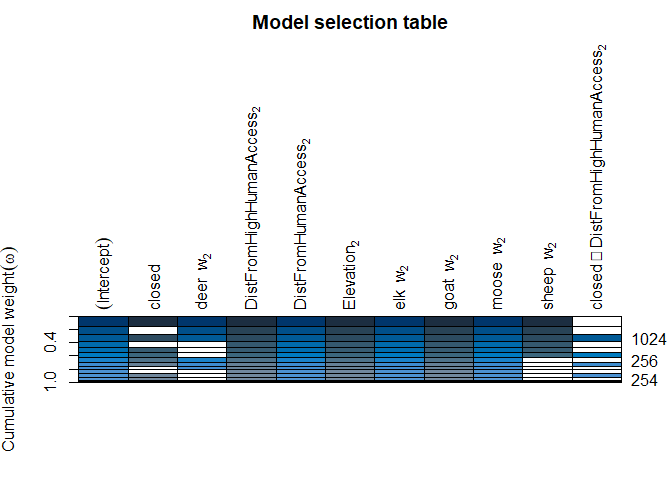<!-- --> Plotting is
a sometimes useful way to visualize the model selection uncertainty
across the top model set. What this plot shows is the variables, their
comparative model rank, and variable importance. Here, we really have
limited model selection uncertainty, so lets look at the dAIC \< 2
models.

Lets subset to only look at the top models with dAIC \< 2.

``` r
#get top models with AICc <2
top.models<-get.models(x1, subset=delta<2)

#model average covariate effects
x6<-model.avg(top.models)
summary(x6)
```

    ## 
    ## Call:
    ## model.avg(object = top.models)
    ## 
    ## Component model call: 
    ## glm(formula = used ~ <11 unique rhs>, family = binomial(logit), data = 
    ##      wolfkde2, na.action = na.fail)
    ## 
    ## Component models: 
    ##                      df  logLik    AICc delta weight
    ## 1+2+3+4+5+6+7+8+9    10 -634.60 1289.31  0.00   0.16
    ## 2+3+4+5+6+7+8+9       9 -635.84 1289.77  0.46   0.13
    ## 1+2+3+4+5+6+7+8+9+10 11 -633.93 1289.98  0.68   0.11
    ## 3+4+5+6+7+8+9         8 -637.12 1290.30  1.00   0.10
    ## 1+3+4+5+6+7+8+9       9 -636.15 1290.38  1.08   0.09
    ## 1+3+4+5+6+7+8+9+10   10 -635.28 1290.66  1.36   0.08
    ## 1+2+3+4+5+6+7+8       9 -636.37 1290.83  1.53   0.07
    ## 1+2+3+4+5+6+7+8+10   10 -635.50 1291.11  1.80   0.07
    ## 2+3+4+5+6+7+8         8 -637.56 1291.18  1.88   0.06
    ## 3+4+5+6+7+8           7 -638.60 1291.26  1.96   0.06
    ## 1+3+4+5+6+7+8+10      9 -636.60 1291.28  1.98   0.06
    ## 
    ## Term codes: 
    ##                          closed                         deer_w2 
    ##                               1                               2 
    ##        DistFromHighHumanAccess2            DistFromHumanAccess2 
    ##                               3                               4 
    ##                      Elevation2                          elk_w2 
    ##                               5                               6 
    ##                         goat_w2                        moose_w2 
    ##                               7                               8 
    ##                        sheep_w2 closed:DistFromHighHumanAccess2 
    ##                               9                              10 
    ## 
    ## Model-averaged coefficients:  
    ## (full average) 
    ##                                   Estimate Std. Error Adjusted SE z value
    ## (Intercept)                      7.178e+00  1.409e+00   1.409e+00   5.093
    ## closed                          -2.374e-01  2.495e-01   2.496e-01   0.951
    ## deer_w2                          1.146e-01  1.301e-01   1.301e-01   0.881
    ## DistFromHighHumanAccess2         1.654e-04  4.748e-05   4.750e-05   3.482
    ## DistFromHumanAccess2            -6.499e-04  1.987e-04   1.989e-04   3.268
    ## Elevation2                      -4.935e-03  6.315e-04   6.318e-04   7.810
    ## elk_w2                           4.932e-01  1.314e-01   1.314e-01   3.752
    ## goat_w2                         -1.916e-01  6.067e-02   6.071e-02   3.156
    ## moose_w2                        -4.431e-01  9.399e-02   9.404e-02   4.712
    ## sheep_w2                        -6.612e-02  6.422e-02   6.424e-02   1.029
    ## closed:DistFromHighHumanAccess2  2.216e-05  4.480e-05   4.481e-05   0.495
    ##                                 Pr(>|z|)    
    ## (Intercept)                      4.0e-07 ***
    ## closed                          0.341586    
    ## deer_w2                         0.378544    
    ## DistFromHighHumanAccess2        0.000497 ***
    ## DistFromHumanAccess2            0.001082 ** 
    ## Elevation2                       < 2e-16 ***
    ## elk_w2                          0.000175 ***
    ## goat_w2                         0.001598 ** 
    ## moose_w2                         2.5e-06 ***
    ## sheep_w2                        0.303377    
    ## closed:DistFromHighHumanAccess2 0.620916    
    ##  
    ## (conditional average) 
    ##                                   Estimate Std. Error Adjusted SE z value
    ## (Intercept)                      7.178e+00  1.409e+00   1.409e+00   5.093
    ## closed                          -3.645e-01  2.220e-01   2.221e-01   1.641
    ## deer_w2                          1.890e-01  1.177e-01   1.178e-01   1.605
    ## DistFromHighHumanAccess2         1.654e-04  4.748e-05   4.750e-05   3.482
    ## DistFromHumanAccess2            -6.499e-04  1.987e-04   1.989e-04   3.268
    ## Elevation2                      -4.935e-03  6.315e-04   6.318e-04   7.810
    ## elk_w2                           4.932e-01  1.314e-01   1.314e-01   3.752
    ## goat_w2                         -1.916e-01  6.067e-02   6.071e-02   3.156
    ## moose_w2                        -4.431e-01  9.399e-02   9.404e-02   4.712
    ## sheep_w2                        -9.775e-02  5.482e-02   5.485e-02   1.782
    ## closed:DistFromHighHumanAccess2  6.891e-05  5.495e-05   5.498e-05   1.253
    ##                                 Pr(>|z|)    
    ## (Intercept)                     3.50e-07 ***
    ## closed                          0.100836    
    ## deer_w2                         0.108553    
    ## DistFromHighHumanAccess2        0.000497 ***
    ## DistFromHumanAccess2            0.001082 ** 
    ## Elevation2                       < 2e-16 ***
    ## elk_w2                          0.000175 ***
    ## goat_w2                         0.001598 ** 
    ## moose_w2                        2.45e-06 ***
    ## sheep_w2                        0.074766 .  
    ## closed:DistFromHighHumanAccess2 0.210078    
    ## ---
    ## Signif. codes:  0 '***' 0.001 '**' 0.01 '*' 0.05 '.' 0.1 ' ' 1

This is a model averaged set of coefficients across the top model set.
Given we did not have much model selection uncertainty here, this model
does not differ that much from our top model(s).

Next lets do landcover using dredge to whittle down our landcover model
list. This is a COMMON approach I take with trying to reduce landcover.

``` r
top.dredge.lc = glm(used ~ openConif+modConif+closedConif+mixed+herb+shrub+water+burn+decid+regen+alpine, data=wolfkde2,family=binomial(logit), na.action ="na.fail")
x2<-dredge(top.dredge.lc)
```

    ## Fixed term is "(Intercept)"

``` r
head(x2, n=10)
```

    ## Global model call: glm(formula = used ~ openConif + modConif + closedConif + mixed + 
    ##     herb + shrub + water + burn + decid + regen + alpine, family = binomial(logit), 
    ##     data = wolfkde2, na.action = "na.fail")
    ## ---
    ## Model selection table 
    ##      (Intrc)   alpin  burn clsdC  decid  herb mixed mdCnf opnCn shrub water df
    ## 1783  -3.970         4.092 2.022        3.970 4.773 2.923 3.305 3.109 4.376  9
    ## 2039  -3.970         4.092 2.022        3.970 4.773 2.923 3.305 3.109 4.376  9
    ## 1784  -4.025  0.3878 4.147 2.077        4.025 4.828 2.978 3.360 3.164 4.431 10
    ## 2040  -4.025  0.3878 4.147 2.077        4.025 4.828 2.978 3.360 3.164 4.431 10
    ## 1791  -3.966         4.087 2.017 -9.601 3.966 4.768 2.918 3.300 3.104 4.371 10
    ## 2047  -3.966         4.087 2.017 -9.601 3.966 4.768 2.918 3.300 3.104 4.371 10
    ## 1792  -4.020  0.3824 4.141 2.072 -9.546 4.020 4.822 2.973 3.354 3.158 4.425 11
    ## 2048  -4.020  0.3824 4.141 2.072 -9.546 4.020 4.822 2.973 3.354 3.158 4.425 11
    ## 1780  -2.662 -0.9753 2.784              2.662 3.465 1.615 1.996 1.801 3.068  9
    ## 2036  -2.662 -0.9753 2.784              2.662 3.465 1.615 1.996 1.801 3.068  9
    ##        logLik   AICc delta weight
    ## 1783 -839.034 1696.2  0.00  0.256
    ## 2039 -839.034 1696.2  0.00  0.256
    ## 1784 -838.921 1697.9  1.79  0.105
    ## 2040 -838.921 1697.9  1.79  0.105
    ## 1791 -838.977 1698.1  1.91  0.099
    ## 2047 -838.977 1698.1  1.91  0.099
    ## 1792 -838.868 1699.9  3.71  0.040
    ## 2048 -838.868 1699.9  3.71  0.040
    ## 1780 -864.294 1746.7 50.52  0.000
    ## 2036 -864.294 1746.7 50.52  0.000
    ## Models ranked by AICc(x)

``` r
top.lc <- glm(used ~ openConif+modConif+closedConif+mixed+herb+shrub+water+burn, data=wolfkde2,family=binomial(logit))
summary(top.lc)
```

    ## 
    ## Call:
    ## glm(formula = used ~ openConif + modConif + closedConif + mixed + 
    ##     herb + shrub + water + burn, family = binomial(logit), data = wolfkde2)
    ## 
    ## Deviance Residuals: 
    ##     Min       1Q   Median       3Q      Max  
    ## -1.5315  -0.7756  -0.5162  -0.1933   2.8245  
    ## 
    ## Coefficients:
    ##             Estimate Std. Error z value Pr(>|z|)    
    ## (Intercept)  -3.9703     0.2914 -13.627  < 2e-16 ***
    ## openConif     3.3045     0.3547   9.317  < 2e-16 ***
    ## modConif      2.9232     0.3050   9.584  < 2e-16 ***
    ## closedConif   2.0219     0.3239   6.242 4.33e-10 ***
    ## mixed         4.7726     0.4431  10.772  < 2e-16 ***
    ## herb          3.9703     0.4427   8.968  < 2e-16 ***
    ## shrub         3.1088     0.3637   8.547  < 2e-16 ***
    ## water         4.3758     0.5415   8.081 6.43e-16 ***
    ## burn          4.0917     0.3817  10.719  < 2e-16 ***
    ## ---
    ## Signif. codes:  0 '***' 0.001 '**' 0.01 '*' 0.05 '.' 0.1 ' ' 1
    ## 
    ## (Dispersion parameter for binomial family taken to be 1)
    ## 
    ##     Null deviance: 2040.9  on 2117  degrees of freedom
    ## Residual deviance: 1678.1  on 2109  degrees of freedom
    ## AIC: 1696.1
    ## 
    ## Number of Fisher Scoring iterations: 6

``` r
#compare to full landcover model
AIC(top.lc, top.dredge.lc)
```

    ##               df      AIC
    ## top.lc         9 1696.067
    ## top.dredge.lc 11 1699.736

So the top landcover model has 2 fewer landcover types, and a dAIC of
3.6 ‘better’ than the full model.

## Manipulating Coefficients from Dredge

Now, it’s up to you what you want from your model. If you just want
coefficients, for example, here they are for model 1 from the :

``` r
coefficients(top.models[[1]])
```

    ##              (Intercept)                   closed                  deer_w2 
    ##             6.6091154605            -0.3139421230             0.2057860141 
    ## DistFromHighHumanAccess2     DistFromHumanAccess2               Elevation2 
    ##             0.0001812717            -0.0006644521            -0.0047249488 
    ##                   elk_w2                  goat_w2                 moose_w2 
    ##             0.4493349534            -0.1873161211            -0.3994125438 
    ##                 sheep_w2 
    ##            -0.1032436954

To get them from all the models, you need to make friends with the
`lapply` and `sapply` functions, or, the `ldply()` from `plyr`. For
example:

``` r
top.model.coef <- lapply(top.models, coefficients)
#str(top.model.coef)
```

str(top.model.coef) makes a horrendous list. You can collapse those into
a single data frame by doing something like this with `ldply`:

``` r
require(plyr)
```

    ## Loading required package: plyr

    ## ------------------------------------------------------------------------------

    ## You have loaded plyr after dplyr - this is likely to cause problems.
    ## If you need functions from both plyr and dplyr, please load plyr first, then dplyr:
    ## library(plyr); library(dplyr)

    ## ------------------------------------------------------------------------------

    ## 
    ## Attaching package: 'plyr'

    ## The following object is masked from 'package:corrgram':
    ## 
    ##     baseball

    ## The following objects are masked from 'package:dplyr':
    ## 
    ##     arrange, count, desc, failwith, id, mutate, rename, summarise,
    ##     summarize

    ## The following object is masked from 'package:purrr':
    ## 
    ##     compact

``` r
ldply(top.models, function(l) as.data.frame(t(coefficients(l))))
```

    ##     .id (Intercept)     closed   deer_w2 DistFromHighHumanAccess2
    ## 1   512    6.609115 -0.3139421 0.2057860             0.0001812717
    ## 2   511    6.418206         NA 0.1859113             0.0001849705
    ## 3  1024    6.883357 -0.4357464 0.1931157             0.0001367724
    ## 4   509    7.419861         NA        NA             0.0001804428
    ## 5   510    7.670538 -0.2740469        NA             0.0001765235
    ## 6  1022    7.916995 -0.4135449        NA             0.0001274067
    ## 7   256    7.094109 -0.3057049 0.1853488             0.0001817791
    ## 8   768    7.375797 -0.4449028 0.1721550             0.0001323199
    ## 9   255    6.900379         NA 0.1666358             0.0001855422
    ## 10  253    7.782877         NA        NA             0.0001814125
    ## 11  766    8.277488 -0.4243395        NA             0.0001243356
    ##    DistFromHumanAccess2   Elevation2    elk_w2    goat_w2   moose_w2
    ## 1         -0.0006644521 -0.004724949 0.4493350 -0.1873161 -0.3994125
    ## 2         -0.0006667275 -0.004745794 0.4676959 -0.1799603 -0.4128860
    ## 3         -0.0006559658 -0.004761781 0.4478003 -0.1856042 -0.4165298
    ## 4         -0.0006362010 -0.005049899 0.5822713 -0.1808138 -0.4662290
    ## 5         -0.0006319914 -0.005059625 0.5779479 -0.1872497 -0.4585099
    ## 6         -0.0006244058 -0.005082654 0.5667675 -0.1854004 -0.4743264
    ## 7         -0.0006625677 -0.004948369 0.4240470 -0.2114815 -0.4374816
    ## 8         -0.0006534221 -0.004977994 0.4249496 -0.2084569 -0.4550233
    ## 9         -0.0006646260 -0.004964879 0.4415978 -0.2033809 -0.4499559
    ## 10        -0.0006378098 -0.005231025 0.5471933 -0.2022158 -0.4961484
    ## 11        -0.0006257271 -0.005255529 0.5341738 -0.2060864 -0.5045894
    ##       sheep_w2 closed:DistFromHighHumanAccess2
    ## 1  -0.10324370                              NA
    ## 2  -0.10149850                              NA
    ## 3  -0.09785598                    6.271482e-05
    ## 4  -0.09392772                              NA
    ## 5  -0.09462624                              NA
    ## 6  -0.08904594                    7.064784e-05
    ## 7           NA                              NA
    ## 8           NA                    7.031454e-05
    ## 9           NA                              NA
    ## 10          NA                              NA
    ## 11          NA                    7.687103e-05

Which is pretty tidy. If you want, for example, p-values, you need to
dig into the fitted model object a bit. Here is the stats table for the
top model:

``` r
summary(top.models[[1]])$coefficients
```

    ##                               Estimate   Std. Error   z value     Pr(>|z|)
    ## (Intercept)               6.6091154605 1.346135e+00  4.909696 9.121756e-07
    ## closed                   -0.3139421230 1.991085e-01 -1.576739 1.148556e-01
    ## deer_w2                   0.2057860141 1.174938e-01  1.751463 7.986622e-02
    ## DistFromHighHumanAccess2  0.0001812717 3.427699e-05  5.288437 1.233661e-07
    ## DistFromHumanAccess2     -0.0006644521 1.980971e-04 -3.354174 7.960218e-04
    ## Elevation2               -0.0047249488 6.169851e-04 -7.658124 1.886681e-14
    ## elk_w2                    0.4493349534 1.253416e-01  3.584882 3.372308e-04
    ## goat_w2                  -0.1873161211 6.010484e-02 -3.116490 1.830180e-03
    ## moose_w2                 -0.3994125438 9.022510e-02 -4.426845 9.562124e-06
    ## sheep_w2                 -0.1032436954 5.465143e-02 -1.889131 5.887432e-02

So you need to pull out the p-values inside of your ldply command:

``` r
tidyList1<- ldply(top.models, function(l) as.data.frame(t(summary(l)$coefficients[,4])))
head(tidyList1)
```

    ##    .id  (Intercept)     closed    deer_w2 DistFromHighHumanAccess2
    ## 1  512 9.121756e-07 0.11485562 0.07986622             1.233661e-07
    ## 2  511 1.947976e-06         NA 0.11175795             7.781029e-08
    ## 3 1024 5.572340e-07 0.05376472 0.10188518             9.883457e-03
    ## 4  509 4.995728e-10         NA         NA             1.399920e-07
    ## 5  510 1.768150e-10 0.16353162         NA             2.381155e-07
    ## 6 1022 1.003705e-10 0.06504067         NA             1.492149e-02
    ##   DistFromHumanAccess2   Elevation2       elk_w2     goat_w2     moose_w2
    ## 1         0.0007960218 1.886681e-14 3.372308e-04 0.001830180 9.562124e-06
    ## 2         0.0007962090 2.080063e-14 1.813541e-04 0.002647095 4.914827e-06
    ## 3         0.0009484086 1.418790e-14 3.647923e-04 0.002052838 5.926397e-06
    ## 4         0.0012587144 1.765241e-17 1.533627e-08 0.002637443 3.303088e-08
    ## 5         0.0013095140 1.035401e-17 1.711344e-08 0.001920528 5.378862e-08
    ## 6         0.0015296141 7.712810e-18 4.139794e-08 0.002162325 3.044111e-08
    ##     sheep_w2 closed:DistFromHighHumanAccess2
    ## 1 0.05887432                              NA
    ## 2 0.06324370                              NA
    ## 3 0.07522054                       0.2557586
    ## 4 0.08384947                              NA
    ## 5 0.08146970                              NA
    ## 6 0.10332892                       0.1969260

There are your p-values.

Next we will use the `broom` package, which has a `tidy` command which
might automate everything for you. Check this out:

``` r
require(broom)
tidy(top.models[[1]])
```

    ## # A tibble: 10 × 5
    ##    term                      estimate std.error statistic  p.value
    ##    <chr>                        <dbl>     <dbl>     <dbl>    <dbl>
    ##  1 (Intercept)               6.61     1.35           4.91 9.12e- 7
    ##  2 closed                   -0.314    0.199         -1.58 1.15e- 1
    ##  3 deer_w2                   0.206    0.117          1.75 7.99e- 2
    ##  4 DistFromHighHumanAccess2  0.000181 0.0000343      5.29 1.23e- 7
    ##  5 DistFromHumanAccess2     -0.000664 0.000198      -3.35 7.96e- 4
    ##  6 Elevation2               -0.00472  0.000617      -7.66 1.89e-14
    ##  7 elk_w2                    0.449    0.125          3.58 3.37e- 4
    ##  8 goat_w2                  -0.187    0.0601        -3.12 1.83e- 3
    ##  9 moose_w2                 -0.399    0.0902        -4.43 9.56e- 6
    ## 10 sheep_w2                 -0.103    0.0547        -1.89 5.89e- 2

``` r
tidyList2 <- ldply(top.models, tidy)
head(tidyList2)
```

    ##   .id                     term      estimate    std.error statistic
    ## 1 512              (Intercept)  6.6091154605 1.346135e+00  4.909696
    ## 2 512                   closed -0.3139421230 1.991085e-01 -1.576739
    ## 3 512                  deer_w2  0.2057860141 1.174938e-01  1.751463
    ## 4 512 DistFromHighHumanAccess2  0.0001812717 3.427699e-05  5.288437
    ## 5 512     DistFromHumanAccess2 -0.0006644521 1.980971e-04 -3.354174
    ## 6 512               Elevation2 -0.0047249488 6.169851e-04 -7.658124
    ##        p.value
    ## 1 9.121756e-07
    ## 2 1.148556e-01
    ## 3 7.986622e-02
    ## 4 1.233661e-07
    ## 5 7.960218e-04
    ## 6 1.886681e-14

That extracts the main information you might need.

What you actually want is confidence intervals. You can get those out of
the `tidy` output with a little piping %\>% (with magrittr, which is
included in tidyverse)

``` r
(CI.table <- ldply(top.models, tidy) %>%  mutate(CI.low = estimate - 2*std.error, CI.high = estimate + 2*std.error))
```

    ##      .id                            term      estimate    std.error statistic
    ## 1    512                     (Intercept)  6.609115e+00 1.346135e+00  4.909696
    ## 2    512                          closed -3.139421e-01 1.991085e-01 -1.576739
    ## 3    512                         deer_w2  2.057860e-01 1.174938e-01  1.751463
    ## 4    512        DistFromHighHumanAccess2  1.812717e-04 3.427699e-05  5.288437
    ## 5    512            DistFromHumanAccess2 -6.644521e-04 1.980971e-04 -3.354174
    ## 6    512                      Elevation2 -4.724949e-03 6.169851e-04 -7.658124
    ## 7    512                          elk_w2  4.493350e-01 1.253416e-01  3.584882
    ## 8    512                         goat_w2 -1.873161e-01 6.010484e-02 -3.116490
    ## 9    512                        moose_w2 -3.994125e-01 9.022510e-02 -4.426845
    ## 10   512                        sheep_w2 -1.032437e-01 5.465143e-02 -1.889131
    ## 11   511                     (Intercept)  6.418206e+00 1.348717e+00  4.758748
    ## 12   511                         deer_w2  1.859113e-01 1.169003e-01  1.590341
    ## 13   511        DistFromHighHumanAccess2  1.849705e-04 3.443147e-05  5.372134
    ## 14   511            DistFromHumanAccess2 -6.667275e-04 1.987793e-04 -3.354109
    ## 15   511                      Elevation2 -4.745794e-03 6.207239e-04 -7.645580
    ## 16   511                          elk_w2  4.676959e-01 1.249299e-01  3.743667
    ## 17   511                         goat_w2 -1.799603e-01 5.986704e-02 -3.005999
    ## 18   511                        moose_w2 -4.128860e-01 9.037887e-02 -4.568391
    ## 19   511                        sheep_w2 -1.014985e-01 5.464329e-02 -1.857474
    ## 20  1024                     (Intercept)  6.883357e+00 1.375165e+00  5.005479
    ## 21  1024                          closed -4.357464e-01 2.259243e-01 -1.928727
    ## 22  1024                         deer_w2  1.931157e-01 1.180571e-01  1.635782
    ## 23  1024        DistFromHighHumanAccess2  1.367724e-04 5.301500e-05  2.579880
    ## 24  1024            DistFromHumanAccess2 -6.559658e-04 1.984527e-04 -3.305400
    ## 25  1024                      Elevation2 -4.761781e-03 6.188429e-04 -7.694653
    ## 26  1024                          elk_w2  4.478003e-01 1.256339e-01  3.564326
    ## 27  1024                         goat_w2 -1.856042e-01 6.021263e-02 -3.082480
    ## 28  1024                        moose_w2 -4.165298e-01 9.196951e-02 -4.528998
    ## 29  1024                        sheep_w2 -9.785598e-02 5.500255e-02 -1.779117
    ## 30  1024 closed:DistFromHighHumanAccess2  6.271482e-05 5.518372e-05  1.136473
    ## 31   509                     (Intercept)  7.419861e+00 1.193050e+00  6.219239
    ## 32   509        DistFromHighHumanAccess2  1.804428e-04 3.427045e-05  5.265259
    ## 33   509            DistFromHumanAccess2 -6.362010e-04 1.972576e-04 -3.225230
    ## 34   509                      Elevation2 -5.049899e-03 5.935272e-04 -8.508285
    ## 35   509                          elk_w2  5.822713e-01 1.029155e-01  5.657759
    ## 36   509                         goat_w2 -1.808138e-01 6.012875e-02 -3.007110
    ## 37   509                        moose_w2 -4.662290e-01 8.439203e-02 -5.524562
    ## 38   509                        sheep_w2 -9.392772e-02 5.433197e-02 -1.728774
    ## 39   510                     (Intercept)  7.670538e+00 1.202234e+00  6.380236
    ## 40   510                          closed -2.740469e-01 1.966902e-01 -1.393292
    ## 41   510        DistFromHighHumanAccess2  1.765235e-04 3.416485e-05  5.166816
    ## 42   510            DistFromHumanAccess2 -6.319914e-04 1.966440e-04 -3.213887
    ## 43   510                      Elevation2 -5.059625e-03 5.903922e-04 -8.569939
    ## 44   510                          elk_w2  5.779479e-01 1.024929e-01  5.638906
    ## 45   510                         goat_w2 -1.872497e-01 6.035924e-02 -3.102254
    ## 46   510                        moose_w2 -4.585099e-01 8.431112e-02 -5.438309
    ## 47   510                        sheep_w2 -9.462624e-02 5.431355e-02 -1.742221
    ## 48  1022                     (Intercept)  7.916995e+00 1.224330e+00  6.466392
    ## 49  1022                          closed -4.135449e-01 2.241462e-01 -1.844979
    ## 50  1022        DistFromHighHumanAccess2  1.274067e-04 5.233857e-05  2.434279
    ## 51  1022            DistFromHumanAccess2 -6.244058e-04 1.970353e-04 -3.169006
    ## 52  1022                      Elevation2 -5.082654e-03 5.907461e-04 -8.603787
    ## 53  1022                          elk_w2  5.667675e-01 1.033346e-01  5.484782
    ## 54  1022                         goat_w2 -1.854004e-01 6.045045e-02 -3.066981
    ## 55  1022                        moose_w2 -4.743264e-01 8.563579e-02 -5.538881
    ## 56  1022                        sheep_w2 -8.904594e-02 5.466547e-02 -1.628925
    ## 57  1022 closed:DistFromHighHumanAccess2  7.064784e-05 5.475053e-05  1.290359
    ## 58   256                     (Intercept)  7.094109e+00 1.328228e+00  5.341031
    ## 59   256                          closed -3.057049e-01 1.985897e-01 -1.539380
    ## 60   256                         deer_w2  1.853488e-01 1.160727e-01  1.596833
    ## 61   256        DistFromHighHumanAccess2  1.817791e-04 3.430244e-05  5.299304
    ## 62   256            DistFromHumanAccess2 -6.625677e-04 1.988157e-04 -3.332573
    ## 63   256                      Elevation2 -4.948369e-03 6.107604e-04 -8.101980
    ## 64   256                          elk_w2  4.240470e-01 1.249522e-01  3.393674
    ## 65   256                         goat_w2 -2.114815e-01 5.873260e-02 -3.600752
    ## 66   256                        moose_w2 -4.374816e-01 8.907649e-02 -4.911302
    ## 67   768                     (Intercept)  7.375797e+00 1.353865e+00  5.447958
    ## 68   768                          closed -4.449028e-01 2.256107e-01 -1.971994
    ## 69   768                         deer_w2  1.721550e-01 1.166461e-01  1.475874
    ## 70   768        DistFromHighHumanAccess2  1.323199e-04 5.245044e-05  2.522760
    ## 71   768            DistFromHumanAccess2 -6.534221e-04 1.991924e-04 -3.280357
    ## 72   768                      Elevation2 -4.977994e-03 6.118143e-04 -8.136447
    ## 73   768                          elk_w2  4.249496e-01 1.253021e-01  3.391399
    ## 74   768                         goat_w2 -2.084569e-01 5.882006e-02 -3.543976
    ## 75   768                        moose_w2 -4.550233e-01 9.053939e-02 -5.025694
    ## 76   768 closed:DistFromHighHumanAccess2  7.031454e-05 5.439661e-05  1.292627
    ## 77   255                     (Intercept)  6.900379e+00 1.329664e+00  5.189568
    ## 78   255                         deer_w2  1.666358e-01 1.155370e-01  1.442273
    ## 79   255        DistFromHighHumanAccess2  1.855422e-04 3.442827e-05  5.389241
    ## 80   255            DistFromHumanAccess2 -6.646260e-04 1.994762e-04 -3.331856
    ## 81   255                      Elevation2 -4.964879e-03 6.143782e-04 -8.081145
    ## 82   255                          elk_w2  4.415978e-01 1.244354e-01  3.548812
    ## 83   255                         goat_w2 -2.033809e-01 5.846447e-02 -3.478710
    ## 84   255                        moose_w2 -4.499559e-01 8.918225e-02 -5.045353
    ## 85   253                     (Intercept)  7.782877e+00 1.179728e+00  6.597180
    ## 86   253        DistFromHighHumanAccess2  1.814125e-04 3.428347e-05  5.291543
    ## 87   253            DistFromHumanAccess2 -6.378098e-04 1.980271e-04 -3.220820
    ## 88   253                      Elevation2 -5.231025e-03 5.880026e-04 -8.896262
    ## 89   253                          elk_w2  5.471933e-01 1.013206e-01  5.400614
    ## 90   253                         goat_w2 -2.022158e-01 5.867279e-02 -3.446500
    ## 91   253                        moose_w2 -4.961484e-01 8.348522e-02 -5.942949
    ## 92   766                     (Intercept)  8.277488e+00 1.209203e+00  6.845408
    ## 93   766                          closed -4.243395e-01 2.238164e-01 -1.895927
    ## 94   766        DistFromHighHumanAccess2  1.243356e-04 5.190015e-05  2.395668
    ## 95   766            DistFromHumanAccess2 -6.257271e-04 1.978262e-04 -3.163015
    ## 96   766                      Elevation2 -5.255529e-03 5.847672e-04 -8.987386
    ## 97   766                          elk_w2  5.341738e-01 1.018197e-01  5.246269
    ## 98   766                         goat_w2 -2.060864e-01 5.898562e-02 -3.493842
    ## 99   766                        moose_w2 -5.045894e-01 8.450670e-02 -5.970998
    ## 100  766 closed:DistFromHighHumanAccess2  7.687103e-05 5.407088e-05  1.421672
    ##          p.value        CI.low       CI.high
    ## 1   9.121756e-07  3.916845e+00  9.3013860564
    ## 2   1.148556e-01 -7.121591e-01  0.0842748878
    ## 3   7.986622e-02 -2.920157e-02  0.4407736029
    ## 4   1.233661e-07  1.127177e-04  0.0002498257
    ## 5   7.960218e-04 -1.060646e-03 -0.0002682580
    ## 6   1.886681e-14 -5.958919e-03 -0.0034909786
    ## 7   3.372308e-04  1.986517e-01  0.7000182236
    ## 8   1.830180e-03 -3.075258e-01 -0.0671064434
    ## 9   9.562124e-06 -5.798627e-01 -0.2189623528
    ## 10  5.887432e-02 -2.125466e-01  0.0060591648
    ## 11  1.947976e-06  3.720771e+00  9.1156404739
    ## 12  1.117579e-01 -4.788925e-02  0.4197119019
    ## 13  7.781029e-08  1.161075e-04  0.0002538334
    ## 14  7.962090e-04 -1.064286e-03 -0.0002691689
    ## 15  2.080063e-14 -5.987242e-03 -0.0035043460
    ## 16  1.813541e-04  2.178361e-01  0.7175557632
    ## 17  2.647095e-03 -2.996944e-01 -0.0602262068
    ## 18  4.914827e-06 -5.936437e-01 -0.2321282611
    ## 19  6.324370e-02 -2.107851e-01  0.0077880706
    ## 20  5.572340e-07  4.133028e+00  9.6336858383
    ## 21  5.376472e-02 -8.875950e-01  0.0161022174
    ## 22  1.018852e-01 -4.299849e-02  0.4292298246
    ## 23  9.883457e-03  3.074236e-05  0.0002428024
    ## 24  9.484086e-04 -1.052871e-03 -0.0002590603
    ## 25  1.418790e-14 -5.999467e-03 -0.0035240953
    ## 26  3.647923e-04  1.965324e-01  0.6990681664
    ## 27  2.052838e-03 -3.060295e-01 -0.0651789442
    ## 28  5.926397e-06 -6.004688e-01 -0.2325907359
    ## 29  7.522054e-02 -2.078611e-01  0.0121491136
    ## 30  2.557586e-01 -4.765262e-05  0.0001730823
    ## 31  4.995728e-10  5.033761e+00  9.8059602087
    ## 32  1.399920e-07  1.119019e-04  0.0002489837
    ## 33  1.258714e-03 -1.030716e-03 -0.0002416859
    ## 34  1.765241e-17 -6.236954e-03 -0.0038628447
    ## 35  1.533627e-08  3.764402e-01  0.7881023597
    ## 36  2.637443e-03 -3.010713e-01 -0.0605562661
    ## 37  3.303088e-08 -6.350131e-01 -0.2974449483
    ## 38  8.384947e-02 -2.025917e-01  0.0147362176
    ## 39  1.768150e-10  5.266069e+00 10.0750059526
    ## 40  1.635316e-01 -6.674274e-01  0.1193336205
    ## 41  2.381155e-07  1.081938e-04  0.0002448532
    ## 42  1.309514e-03 -1.025279e-03 -0.0002387035
    ## 43  1.035401e-17 -6.240410e-03 -0.0038788409
    ## 44  1.711344e-08  3.729620e-01  0.7829336899
    ## 45  1.920528e-03 -3.079682e-01 -0.0665312381
    ## 46  5.378862e-08 -6.271322e-01 -0.2898876809
    ## 47  8.146970e-02 -2.032533e-01  0.0140008668
    ## 48  1.003705e-10  5.468336e+00 10.3656535354
    ## 49  6.504067e-02 -8.618372e-01  0.0347474764
    ## 50  1.492149e-02  2.272955e-05  0.0002320838
    ## 51  1.529614e-03 -1.018476e-03 -0.0002303353
    ## 52  7.712810e-18 -6.264146e-03 -0.0039011616
    ## 53  4.139794e-08  3.600984e-01  0.7734365891
    ## 54  2.162325e-03 -3.063013e-01 -0.0644994958
    ## 55  3.044111e-08 -6.455980e-01 -0.3030548335
    ## 56  1.033289e-01 -1.983769e-01  0.0202849938
    ## 57  1.969260e-01 -3.885323e-05  0.0001801489
    ## 58  9.241954e-08  4.437652e+00  9.7505656745
    ## 59  1.237116e-01 -7.028842e-01  0.0914744234
    ## 60  1.103028e-01 -4.679663e-02  0.4174942139
    ## 61  1.162448e-07  1.131742e-04  0.0002503840
    ## 62  8.604696e-04 -1.060199e-03 -0.0002649364
    ## 63  5.407174e-16 -6.169890e-03 -0.0037268480
    ## 64  6.896181e-04  1.741426e-01  0.6739513845
    ## 65  3.172983e-04 -3.289467e-01 -0.0940163176
    ## 66  9.047350e-07 -6.156345e-01 -0.2593285834
    ## 67  5.095142e-08  4.668068e+00 10.0835261948
    ## 68  4.861031e-02 -8.961241e-01  0.0063184825
    ## 69  1.399776e-01 -6.113721e-02  0.4054472086
    ## 70  1.164378e-02  2.741899e-05  0.0002372208
    ## 71  1.036758e-03 -1.051807e-03 -0.0002550373
    ## 72  4.070479e-16 -6.201623e-03 -0.0037543658
    ## 73  6.953682e-04  1.743453e-01  0.6755538523
    ## 74  3.941417e-04 -3.260970e-01 -0.0908167422
    ## 75  5.016158e-07 -6.361020e-01 -0.2739444713
    ## 76  1.961400e-01 -3.847869e-05  0.0001791078
    ## 77  2.107826e-07  4.241052e+00  9.5597062271
    ## 78  1.492255e-01 -6.443815e-02  0.3977097918
    ## 79  7.075603e-08  1.166857e-04  0.0002543988
    ## 80  8.626887e-04 -1.063578e-03 -0.0002656736
    ## 81  6.416161e-16 -6.193635e-03 -0.0037361226
    ## 82  3.869729e-04  1.927270e-01  0.6904685604
    ## 83  5.038334e-04 -3.203099e-01 -0.0864519988
    ## 84  4.526846e-07 -6.283204e-01 -0.2715914383
    ## 85  4.190523e-11  5.423421e+00 10.1423323055
    ## 86  1.212887e-07  1.128455e-04  0.0002499794
    ## 87  1.278244e-03 -1.033864e-03 -0.0002417555
    ## 88  5.775904e-19 -6.407031e-03 -0.0040550202
    ## 89  6.641326e-08  3.445522e-01  0.7498344914
    ## 90  5.678985e-04 -3.195613e-01 -0.0848701850
    ## 91  2.799394e-09 -6.631188e-01 -0.3291779670
    ## 92  7.625833e-12  5.859082e+00 10.6958938388
    ## 93  5.796973e-02 -8.719723e-01  0.0232933047
    ## 94  1.659009e-02  2.053525e-05  0.0002281359
    ## 95  1.561445e-03 -1.021379e-03 -0.0002300747
    ## 96  2.531792e-19 -6.425064e-03 -0.0040859946
    ## 97  1.552100e-07  3.305343e-01  0.7378132407
    ## 98  4.761223e-04 -3.240577e-01 -0.0881152096
    ## 99  2.358060e-09 -6.736028e-01 -0.3355759918
    ## 100 1.551216e-01 -3.127073e-05  0.0001850128

This thing you can quickly ggplot, which is nice:

``` r
ggplot(mutate(CI.table, model = .id), aes(model, estimate)) + 
  geom_errorbar(aes(ymin = CI.low, ymax = CI.high)) + 
  facet_wrap(.~term, scales = "free_y") + theme(axis.text.x = element_text(angle = 90))
```

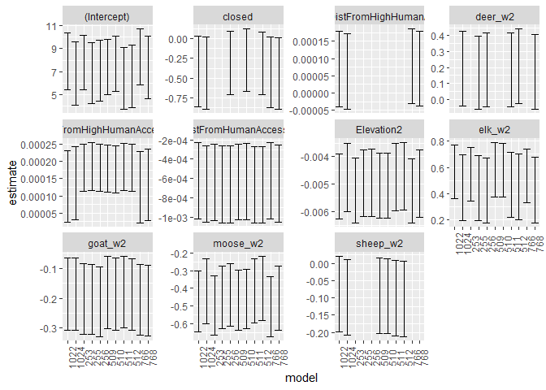<!-- -->

# Model Selection using BIC

One of the challenges of used-available RSF designs with radiocollar
data is that the sample size is based on the \# of rows, which represent
individual radiotelemetry points, which can be HUGE for GPS radiocollar
datasets. Yet, in the formula for AIC, there is no information about
sample size as a factor that affects model selection. As a result, in my
experience, model selection using AIC in GPS radiocollar- based RSF
models ALWAYS results in overfit models with almost every parameter
being retained.

Note we will use the function BIC() in the base {stats4} pacakge. This
generic function calculates the Bayesian information criterion, also
known as Schwarz’s Bayesian criterion (SBC), for one or several fitted
model objects for which a log-likelihood value can be obtained,
according to the formula $$BIC = -2*log-likelihood + npar*log(nobs)$$,
where npar represents the number of parameters and nobs the number of
observations in the fitted model.

In my estimation, BIC tends to be more conservative in preventing model
overfitting because it does not consider K the ‘penalty’ function, but
instead, considers K\*log(n) where n is the number of rows of data, as
the penalty function. Thus, it calculates a bigger penalty for larger
datasets, which gaurds against overfitting.

Note: There are not as many functions out there to calculate model
selection using BIC. Today we will use BIC in the package MuMIn.

References

Aho, K., Derryberry, D. & Peterson, T. (2014) Model selection for
ecologists: the worldviews of AIC and BIC. Ecology, 95, 631-636.

Lets next explore extracting BIC manually and comparing model fit
between AIC and BIC.

``` r
## First manually
AIC(top.forward, top.biotic, second.biotic, top.env)
```

    ##               df      AIC
    ## top.forward   11 1289.858
    ## top.biotic     4 1406.235
    ## second.biotic  4 1409.000
    ## top.env       11 1320.283

``` r
BIC(top.forward, top.biotic, second.biotic, top.env)
```

    ##               df      BIC
    ## top.forward   11 1352.099
    ## top.biotic     4 1428.868
    ## second.biotic  4 1431.633
    ## top.env       11 1382.524

OK - so not much difference in top models using BIC and AIC in this
dataset.

## BIC with Dredge

Now lets use the dredge function with BIC

``` r
x1.bic<-dredge(top.forward, rank=BIC) ## note this now ranks using BIC
```

    ## Fixed term is "(Intercept)"

``` r
plot(x1.bic)
```

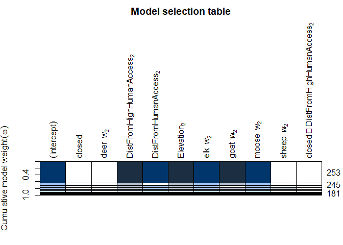<!-- -->

``` r
## x1.bic - look at all 

head(x1.bic, n = 10) ## only shows top 10 models fit
```

    ## Global model call: glm(formula = used ~ deer_w2 + elk_w2 + moose_w2 + sheep_w2 + 
    ##     goat_w2 + Elevation2 + DistFromHumanAccess2 + DistFromHighHumanAccess2 + 
    ##     closed + DistFromHighHumanAccess2 * closed, family = binomial(logit), 
    ##     data = wolfkde2, na.action = "na.fail")
    ## ---
    ## Model selection table 
    ##      (Int)     cls der_w2      DFHH       DFHA       El2 elk_w2  got_w2  mos_w2
    ## 253  7.783                0.0001814 -0.0006378 -0.005231 0.5472 -0.2022 -0.4961
    ## 245  8.768                0.0001893            -0.006011 0.5692 -0.1966 -0.5242
    ## 189  9.031                0.0001925 -0.0006260 -0.006066 0.4386         -0.4672
    ## 509  7.420                0.0001804 -0.0006362 -0.005050 0.5823 -0.1808 -0.4662
    ## 255  6.900         0.1666 0.0001855 -0.0006646 -0.004965 0.4416 -0.2034 -0.4500
    ## 254  8.033 -0.2702        0.0001774 -0.0006339 -0.005242 0.5430 -0.2091 -0.4889
    ## 445  8.354                0.0001889 -0.0006240 -0.005691 0.5071         -0.4383
    ## 181 10.010                0.0002013            -0.006832 0.4615         -0.4964
    ## 501  8.388                0.0001874            -0.005824 0.6059 -0.1747 -0.4945
    ## 511  6.418         0.1859 0.0001850 -0.0006667 -0.004746 0.4677 -0.1800 -0.4129
    ##       shp_w2 df   logLik    BIC delta weight
    ## 253           7 -638.605 1330.8  0.00  0.659
    ## 245           6 -644.494 1334.9  4.12  0.084
    ## 189           6 -644.751 1335.5  4.63  0.065
    ## 509 -0.09393  8 -637.118 1335.5  4.68  0.063
    ## 255           8 -637.558 1336.4  5.56  0.041
    ## 254           8 -637.659 1336.6  5.77  0.037
    ## 445 -0.12620  7 -641.770 1337.1  6.33  0.028
    ## 181           5 -650.382 1339.1  8.24  0.011
    ## 501 -0.09293  7 -643.023 1339.7  8.84  0.008
    ## 511 -0.10150  9 -635.842 1340.6  9.79  0.005
    ## Models ranked by BIC(x)

``` r
# lets compare the top model from AIC and BIC
head(x1.bic, n = 1) ## only shows top 1 models fit with BIC
```

    ## Global model call: glm(formula = used ~ deer_w2 + elk_w2 + moose_w2 + sheep_w2 + 
    ##     goat_w2 + Elevation2 + DistFromHumanAccess2 + DistFromHighHumanAccess2 + 
    ##     closed + DistFromHighHumanAccess2 * closed, family = binomial(logit), 
    ##     data = wolfkde2, na.action = "na.fail")
    ## ---
    ## Model selection table 
    ##     (Int)      DFHH       DFHA       El2 elk_w2  got_w2  mos_w2 df   logLik
    ## 253 7.783 0.0001814 -0.0006378 -0.005231 0.5472 -0.2022 -0.4961  7 -638.605
    ##        BIC delta weight
    ## 253 1330.8     0      1
    ## Models ranked by BIC(x)

``` r
head(x1, n = 1) ## only shows top 1 models fit with AIC
```

    ## Global model call: glm(formula = used ~ deer_w2 + elk_w2 + moose_w2 + sheep_w2 + 
    ##     goat_w2 + Elevation2 + DistFromHumanAccess2 + DistFromHighHumanAccess2 + 
    ##     closed + DistFromHighHumanAccess2 * closed, family = binomial(logit), 
    ##     data = wolfkde2, na.action = "na.fail")
    ## ---
    ## Model selection table 
    ##     (Int)     cls der_w2      DFHH       DFHA       El2 elk_w2  got_w2  mos_w2
    ## 512 6.609 -0.3139 0.2058 0.0001813 -0.0006645 -0.004725 0.4493 -0.1873 -0.3994
    ##      shp_w2 df   logLik   AICc delta weight
    ## 512 -0.1032 10 -634.601 1289.3     0      1
    ## Models ranked by AICc(x)

So AIC is overfitting here potentially, selecting a model with 11
parameters versus 7 parameters with BIC. Take note. This is a theme.

Next, lets take a look at the top models.

``` r
#get top models with BIC <2
top.models.bic<-get.models(x1.bic, subset=delta<2)
top.models.bic 
```

    ## $`253`
    ## 
    ## Call:  glm(formula = used ~ DistFromHighHumanAccess2 + DistFromHumanAccess2 + 
    ##     Elevation2 + elk_w2 + goat_w2 + moose_w2 + 1, family = binomial(logit), 
    ##     data = wolfkde2, na.action = "na.fail")
    ## 
    ## Coefficients:
    ##              (Intercept)  DistFromHighHumanAccess2      DistFromHumanAccess2  
    ##                7.7828767                 0.0001814                -0.0006378  
    ##               Elevation2                    elk_w2                   goat_w2  
    ##               -0.0052310                 0.5471933                -0.2022158  
    ##                 moose_w2  
    ##               -0.4961484  
    ## 
    ## Degrees of Freedom: 2117 Total (i.e. Null);  2111 Residual
    ## Null Deviance:       2041 
    ## Residual Deviance: 1277  AIC: 1291
    ## 
    ## attr(,"rank")
    ## function (x) 
    ## do.call("rank", list(x))
    ## <environment: 0x0000026f2e2fd9b0>
    ## attr(,"call")
    ## BIC(x)
    ## attr(,"class")
    ## [1] "function"     "rankFunction"
    ## attr(,"beta")
    ## [1] "none"

Note there is only 1 top model here using BIC, thus, there is no need to
model average covariate effects using this command.

    x.top.bic<-model.avg(top.models.bic) ## only 1 top model, so this doesnt work

Lets run the ‘top’ model selected using BIC for next week.

``` r
## Lets run the 'top' model selected using BIC for next week
top.model.bic = glm(used ~ DistFromHighHumanAccess2 + DistFromHumanAccess2+Elevation2+elk_w2+goat_w2+moose_w2, data=wolfkde2,family=binomial(logit), na.action ="na.fail")
summary(top.model.bic)
```

    ## 
    ## Call:
    ## glm(formula = used ~ DistFromHighHumanAccess2 + DistFromHumanAccess2 + 
    ##     Elevation2 + elk_w2 + goat_w2 + moose_w2, family = binomial(logit), 
    ##     data = wolfkde2, na.action = "na.fail")
    ## 
    ## Deviance Residuals: 
    ##     Min       1Q   Median       3Q      Max  
    ## -1.8576  -0.4580  -0.1602  -0.0385   3.2508  
    ## 
    ## Coefficients:
    ##                            Estimate Std. Error z value Pr(>|z|)    
    ## (Intercept)               7.783e+00  1.180e+00   6.597 4.19e-11 ***
    ## DistFromHighHumanAccess2  1.814e-04  3.428e-05   5.292 1.21e-07 ***
    ## DistFromHumanAccess2     -6.378e-04  1.980e-04  -3.221 0.001278 ** 
    ## Elevation2               -5.231e-03  5.880e-04  -8.896  < 2e-16 ***
    ## elk_w2                    5.472e-01  1.013e-01   5.401 6.64e-08 ***
    ## goat_w2                  -2.022e-01  5.867e-02  -3.447 0.000568 ***
    ## moose_w2                 -4.961e-01  8.349e-02  -5.943 2.80e-09 ***
    ## ---
    ## Signif. codes:  0 '***' 0.001 '**' 0.01 '*' 0.05 '.' 0.1 ' ' 1
    ## 
    ## (Dispersion parameter for binomial family taken to be 1)
    ## 
    ##     Null deviance: 2040.9  on 2117  degrees of freedom
    ## Residual deviance: 1277.2  on 2111  degrees of freedom
    ## AIC: 1291.2
    ## 
    ## Number of Fisher Scoring iterations: 7

``` r
## compare to top AIC model
summary(top.forward)
```

    ## 
    ## Call:
    ## glm(formula = used ~ deer_w2 + elk_w2 + moose_w2 + sheep_w2 + 
    ##     goat_w2 + Elevation2 + DistFromHumanAccess2 + DistFromHighHumanAccess2 + 
    ##     closed + DistFromHighHumanAccess2 * closed, family = binomial(logit), 
    ##     data = wolfkde2, na.action = "na.fail")
    ## 
    ## Deviance Residuals: 
    ##      Min        1Q    Median        3Q       Max  
    ## -2.01010  -0.46000  -0.15835  -0.04175   3.12206  
    ## 
    ## Coefficients:
    ##                                   Estimate Std. Error z value Pr(>|z|)    
    ## (Intercept)                      6.883e+00  1.375e+00   5.005 5.57e-07 ***
    ## deer_w2                          1.931e-01  1.181e-01   1.636 0.101885    
    ## elk_w2                           4.478e-01  1.256e-01   3.564 0.000365 ***
    ## moose_w2                        -4.165e-01  9.197e-02  -4.529 5.93e-06 ***
    ## sheep_w2                        -9.786e-02  5.500e-02  -1.779 0.075221 .  
    ## goat_w2                         -1.856e-01  6.021e-02  -3.082 0.002053 ** 
    ## Elevation2                      -4.762e-03  6.188e-04  -7.695 1.42e-14 ***
    ## DistFromHumanAccess2            -6.560e-04  1.984e-04  -3.305 0.000948 ***
    ## DistFromHighHumanAccess2         1.368e-04  5.302e-05   2.580 0.009883 ** 
    ## closed                          -4.357e-01  2.259e-01  -1.929 0.053765 .  
    ## DistFromHighHumanAccess2:closed  6.271e-05  5.518e-05   1.136 0.255759    
    ## ---
    ## Signif. codes:  0 '***' 0.001 '**' 0.01 '*' 0.05 '.' 0.1 ' ' 1
    ## 
    ## (Dispersion parameter for binomial family taken to be 1)
    ## 
    ##     Null deviance: 2040.9  on 2117  degrees of freedom
    ## Residual deviance: 1267.9  on 2107  degrees of freedom
    ## AIC: 1289.9
    ## 
    ## Number of Fisher Scoring iterations: 7

# Caterpillar plots of coefficients

``` r
# run logistic regression model
summary(full.model)
```

    ## 
    ## Call:
    ## glm(formula = used ~ deer_w2 + elk_w2 + moose_w2 + sheep_w2 + 
    ##     goat_w2 + Elevation2 + DistFromHumanAccess2 + DistFromHighHumanAccess2 + 
    ##     closed + closed * DistFromHighHumanAccess2, family = binomial(logit), 
    ##     data = wolfkde2)
    ## 
    ## Deviance Residuals: 
    ##      Min        1Q    Median        3Q       Max  
    ## -2.01010  -0.46000  -0.15835  -0.04175   3.12206  
    ## 
    ## Coefficients:
    ##                                   Estimate Std. Error z value Pr(>|z|)    
    ## (Intercept)                      6.883e+00  1.375e+00   5.005 5.57e-07 ***
    ## deer_w2                          1.931e-01  1.181e-01   1.636 0.101885    
    ## elk_w2                           4.478e-01  1.256e-01   3.564 0.000365 ***
    ## moose_w2                        -4.165e-01  9.197e-02  -4.529 5.93e-06 ***
    ## sheep_w2                        -9.786e-02  5.500e-02  -1.779 0.075221 .  
    ## goat_w2                         -1.856e-01  6.021e-02  -3.082 0.002053 ** 
    ## Elevation2                      -4.762e-03  6.188e-04  -7.695 1.42e-14 ***
    ## DistFromHumanAccess2            -6.560e-04  1.984e-04  -3.305 0.000948 ***
    ## DistFromHighHumanAccess2         1.368e-04  5.302e-05   2.580 0.009883 ** 
    ## closed                          -4.357e-01  2.259e-01  -1.929 0.053765 .  
    ## DistFromHighHumanAccess2:closed  6.271e-05  5.518e-05   1.136 0.255759    
    ## ---
    ## Signif. codes:  0 '***' 0.001 '**' 0.01 '*' 0.05 '.' 0.1 ' ' 1
    ## 
    ## (Dispersion parameter for binomial family taken to be 1)
    ## 
    ##     Null deviance: 2040.9  on 2117  degrees of freedom
    ## Residual deviance: 1267.9  on 2107  degrees of freedom
    ## AIC: 1289.9
    ## 
    ## Number of Fisher Scoring iterations: 7

``` r
B<-summary(full.model)$coefficient[1:length(summary(full.model)$coefficient[,1]),1]
#create margin of error (ME) for 95% CI
ME <- summary(full.model)$coefficient[1:length(summary(full.model)$coefficient[,1]),2]*1.96
lower<-B - ME
upper<-B + ME


# bundle into data frame
logisData<-data.frame(B, lower, upper, names(summary(full.model)$coefficient[,2]))
names(logisData) <- c("Coefficient", "lower.ci", "upper.ci", "Variable")
levels(logisData$Variable)[1] <- "Intercept"
#logisData$Variable <- relevel(logisData$Variable, ref="Intercept")

## Lets make nicer labels for graphing of the covariate oders that I pulled out of logisData
figLabels = c("B0", "Closed", "Deer", "DHHA", "D:C", "DHA", "Elev", "Elk", "Goat", "Moose", "Sheep")


pd <- position_dodge(0.6) # move them .05 to the left and right
x1<-ggplot(data=logisData, aes(x=Variable,y=Coefficient)) +
  geom_errorbar(data=logisData,aes(ymin=lower.ci, ymax=upper.ci), width=.4,position=pd,size=1) +
  geom_point(size=3, col="blue") 
```

    ## Warning: Using `size` aesthetic for lines was deprecated in ggplot2 3.4.0.
    ## ℹ Please use `linewidth` instead.

``` r
p6<-x1+theme(axis.text.y = element_text(size=14, family="Times"),axis.text.x = element_text(size=14, family="Times", angle = 90, vjust = 0.5),text = element_text(size=16, family="Times"),axis.title.x=element_text(size=16, family="Times"),axis.title.y=element_text(size=16, family="Times",vjust=1))
p7<-p6+theme(axis.line.x = element_line(color="black", size = 0.25),
             axis.line.y = element_line(color="black", size = 0.25),legend.title=element_blank(),legend.text=element_text(size=16, family="Times"))+ylab("Estimate") + xlab("Coefficient") + scale_x_discrete(labels = figLabels)
```

    ## Warning: The `size` argument of `element_line()` is deprecated as of ggplot2 3.4.0.
    ## ℹ Please use the `linewidth` argument instead.

``` r
p7
```

    ## Warning in grid.Call(C_stringMetric, as.graphicsAnnot(x$label)): font family not
    ## found in Windows font database

    ## Warning in grid.Call(C_stringMetric, as.graphicsAnnot(x$label)): font family not
    ## found in Windows font database

    ## Warning in grid.Call(C_textBounds, as.graphicsAnnot(x$label), x$x, x$y, : font
    ## family not found in Windows font database

    ## Warning in grid.Call(C_textBounds, as.graphicsAnnot(x$label), x$x, x$y, : font
    ## family not found in Windows font database

    ## Warning in grid.Call(C_textBounds, as.graphicsAnnot(x$label), x$x, x$y, : font
    ## family not found in Windows font database

    ## Warning in grid.Call(C_textBounds, as.graphicsAnnot(x$label), x$x, x$y, : font
    ## family not found in Windows font database

    ## Warning in grid.Call(C_textBounds, as.graphicsAnnot(x$label), x$x, x$y, : font
    ## family not found in Windows font database

    ## Warning in grid.Call.graphics(C_text, as.graphicsAnnot(x$label), x$x, x$y, :
    ## font family not found in Windows font database

    ## Warning in grid.Call.graphics(C_text, as.graphicsAnnot(x$label), x$x, x$y, :
    ## font family not found in Windows font database

    ## Warning in grid.Call.graphics(C_text, as.graphicsAnnot(x$label), x$x, x$y, :
    ## font family not found in Windows font database

    ## Warning in grid.Call.graphics(C_text, as.graphicsAnnot(x$label), x$x, x$y, :
    ## font family not found in Windows font database

    ## Warning in grid.Call.graphics(C_text, as.graphicsAnnot(x$label), x$x, x$y, :
    ## font family not found in Windows font database

    ## Warning in grid.Call.graphics(C_text, as.graphicsAnnot(x$label), x$x, x$y, :
    ## font family not found in Windows font database

    ## Warning in grid.Call.graphics(C_text, as.graphicsAnnot(x$label), x$x, x$y, :
    ## font family not found in Windows font database

    ## Warning in grid.Call.graphics(C_text, as.graphicsAnnot(x$label), x$x, x$y, :
    ## font family not found in Windows font database

    ## Warning in grid.Call.graphics(C_text, as.graphicsAnnot(x$label), x$x, x$y, :
    ## font family not found in Windows font database

    ## Warning in grid.Call.graphics(C_text, as.graphicsAnnot(x$label), x$x, x$y, :
    ## font family not found in Windows font database

    ## Warning in grid.Call.graphics(C_text, as.graphicsAnnot(x$label), x$x, x$y, :
    ## font family not found in Windows font database

    ## Warning in grid.Call.graphics(C_text, as.graphicsAnnot(x$label), x$x, x$y, :
    ## font family not found in Windows font database

    ## Warning in grid.Call.graphics(C_text, as.graphicsAnnot(x$label), x$x, x$y, :
    ## font family not found in Windows font database

    ## Warning in grid.Call.graphics(C_text, as.graphicsAnnot(x$label), x$x, x$y, :
    ## font family not found in Windows font database

    ## Warning in grid.Call.graphics(C_text, as.graphicsAnnot(x$label), x$x, x$y, :
    ## font family not found in Windows font database

    ## Warning in grid.Call.graphics(C_text, as.graphicsAnnot(x$label), x$x, x$y, :
    ## font family not found in Windows font database

    ## Warning in grid.Call.graphics(C_text, as.graphicsAnnot(x$label), x$x, x$y, :
    ## font family not found in Windows font database

    ## Warning in grid.Call.graphics(C_text, as.graphicsAnnot(x$label), x$x, x$y, :
    ## font family not found in Windows font database

    ## Warning in grid.Call.graphics(C_text, as.graphicsAnnot(x$label), x$x, x$y, :
    ## font family not found in Windows font database

    ## Warning in grid.Call.graphics(C_text, as.graphicsAnnot(x$label), x$x, x$y, :
    ## font family not found in Windows font database

    ## Warning in grid.Call.graphics(C_text, as.graphicsAnnot(x$label), x$x, x$y, :
    ## font family not found in Windows font database

    ## Warning in grid.Call(C_textBounds, as.graphicsAnnot(x$label), x$x, x$y, : font
    ## family not found in Windows font database

    ## Warning in grid.Call.graphics(C_text, as.graphicsAnnot(x$label), x$x, x$y, :
    ## font family not found in Windows font database

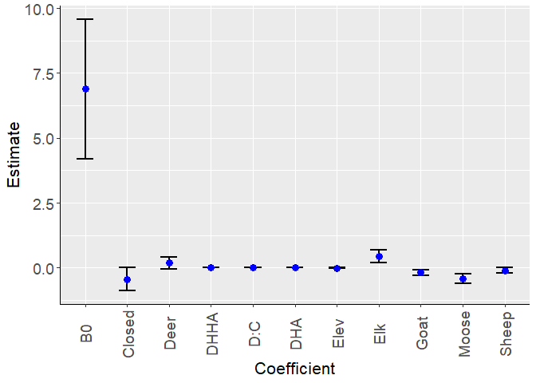<!-- -->

``` r
tiff(here::here("Lab5","Output","coefPlot.tiff"), res=600, compression = "lzw", height=5, width=7, units="in")
p7
```

    ## Warning in grid.Call(C_stringMetric, as.graphicsAnnot(x$label)): font family not
    ## found in Windows font database

    ## Warning in grid.Call(C_stringMetric, as.graphicsAnnot(x$label)): font family not
    ## found in Windows font database

    ## Warning in grid.Call(C_textBounds, as.graphicsAnnot(x$label), x$x, x$y, : font
    ## family not found in Windows font database

    ## Warning in grid.Call(C_textBounds, as.graphicsAnnot(x$label), x$x, x$y, : font
    ## family not found in Windows font database

    ## Warning in grid.Call(C_textBounds, as.graphicsAnnot(x$label), x$x, x$y, : font
    ## family not found in Windows font database

    ## Warning in grid.Call(C_textBounds, as.graphicsAnnot(x$label), x$x, x$y, : font
    ## family not found in Windows font database

    ## Warning in grid.Call(C_textBounds, as.graphicsAnnot(x$label), x$x, x$y, : font
    ## family not found in Windows font database

    ## Warning in grid.Call.graphics(C_text, as.graphicsAnnot(x$label), x$x, x$y, :
    ## font family not found in Windows font database

    ## Warning in grid.Call.graphics(C_text, as.graphicsAnnot(x$label), x$x, x$y, :
    ## font family not found in Windows font database

    ## Warning in grid.Call.graphics(C_text, as.graphicsAnnot(x$label), x$x, x$y, :
    ## font family not found in Windows font database

    ## Warning in grid.Call.graphics(C_text, as.graphicsAnnot(x$label), x$x, x$y, :
    ## font family not found in Windows font database

    ## Warning in grid.Call.graphics(C_text, as.graphicsAnnot(x$label), x$x, x$y, :
    ## font family not found in Windows font database

    ## Warning in grid.Call.graphics(C_text, as.graphicsAnnot(x$label), x$x, x$y, :
    ## font family not found in Windows font database

    ## Warning in grid.Call.graphics(C_text, as.graphicsAnnot(x$label), x$x, x$y, :
    ## font family not found in Windows font database

    ## Warning in grid.Call.graphics(C_text, as.graphicsAnnot(x$label), x$x, x$y, :
    ## font family not found in Windows font database

    ## Warning in grid.Call.graphics(C_text, as.graphicsAnnot(x$label), x$x, x$y, :
    ## font family not found in Windows font database

    ## Warning in grid.Call.graphics(C_text, as.graphicsAnnot(x$label), x$x, x$y, :
    ## font family not found in Windows font database

    ## Warning in grid.Call.graphics(C_text, as.graphicsAnnot(x$label), x$x, x$y, :
    ## font family not found in Windows font database

    ## Warning in grid.Call.graphics(C_text, as.graphicsAnnot(x$label), x$x, x$y, :
    ## font family not found in Windows font database

    ## Warning in grid.Call.graphics(C_text, as.graphicsAnnot(x$label), x$x, x$y, :
    ## font family not found in Windows font database

    ## Warning in grid.Call.graphics(C_text, as.graphicsAnnot(x$label), x$x, x$y, :
    ## font family not found in Windows font database

    ## Warning in grid.Call.graphics(C_text, as.graphicsAnnot(x$label), x$x, x$y, :
    ## font family not found in Windows font database

    ## Warning in grid.Call.graphics(C_text, as.graphicsAnnot(x$label), x$x, x$y, :
    ## font family not found in Windows font database

    ## Warning in grid.Call.graphics(C_text, as.graphicsAnnot(x$label), x$x, x$y, :
    ## font family not found in Windows font database

    ## Warning in grid.Call.graphics(C_text, as.graphicsAnnot(x$label), x$x, x$y, :
    ## font family not found in Windows font database

    ## Warning in grid.Call.graphics(C_text, as.graphicsAnnot(x$label), x$x, x$y, :
    ## font family not found in Windows font database

    ## Warning in grid.Call.graphics(C_text, as.graphicsAnnot(x$label), x$x, x$y, :
    ## font family not found in Windows font database

    ## Warning in grid.Call.graphics(C_text, as.graphicsAnnot(x$label), x$x, x$y, :
    ## font family not found in Windows font database

    ## Warning in grid.Call(C_textBounds, as.graphicsAnnot(x$label), x$x, x$y, : font
    ## family not found in Windows font database

    ## Warning in grid.Call.graphics(C_text, as.graphicsAnnot(x$label), x$x, x$y, :
    ## font family not found in Windows font database

``` r
dev.off()
```

    ## png 
    ##   2

## Caterpillar Plots with the GGally Package

Alternatively, another easy way to make cateripillar plots is to check
out the cool GGally package!! This package uses broom and ggplot2.

``` r
ggcoef(full.model)
```

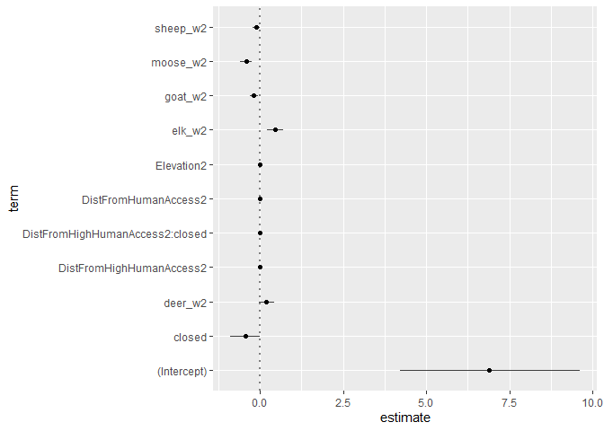<!-- --> Note how the
intercept is off the charts, so lets remove that, and play around with
some other options such as sorting, exponentiating the coefficients
which then displays them as Odds ratio’s from a logistic regression
model, etc.

``` r
ggcoef(full.model, exclude_intercept = TRUE, exponentiate = FALSE, sort = "ascending")
```

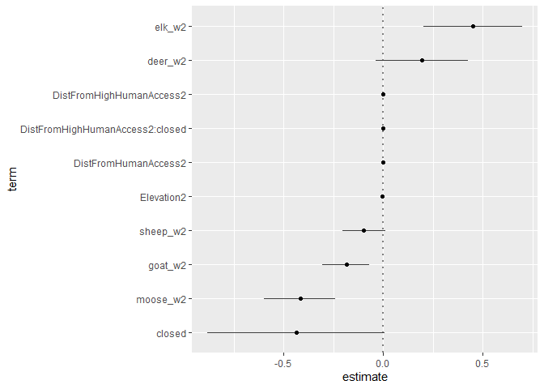<!-- -->

``` r
ggcoef(full.model, exclude_intercept = TRUE, exponentiate = TRUE, sort = "ascending")
```

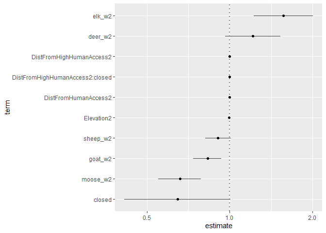<!-- -->

# Variable reduction using PCA - Principle Components Analysis

Note princomp is a base function of {stats4}. Here, we suffered through
the problem of multicollinearity, and had to reduce the number of
covariates we could possibly consider in the same top model as a
results. Accordingly, really, we shouldn’t really have elevation and
distance to high human access in the same model, ever.

Another way around the problem of multicollinearity is through
multivariate statistical approaches, which are NOT to be confused with
multiple logistic regression, etc.

From
[Wikipedia](https://en.wikipedia.org/wiki/Principal_component_analysis)

In multivariate approaches such as Principle Components Analysis,
Principal component analysis (PCA) is a statistical procedure that uses
an orthogonal transformation to convert a set of observations of
possibly correlated variables (entities each of which takes on various
numerical values) into a set of values of linearly uncorrelated
variables called principal components. If there are n observations with
p variables, then the number of distinct principal components is
$\displaystyle \min(n-1,p)$. This transformation is defined in such a
way that the first principal component has the largest possible variance
(that is, accounts for as much of the variability in the data as
possible), and each succeeding component in turn has the highest
variance possible under the constraint that it is orthogonal to the
preceding components. The resulting vectors (each being a linear
combination of the variables and containing n observations) are an
uncorrelated orthogonal basis set. PCA is sensitive to the relative
scaling of the original variables.

HEre, we will use PCA to attempt to reduce the number of variables we
are considering to the minimum number of orthogonal, truly independent
vectors and then use these in our GLM.

``` r
head(wolfkde2)
```

    ##   deer_w2 moose_w2 elk_w2 sheep_w2 goat_w2 wolf_w2 Elevation2
    ## 1       4        5      5        3       3       5   1766.146
    ## 2       4        4      4        1       3       4   1788.780
    ## 3       4        5      5        4       1       5   1765.100
    ## 4       4        5      5        4       1       5   1742.913
    ## 6       1        1      1        1       4       1   1778.360
    ## 7       4        5      5        4       1       5   1764.313
    ##   DistFromHumanAccess2 DistFromHighHumanAccess2 landcover16 EASTING NORTHING
    ## 1             427.3962                9367.8168           8  580840  5724800
    ## 2             360.5043               10398.5999           2  580000  5724195
    ## 3             283.6648               10296.5167           2  579800  5724800
    ## 4             167.4134                6347.8193           2  583803  5725654
    ## 6             622.6257                 723.7941          13  588573  5728804
    ## 7             373.2101                9331.2403           2  580785  5724966
    ##       pack used usedFactor      habitatType        landcov.f closedConif
    ## 1 Red Deer    1          1            Shrub            Shrub           0
    ## 2 Red Deer    1          1 Moderate Conifer Moderate Conifer           0
    ## 3 Red Deer    1          1 Moderate Conifer Moderate Conifer           0
    ## 4 Red Deer    1          1 Moderate Conifer Moderate Conifer           0
    ## 6 Red Deer    1          1   Burn-Grassland             Burn           0
    ## 7 Red Deer    1          1 Moderate Conifer Moderate Conifer           0
    ##   modConif openConif decid regen mixed herb shrub water rockIce burn alpineHerb
    ## 1        0         0     0     0     0    0     1     0       0    0          0
    ## 2        1         0     0     0     0    0     0     0       0    0          0
    ## 3        1         0     0     0     0    0     0     0       0    0          0
    ## 4        1         0     0     0     0    0     0     0       0    0          0
    ## 6        0         0     0     0     0    0     0     0       0    1          0
    ## 7        1         0     0     0     0    0     0     0       0    0          0
    ##   alpineShrub alpine closed closedFactor
    ## 1           0      0      0            0
    ## 2           0      0      1            1
    ## 3           0      0      1            1
    ## 4           0      0      1            1
    ## 6           0      0      1            1
    ## 7           0      0      1            1

``` r
pcawolf <-princomp(na.omit(wolfkde2[1:9]), cor=TRUE)
summary(pcawolf)
```

    ## Importance of components:
    ##                          Comp.1    Comp.2     Comp.3     Comp.4     Comp.5
    ## Standard deviation     2.243495 1.2678247 0.87957691 0.71704964 0.62623282
    ## Proportion of Variance 0.559252 0.1785977 0.08596173 0.05712891 0.04357417
    ## Cumulative Proportion  0.559252 0.7378498 0.82381149 0.88094040 0.92451457
    ##                            Comp.6     Comp.7    Comp.8      Comp.9
    ## Standard deviation     0.60241949 0.38531793 0.3395040 0.229622996
    ## Proportion of Variance 0.04032325 0.01649666 0.0128070 0.005858524
    ## Cumulative Proportion  0.96483782 0.98133448 0.9941415 1.000000000

``` r
loadings(pcawolf)
```

    ## 
    ## Loadings:
    ##                          Comp.1 Comp.2 Comp.3 Comp.4 Comp.5 Comp.6 Comp.7
    ## deer_w2                   0.406         0.142  0.178  0.231  0.348  0.202
    ## moose_w2                  0.370         0.122        -0.132 -0.881  0.140
    ## elk_w2                    0.402  0.207  0.188         0.160  0.109  0.129
    ## sheep_w2                         0.680 -0.178        -0.675  0.133 -0.129
    ## goat_w2                  -0.186  0.570 -0.395         0.639 -0.226 -0.142
    ## wolf_w2                   0.415  0.185  0.136  0.107  0.169  0.138  0.179
    ## Elevation2               -0.408  0.162                              0.895
    ## DistFromHumanAccess2     -0.318         0.351  0.853               -0.182
    ## DistFromHighHumanAccess2 -0.233  0.299  0.775 -0.467               -0.140
    ##                          Comp.8 Comp.9
    ## deer_w2                   0.633  0.398
    ## moose_w2                  0.148       
    ## elk_w2                   -0.744  0.389
    ## sheep_w2                              
    ## goat_w2                               
    ## wolf_w2                         -0.826
    ## Elevation2                            
    ## DistFromHumanAccess2                  
    ## DistFromHighHumanAccess2  0.111       
    ## 
    ##                Comp.1 Comp.2 Comp.3 Comp.4 Comp.5 Comp.6 Comp.7 Comp.8 Comp.9
    ## SS loadings     1.000  1.000  1.000  1.000  1.000  1.000  1.000  1.000  1.000
    ## Proportion Var  0.111  0.111  0.111  0.111  0.111  0.111  0.111  0.111  0.111
    ## Cumulative Var  0.111  0.222  0.333  0.444  0.556  0.667  0.778  0.889  1.000

``` r
plot(pcawolf, type="lines")
```

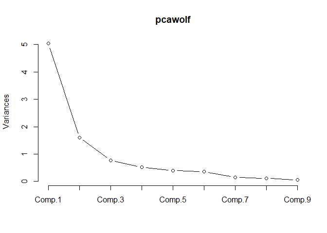<!-- -->

``` r
biplot(pcawolf, xlim =c(-0.06, 0.04))
```

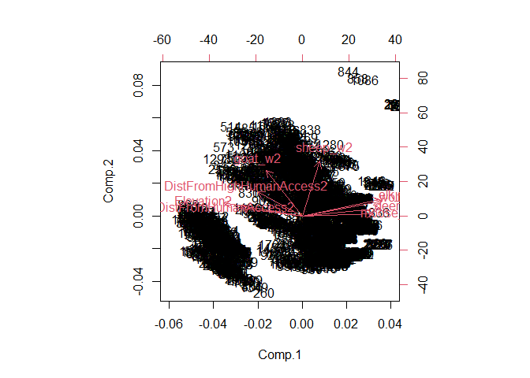<!-- -->

This biplot() tells us that Axis or Component 1 explains most of the
variation here, and, is explained mostly by an axis that is a positive
linear combination of being at low elevations, close to humans, in good
deer/elk/moose habitat, etc. Lets make a new component based on this
orthoganal contrast Axis 1:

``` r
wolfkde2$Comp.1 <- -0.406*wolfkde2$deer_w2 - 0.370*wolfkde2$moose_w2 - 0.402*wolfkde2$elk_w2 +0.182*wolfkde2$goat_w2 - 0.415*wolfkde2$wolf_w2 + 0.408*wolfkde2$Elevation2 + 0.318*wolfkde2$DistFromHumanAccess2 + 0.233*wolfkde2$DistFromHighHumanAccess2

wolf_comp1 <- glm(used ~ Comp.1, family=binomial (logit), data=wolfkde2)
wolfkde2$fitted1 <- fitted(wolf_comp1)
hist(wolfkde2$fitted1)
```

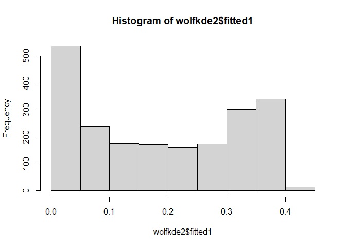<!-- -->

``` r
plot(wolfkde2$fitted1, wolfkde2$Comp.1)
```

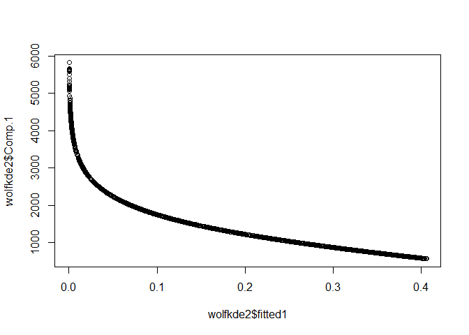<!-- --> Lets examine
the relationship between Component 1 of the PCA and the probability of
wolf used locations:

``` r
figPCA <- ggplot(wolfkde2, aes(x=Comp.1, y=used)) + stat_smooth(method="glm", method.args = list(family="binomial"))
x.axis = "-0.41*deer - 0.37*moose - 0.4*elk +0.18*goat - 0.42*wolf + 0.41*Elev + 0.32*DistHum + 0.23*DistHighHum"
figPCA2 <- figPCA + xlab(x.axis)
figPCA2
```

    ## `geom_smooth()` using formula = 'y ~ x'

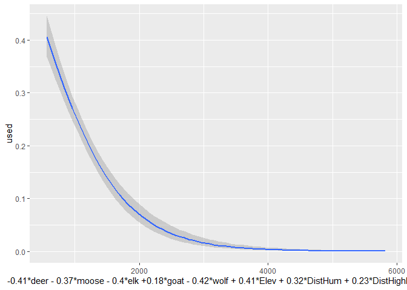<!-- --> The label on
the Axis now explains the problem with PCA and why its such a bugbear.
How do you explain component 1 to a manager?

# Lab 5 Excercises

First, focusing just on the wolfkde.csv dataset:

1)  For today’s assignment, your goal is to detail the steps you chose
    to select the ‘top’ model(s) explaining wolf probability of use from
    a single or set of top model(s) for all wolves combined.  

<!-- -->

1.  First, describe your approach for screening against collinearity in
    your predictor set?
2.  After screening for collinearity, how did you address the problem of
    model selection? You can use ANY of the approaches we used in this
    lab (stepAIC, dredging, development of an a-priori model set(s),
    etc. Either way, describe your approach to developing your candidate
    model set.
3.  Given the top model set, what is the best model(s) explaining wolf
    resource selection? Describe and interpret the effects of the
    individual coefficients on wolf resource selection from this top
    model set.

<!-- -->

2)  Finally, redo the analysis (ideally using a script file created from
    your command log file – this should not be onerous) for each of the
    two different wolf packs separately? Are their differences between
    the packs in terms of collinearity? In the top models selected
    between packs? In model selection uncertainty? Another set of
    excercises could be to redo the same analyses with the wolfmcp.csv
    dataset where we defined availability using a 95% Minimum Convex
    Polygon.

For suggestions on how to present results of model selection, see
Anderson & Burnham (2001) cited in Lab5.

# Literature Cited and Other Useful Citations

1.  Anderson, D. R., Burnham, K. P., Gould, W. R. & Cherry, S. (2001)
    Concerns About Finding Effects That Are Actually Spurious. Wildlife
    Society Bulletin, 29, 311-316.
2.  Anderson, D.R. and K. Burnham. 2002. Avoiding pitfalls when using
    information-theoretic approaches. Journal of Wildlife Management 66:
    912-916.
3.  Anderson, D.R., K.P. Burnham, and W.L. Thompson. 2000. Null
    hypothesis testing: problems, prevalance, and an alternative.
    Journal of Wildlife Management 64: 912-923 .
4.  Anderson, D.R., W.A. Link, D.H. Johnson, and K.P. Burnham. 2001.
    Suggestions for presenting the results of data analyses. Journal of
    Wildlife Management 65: 373-378.
5.  Burnham, K. P. & Anderson, D. R. (2001) Kullback-Leibler Information
    as a Basis for Strong Inference in Ecological Studies. Wildlife
    Research, 28, 111-119.
6.  Burnham, K.P. and D.R. Anderson. 1998. Model selection and
    inference: a practical information-theoretic approach.
    Springer-Verlag, New York.
7.  Guisan, A., T.C. Edwards, and T. Hastie. 2002. Generalized Linear
    and Generalized Additive Models in Studies of Species Distributions:
    Setting the Scene. Ecological Modelling 157 :89-100.
8.  Hooten, M. B., and N. T. Hobbs. 2015. A guide to Bayesian model
    selection for ecologists. Ecological Monographs 85:3–28.
9.  Hosmer, D.W. and S. Lemeshow. 2000. Applied Logistic Regression.
    John Wiley and Sons, New York.
10. McCullough, P. and J.A. Nelder. 1989. Generalized linear models.
    Second edition. Chapman and Hall, London, UK.
11. Menard, S. 2002. Applied logistic regression. Second Edition. Sage
    Publications, London.
12. Prarie, Y.T. and D.F. Bird. 1989. Some misconceptions about the
    spurious correlation problem in the ecological literature. Oecologia
    81: 285-298.
13. Reineking, B. and B. Schroder. 2006. Constrain to Perform:
    Regularization of Habitat Models. Ecological Modelling 193:675-690.
14. Tenan, S., R. B. O’Hara, I. Hendriks, and G. Tavecchia. 2014.
    Bayesian model selection: The steepest mountain to climb. Ecological
    Modelling 283:62-69.
